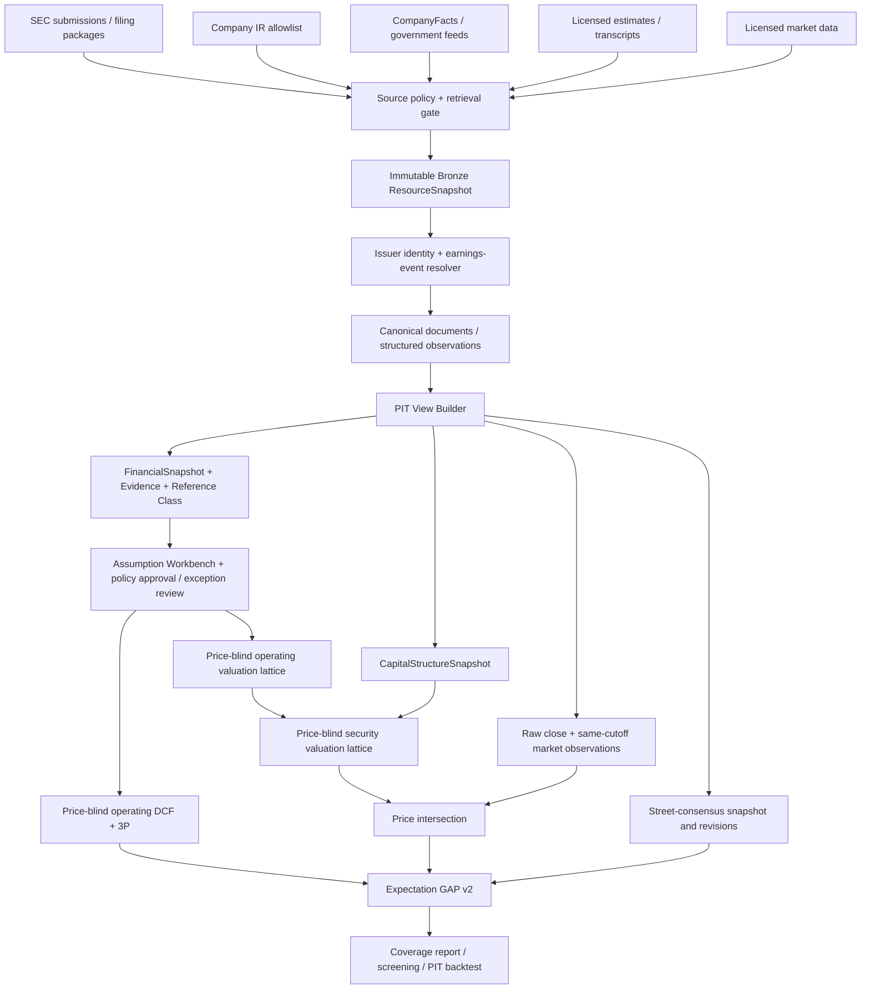
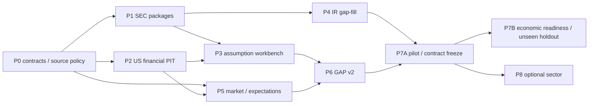

# 미국 주식 Expectation GAP 확장 Plan

상태: 설계 초안 1차

작성 기준일: 2026-08-18

대상 저장소: MoatRader 1.0.0

코드 감사 기준: 설계 감사를 시작한 `af6b51748bf723ac53efc75bdea0f9cf0668d74b`의 tracked baseline. 작성 중 병행된 scoring/source-ablation 실험은 호환성 검토 대상으로만 읽었고 baseline 완료 기능으로 간주하지 않았다. 검토 도중 외부 작업으로 interim 문서와 그 실험이 `2cb22c90264315deb2e819e5f51f7e94a5f60efb`에 커밋됐으며, 현재 문서는 그 commit 위의 최종 review delta다. 기능 gap 판단의 기준선은 소급 변경하지 않는다.

읽는 순서: 의사결정자는 0·16·17·19·21, 구현자는 3·7~14·22, research 설계 검토자는 10·11·15를 먼저 보면 된다. 23은 source 검증, 24는 전달받은 제안과의 traceability다.

## 0. 결론부터

미국 확장은 별도의 분석 엔진을 새로 만드는 프로젝트가 아니다. 현재 MoatRader가 이미 가진
`PIT canonical document -> atomic evidence -> price-blind intrinsic lane -> price-aware reverse DCF -> Expectation Gap`
구조를 유지하고, 그 앞에 미국용 수집·기간 정렬·시장 기대 스냅샷 계층을 붙이는 프로젝트로 정의한다.

권장 MVP의 범위는 다음과 같다.

1. 일반 비금융 미국 기업 5개를 gold set으로 먼저 고정한다.
2. SEC 10-K/10-Q에 더해 8-K의 Item 2.02/7.01/9.01과 제출 패키지 내 관련 Exhibit를 수집한다.
3. CompanyFacts는 재무 정규화와 누락 탐지에 사용하되, 과거 PIT의 유일한 원장으로 사용하지 않는다.
4. 회사 IR은 SEC에서 비는 문서만 채우는 allowlist 기반 보조 수집기로 시작한다.
5. analyst estimates와 transcript vendor는 처음부터 intrinsic 가정 생성에 넣지 않고 별도의 market-expectation/shadow lane에 둔다.
6. 현재 수동 JSON인 `expectation_assumptions`는 자동 숫자 생성기가 아니라 provenance가 붙은 assumption workbench와 승인 artifact로 바꾼다.
7. 현재 Expectation Gap의 축별 min/max 투표는 joint reverse-DCF surface 비교로 교체한다.
8. 5개 gold set을 통과한 뒤 30개 고정 연구 표본으로 확대하고, 가치가 측정된 소스만 더 넓게 수집한다.

설계·gold·30개 engineering pilot까지의 1인 추정은 26~39 engineer-week다. 경제적 검증 준비는 licensed market/security-master/action data와 ledger를 위해 추가 8~14 engineer-week이며, 권장 prospective primary evidence는 별도로 24개 complete monthly decision 관측을 기다린다. 따라서 가까운 완료 기준은 “미국 입력과 GAP v2를 PIT-safe하게 재현하는 research MVP”이고, “검증된 alpha/실거래 구현 가능성”은 독립 gate다.

이 순서를 따르면 SEC 중심의 깨끗한 PIT 장점을 보존하면서도, IR crawler와 유료 데이터에 먼저 큰 비용을 쓰는 것을 피할 수 있다.

단, “수집/분석 MVP를 저비용으로 만들 수 있다”와 “편향 없는 미국 주식 historical alpha backtest를 무료로 만들 수 있다”는 다른 주장이다. 후자는 raw/total-return price, corporate action·delisting consideration, stable security identity, point-in-time universe가 필요하므로 Phase 0에서 licensed market-data 선택을 먼저 해결하거나 경제적 성과 주장을 보류해야 한다.

## 1. 이번 설계에서 바로잡아야 할 전제

붙여넣은 제안의 큰 방향인 `SEC -> 회사 IR -> 저비용 API -> 유료 vendor`는 맞다. 다만 구현 계획으로 옮기려면 아래 전제를 수정해야 한다.

### 1.1 8-K를 받는 것과 earnings material을 받는 것은 다르다

현재 `SecEdgarCollector`는 기본적으로 10-K/10-Q/20-F/40-F와 amendment만 수집한다. `--form 8-K`를 지정할 수는 있지만, 수집 대상은 primary HTML과 complete submission text다. 실제 earnings release나 deck인 Exhibit 99.x를 별도 canonical document로 꺼내지 않는다.

따라서 첫 구현 단위는 단순한 `8-K form 추가`가 아니라 다음 전체다.

```text
submission discovery
-> filing package inventory
-> item filter
-> exhibit relationship extraction
-> relevant exhibit download
-> document-kind classification
-> event-level deduplication
```

Exhibit 번호만으로 문서 의미를 결정해서도 안 된다. `99.1 = earnings release`, `99.2 = deck`은 흔한 관행이지 계약이 아니다. SEC document type, description, 8-K item, 파일명, 본문 heading을 함께 사용하고, 모호하면 review 대상으로 남긴다.

### 1.2 CompanyFacts는 PIT 재무 원장 그 자체가 아니다

SEC CompanyFacts는 표준 taxonomy fact를 한 번에 가져오기 좋은 정규화 보조 소스다. 그러나 현재 응답을 과거 시점에 그대로 소급하면 다음 위험이 있다.

- 나중 제출에서 이전 기간 fact가 다시 보고되거나 restate될 수 있다.
- post-acceptance correction으로 현재 API의 역사 모습이 당시와 달라질 수 있다.
- custom taxonomy와 entity-wide가 아닌 context는 공식 aggregation 범위 밖이다.
- fact row의 `filed` 일자만으로 intraday 공개 시각을 만들면 안 된다.

과거 backtest에서는 fact의 accession을 submissions acceptance timestamp와 연결하고, 가능하면 원 filing의 iXBRL fact와 값·단위·기간을 대조한다. 불일치하면 원 filing을 우선하고 CompanyFacts는 진단 artifact로만 남긴다.

### 1.3 analyst estimate의 “revision history”가 historical vintage를 보장하지 않는다

API가 revision 관련 필드를 제공해도, 과거 각 날짜에 실제로 무엇이 보였는지를 재현하는 `as_of vintage` 계약이 문서화되지 않았다면 historical PIT 데이터로 취급할 수 없다. Alpha Vantage의 기술적 capability는 확인할 수 있지만, 다음 두 조건은 별도 검증 대상이다.

- 특정 과거 `captured_at/as_of`의 full consensus snapshot을 반환하는가?
- 저장, LLM 처리, 연구/상업 사용에 필요한 entitlement가 있는가?

둘 중 하나라도 불명확하면 response를 앞으로 매일/주기적으로 snapshot하여 `received_at` 이후 연구에만 쓰고, 과거 backfill은 current-research-only로 둔다.

### 1.4 무료 API와 사용 가능한 데이터는 같은 뜻이 아니다

각 source에는 호출 비용 외에 저장, 캐시, LLM 전송, 파생물 보존, 재배포, 상업 이용 권리가 있다. 현재 FRED 약관은 API 콘텐츠의 저장·캐시와 AI 관련 사용에 제한을 두므로, MoatRader의 immutable Bronze/LLM 파이프라인에 기본 source로 넣으면 안 된다. 금리 MVP는 U.S. Treasury의 공식 daily interest-rate feed를 우선한다. BLS/BEA 등도 사용할 series와 약관을 source-policy 단위로 검토한다.

이 문서의 source-policy 판단은 법률 자문이 아니라 fail-closed engineering rule이다. 실제 배포 형태가 정해지면 별도 권리 검토가 필요하다.

## 2. 목표와 비목표

### 2.1 목표

- 미국 일반 비금융 기업에 대해 동일한 PIT cutoff에서 재현 가능한 financial/evidence/market input pack을 만든다.
- earnings release, deck, KPI supplement, investor-day material, transcript의 coverage와 증분 가치를 측정한다.
- 수동 숫자 복사를 줄이되 LLM이 DCF 숫자·확률·공정가치를 생성하지 않는 현재 경계를 유지한다.
- 시장 기대를 `price-implied joint surface`와 `street consensus snapshot`으로 분리해 관찰한다.
- 모든 결과가 raw artifact와 source timestamp까지 역추적되게 한다.
- 실제 unseen date를 보기 전에 contract와 gate를 고정한다.

### 2.2 MVP 비목표

- S&P 500 전체 범용 IR crawler
- sell-side 원문 보고서의 대량 수집
- 금융회사 valuation 지원
- pre-revenue biotech의 universe runner 자동 통합
- LLM을 통한 자동 target price 또는 자동 scenario 숫자 생성
- current constituent만 사용한 장기 성과 주장
- entitlement가 확인되지 않은 vendor raw data의 저장 또는 cloud LLM 전송
- scheduler/database/UI를 포함한 상시 서비스화

금융회사는 현재 router만 있고 excess-return engine이 구현되지 않았으므로 fail closed한다. Biotech rNPV는 standalone이므로 미국 MVP 표본에서 분리한다. 20-F/6-K 외국기업과 다중 통화도 second wave로 둔다.

### 2.3 MVP issuer/security eligibility

초기 scope는 다음을 모두 만족하는 security로 고정한다.

- SEC domestic filer이며 10-K/10-Q를 제출
- 미국 거래소의 primary USD common-equity listing
- 일반 비금융 또는 현재 구현된 mature/platform economic-FCFF route
- PIT 시점에 revenue와 운영자산이 존재하고 pre-revenue가 아니며, core MVP screen은 positive normalized TTM NOPAT/invested capital
- 연결 재무 범위와 primary share class를 식별 가능
- 필요한 원문을 영어 parser가 처리 가능

ADR, foreign private issuer, OTC, SPAC shell, fund/ETF, REIT/BDC, MLP/LP unit, preferred, tracking stock, 경제적 권리가 불명확한 multi-class, bank/insurer, pre-revenue biotech, negative-NOPAT turnaround는 universe row에서 exclusion reason을 남긴다. 제외는 회사 품질 판단이 아니라 model/data applicability gate다. Pilot 도중 한 기업이 이 경계를 넘으면 억지로 계속 평가하지 않고 replacement rule에 따라 같은 stratum의 사전 지정 reserve를 사용한다. Negative-NOPAT platform/distressed route와 REIT/regulated/commodity 특화 policy는 별도 gold가 생긴 second wave다.

```text
ModelApplicabilityDecision
  issuer_id
  as_of
  company_type / life_cycle_stage
  selected_route
  status                  ELIGIBLE / EXCLUDED / REVIEW_REQUIRED
  reason_codes
  input_fact_ids
  classification_snapshot_id
  route_policy_version
  decision_method         AUTO_POLICY / BLINDED_REVIEW / PROSPECTIVE_REVIEW
```

Current website sector나 오늘의 company description을 과거 route에 복사하지 않는다. Domestic filer, security type, financial/REIT/BDC/biotech exclusion, positive normalized NOPAT와 operating-capital availability는 cutoff의 filing/identity fact로 판정한다. Life-cycle/platform 같은 모호한 분류가 valuation method를 바꾸면 review item이며, route를 바꿔 더 유리한 value를 고르지 않는다.

## 3. 현재 코드베이스와의 gap audit

| 영역 | 현재 상태 | 미국 확장에 필요한 변화 |
| --- | --- | --- |
| SEC submissions | 구현됨. historical submissions와 acceptance timestamp, primary HTML, complete submission 저장 | 8-K 기본/별도 profile, filing-package inventory, 관련 Exhibit 개별 저장 |
| SEC CompanyFacts | 미구현 | raw snapshot, accession join, filing fact reconciliation, concept policy |
| SEC 8-K Item | submissions의 `items`를 metadata에 보존 | 2.02/7.01/9.01 filter와 event linkage |
| IR collector | KIND 한국 IR PDF 전용 | 미국 issuer endpoint registry와 allowlist adapter |
| IR parser | HTML/PDF 및 visual lane 구현 | jurisdiction/language hardcode 제거, 미국 document kinds와 transcript 처리 |
| Canonical PIT | timezone-aware `available_at` 구현 | event/published/accepted/first-observed를 분리한 availability evidence |
| Identity | 현재 ticker/CIK snapshot 중심 | ticker·exchange·share class의 유효기간과 stable security identity |
| Artifact/run identity | `RunStore.company_dir(ticker)`와 company result가 ticker/current price를 한 record에 보존 | security-ID 경로, issuer analysis와 price-intersection artifact 분리, ticker는 display alias |
| Artifact write/retry | `RunStore`와 Bronze latest pointer가 temp-file 뒤 destination replace를 허용하고 stage attempt/lease가 없음 | immutable artifact는 create-if-absent, task attempt/fencing/closure manifest; mutable latest/lease는 권위 있는 economic artifact와 분리 |
| Hash/runtime identity | `stable_id`/mapping hash가 JSON `default=str`와 일부 Python 표현에 의존하고 exact dependency lock이 없음 | CanonicalHashPolicy, source-tree/lock/runtime identity, clean-build holdout gate |
| US financial snapshot | SEC iXBRL 기본 파싱은 가능 | US-GAAP concept policy, 52/53주, fiscal quarter identity, restatement, units |
| Expectation input | 회사별 수동 `expectation_assumptions` JSON | provenance-first input pack, 자동 base facts, policy compile, exception review |
| DCF field provenance | 주요 값 field만 source/type allowlist에 포함; method·margin convergence·sales-to-capital·explicit horizon 등 일부 value-bearing field는 밖에 있음 | 모든 value-bearing/derived field의 source·policy·derivation provenance와 scenario invariant |
| DCF valuation layer | `EconomicDcfAssumptions` 하나에 operating drivers, net debt, diluted shares, mature-route failure/recovery가 함께 있고 engine이 바로 per-share value를 산출 | issuer operating request/EV, security common-equity bridge/per-share, route-specific distress overlay를 타입과 artifact로 분리 |
| 3P Possible/Plausible | 일부 Possible ceiling이 source-less default이고 required check UNKNOWN도 aggregate PASS가 될 수 있으며, Plausible UNKNOWN은 v1 GAP의 non-outlier 조건을 통과 | versioned PossiblePolicy required/optional, UNKNOWN fail-closed, strict evidence-feasible set |
| CAP reducer | support/erosion evidence count로 prior CAP를 ±1~3년 이동 | PIT duration base-rate, novelty dedup, explicit duration/erosion policy; count-to-years 휴리스틱은 shadow only |
| Analysis orchestration | intrinsic 계산이 price 객체보다 먼저인 in-memory 경계는 있으나 한 `analyze()` call/result에 intrinsic·market artifacts가 함께 묶임 | 별도 intrinsic command/artifact, cacheable lattice, price intersection/comparison command |
| Analyst estimates | 없음 | market lane snapshot contract와 prospective revision derivation |
| Transcript/audio | 없음 | source/generation/speaker/section 계약, entitlement gate |
| Macro | 없음 | source-policy를 통과한 first-party government feed |
| Price | timezone-aware adjusted price CSV import | stable security ID, session semantics, raw/adjusted/total-return 구분 |
| Reverse DCF | joint points 보존, 결과 판정은 축별 marginal range; grid list/tolerance가 hand-authored request에 있고 bound/refinement provenance 없음 | price-blind versioned surface policy, adaptive joint surface와 distance/component diagnostics |
| Backtest | PIT/stale-price/lag/cost/capacity 지원; 실행일 일부 종목 누락은 나머지 종목에 재배분하고 종료 누락은 generic return으로 강제 정산 가능 | exchange session, 고정 leg weight, point-in-time universe, source-backed corporate-action/delist settlement |

검토 시작 시점의 tracked 기준선 322개 테스트를 모두 통과시켰다. 미국 확장은 기존 contract를 깨는 rewrite가 아니라 schema version을 올리는 증분 변경으로 한다.

## 4. 유지할 아키텍처 원칙

### 4.1 세 lane을 끝까지 분리한다

1. `Intrinsic Evidence Lane`: 공시, first-party IR, 산업 base rate, financial snapshot만 사용한다.
2. `Price-Implied Lane`: current price와 동일 cutoff의 capital structure를 사용해 reverse DCF surface를 만든다.
3. `Street-Consensus Lane`: EPS/revenue estimate와 revision snapshot을 관찰하되 intrinsic scenario를 바꾸지 않는다.

세 lane은 최종 comparison 단계에서만 만난다. 특히 analyst consensus를 central growth의 자동 입력으로 넣으면 시장 기대를 intrinsic evidence로 복제하게 되어 GAP이 사라진다.

| consumer artifact | SEC/first-party actual | management guidance/intrinsic evidence | PIT reference/macro policy | capital structure | street consensus | raw current close | forward return/action outcome |
| --- | ---: | ---: | ---: | ---: | ---: | ---: | ---: |
| BaseFactPack | 허용 | 금지 | policy만 | source facts | 금지 | 금지 | 금지 |
| ScenarioDraft/ApprovedOperatingDcfRequest | 허용 | 허용 | 허용 | ID 참조만 | 금지 | 금지 | 금지 |
| OperatingValuation/OperatingValuationLattice/3P | 승인 input만 | 승인 input만 | 승인 input만 | 금지 | 금지 | 금지 | 금지 |
| CommonEquityBridgeRequest/SecurityValuationLattice | operating value만 | 금지 | policy만 | 허용 | 금지 | 금지 | 금지 |
| PriceIntersection/GAP | frozen intrinsic/security artifacts | 금지 | 읽기 전용 | frozen ID만 | 금지 | 허용 | 금지 |
| StreetComparison | frozen artifacts | 금지 | period bridge만 | frozen ID만 | 허용 | 허용 | 금지 |
| Backtest evaluator | frozen signal | 금지 | cost/cash policy | action ledger | shadow feature만 | execution raw bar | 실행 이후에만 허용 |

“ID 참조만”은 capital snapshot의 존재/일관성 검증은 가능하지만 share/debt 숫자로 operating scenario를 바꿀 수 없다는 뜻이다. 이 matrix를 module import test와 request-schema denylist로 구현한다.

여기서 `price-blind`는 회사의 current price나 그 가격에 맞춘 implied assumption을 보지 않는다는 뜻이다. 동일 cutoff의 risk-free rate, 사전 고정 ERP 정책, historical beta처럼 valuation policy에 필요한 시장 환경까지 금지한다는 뜻은 아니다. 다만 이 값들도 price를 맞추는 조정 knob가 되지 않도록 source와 policy version을 고정한다.

### 4.2 LLM과 Python의 책임은 현재대로 유지한다

LLM이 해도 되는 일:

- 모호한 문서 종류 분류의 보조 판단
- 원문 atomic fact의 driver/role/direction 분류
- prepared remarks와 Q&A의 semantic evidence 추출
- source-grounded 짧은 rationale

LLM이 하면 안 되는 일:

- growth, margin, ROIIC, CAP, WACC 숫자 생성
- estimate가 없는 셀 보간
- 공정가치·확률·target price 생성
- publication timestamp 추정
- analyst 질문을 사실로 승격

Python이 기간 정렬, fact reconciliation, provenance, scenario 산술, 3P, DCF, reverse surface, GAP, quality gate를 담당한다.

LLM 호출 자체도 재현 가능한 observation으로 남긴다.

```text
LlmClassificationRun
  task_type
  input_node_ids
  input_manifest_hash
  information_lane
  provider/model/version
  prompt_template_hash
  response_schema_version
  generation_parameters
  external_tools_enabled       false
  requested_at / completed_at
  raw_response_hash
  raw_response_storage_class
  replay_status               FULL / LICENSE_DEPENDENT / NON_REPLAYABLE
  parsed_output_id?
  validation_status            VALID / REJECTED / REVIEW_REQUIRED
  token_usage / cost
  source_policy_ids
```

동일 run replay는 저장 권리가 있는 raw response를 사용하고 network를 다시 호출하지 않는다. 같은 prompt/model 이름을 다시 호출해 결과가 달라지면 기존 output을 덮어쓰지 않고 새 run ID를 만든다. Temperature를 0으로 두는 것을 결정론 보장으로 간주하지 않는다. Prompt, schema, model version 중 하나가 바뀌면 gold regression을 다시 실행한다. Source policy가 `LOCAL_ONLY/NONE`이면 cloud LLM 호출 전 payload gate에서 차단하고, 입력 node 밖 지식이나 도구 검색을 허용하지 않는다. Input/output retention 권리가 없어 response를 보존할 수 없으면 `NON_REPLAYABLE`이며 core audited evidence나 primary signal로 승격하지 않고 capability/shadow diagnostic에만 쓴다.

장기 prospective holdout은 LLM alias를 그대로 24개월 호출하는 연속 experiment가 아니다.

```text
ExperimentAnalysisEpoch
  analysis_epoch_id
  code_execution_identity_id / input_schema_hash
  economic_policy_bundle_hash
  provider / exact_model_version
  prompt_template_hash / response_schema_version
  generation_parameters / tool_policy
  source_selection_policy_id
  started_at / ended_at?
  retirement_reason?
  gold_regression_report_id
  primary_eligible
```

Primary window는 사전 고정한 exact analysis epoch만 사용한다. Provider가 model을 retire해 새 event를 같은 version으로 처리할 수 없거나 code/schema/economic policy가 결과에 영향을 주게 바뀌면 old epoch의 monthly series를 조용히 이어 붙이지 않고 그 epoch를 종료한다. 후보 model/build를 price/return이 가려진 gold·prospective shadow traffic과 old-input exact replay에서 regression한 뒤 새 preregistration/experiment epoch를 시작한다. 사전에 선언한 paired bridge study 없이 서로 다른 epoch의 return을 한 primary estimator로 pool하지 않는다. Output-equivalent infrastructure/security patch라고 주장하려면 전체 frozen-input replay hash가 같은 equivalence report를 남기며, 달라진 case가 하나라도 있으면 새 epoch다. 24개월을 현실적으로 유지하려면 primary path의 가능한 많은 부분을 deterministic parser/policy로 만들고, 장기 보존 가능한 local checkpoint 또는 vendor support horizon을 provider scorecard에 포함한다.

수집 문서는 trusted instruction이 아니라 untrusted data다. Prompt는 document node를 명시적 data delimiter 안에 넣고 그 안의 “ignore previous instructions”, URL 호출, secret 요청 등을 실행하지 않도록 고정한다. LLM task에는 network/file/shell tool을 연결하지 않으며, schema/quote/numeric validation이 통과하지 않으면 output을 폐기한다. Gold에 synthetic prompt-injection paragraph/table/alt-text fixture를 포함한다.

### 4.3 누락은 0이 아니다

문서 미수집, 파서 실패, 미공시, vendor null, analyst count 0은 서로 다른 상태다. 모든 downstream field는 `value + status + source_refs + available_at`을 가진다. silent default를 금지한다.

### 4.4 기대치의 네 가지 의미를 섞지 않는다

미국 자료가 늘어나면 같은 `revenue growth` 숫자라도 성격이 전혀 다른 값이 한 화면에 모인다. 각 값은 아래 ontology를 먼저 통과해야 한다.

| 관측 유형 | 의미 | intrinsic scenario 사용 | market comparison 사용 | 자동 승격 금지 |
| --- | --- | --- | --- | --- |
| `REPORTED_ACTUAL` | 회사가 이미 실현해 보고한 결과 | base fact와 historical range | actual surprise의 분자 | 현재 수치가 미래에도 지속된다고 가정 |
| `MANAGEMENT_GUIDANCE` | 경영진이 제시한 미래 범위/목표 | 반증 가능한 near-term evidence | consensus 대비 guidance 비교 | structural growth·margin으로 직결 |
| `STREET_CONSENSUS` | analyst 집단의 특정 시점 예상 | 사용 금지 | 기대 수준·revision·surprise | price-blind lane의 central assumption |
| `PRICE_IMPLIED` | 현재 가격과 valuation policy가 요구하는 joint future | 사용 금지 | GAP의 비교 대상 | 단일 implied 성장률을 시장의 정답으로 표현 |

따라서 `ExpectationObservation` 같은 하나의 범용 테이블에 네 종류를 넣고 type만 달리하는 것은 허용할 수 있지만, downstream accessor는 역할별로 분리한다. 예를 들어 intrinsic compiler는 `REPORTED_ACTUAL`, 승인된 `MANAGEMENT_GUIDANCE`, PIT reference class만 읽고, `STREET_CONSENSUS`와 `PRICE_IMPLIED`를 import하지 못하도록 dependency-level test를 둔다.

### 4.5 문서 본문을 통한 price leakage도 차단한다

IR deck와 transcript에는 current/historical share price, market cap, valuation multiple, analyst target, consensus가 섞일 수 있다. Request schema에 price field가 없다는 것만으로는 price-blind를 보장하지 못한다. Atomic candidate/node에 다음 lane tag를 붙인다.

```text
information_lane
  INTRINSIC_ELIGIBLE
  MARKET_REFERENCE_ONLY
  MIXED_REVIEW
```

주가·target price·market multiple·analyst rating/consensus를 직접 인용한 candidate는 market lane으로 보내며 intrinsic retrieval에서 제외한다. Reported EPS, share count, buyback cash flow처럼 per-share 단위가 등장했다는 이유만으로 market 정보로 오분류하지 않는다. Analyst 질문에 consensus가 있고 경영진 답변에 운영 fact가 있으면 turn을 question/answer node로 분리하고 answer만 management claim 후보가 된다. Mixed candidate는 사람이 분리 승인하기 전 scenario input이 될 수 없다.

Run manifest에는 intrinsic LLM request에 들어간 node IDs를 저장하고, market-tagged node가 하나도 없는지 leakage audit를 낸다.

## 5. 목표 아키텍처



핵심 변경은 canonical model보다 앞에 `ResourceSnapshot`, 중간에 `EarningsEvent`, valuation 직전에 `ExpectationInputPack`을 두는 것이다.

## 6. Source ladder와 운영 정책

| 우선 | source | 기본 역할 | MVP 정책 |
| ---: | --- | --- | --- |
| 1 | SEC submissions + Archives | filing, acceptance time, exhibit, 원문 | production 기본 |
| 1 | SEC filing iXBRL | historical PIT financial fact | primary financial authority |
| 2 | SEC CompanyFacts | standard-tag normalization, 누락/불일치 탐지 | reconciliation 보조 |
| 3 | 회사 IR | SEC에 없는 deck, investor day, KPI, transcript/audio | allowlist, gap-fill only |
| 3 | U.S. Treasury official feed | risk-free rate | source policy 통과 후 저장 |
| 4 | estimates API | consensus와 revision | entitlement/vintage 검증 전 shadow only |
| 4 | transcript API | 회사 transcript가 없을 때 fallback | entitlement 검증 전 shadow only |
| 5 | 유료 aggregator | coverage bottleneck 해소 | bakeoff 결과가 비용을 정당화할 때만 |
| 수동 | Quartr 등 display product | coverage benchmark | 자동 수집 금지, 수동 QA만 |

FRED는 기술적 PIT 장점이 있는 ALFRED를 제공하지만, 현재 약관상 immutable 저장과 AI pipeline 사용을 기본 허용으로 가정하지 않는다. `BLOCKED_PENDING_REVIEW`가 기본값이다. 같은 경제 series의 원발행기관 API가 있으면 그쪽을 우선한다.

## 7. 새 공통 계약

### 계약 공통 불변조건

| identity | 생성 기준 | 불변조건 |
| --- | --- | --- |
| `issuer_id` | CIK 중심 stable key | ticker 변경과 무관 |
| `security_id` | append-only registry + authoritative native issue/share-class anchor | ticker/listing observation과 분리하고 explicit action resolution으로 연속성 판정 |
| `resource_id` | provider native ID 또는 canonical request identity | 같은 logical resource의 revision에서 유지; semantic query/body는 포함하고 secret은 제외 |
| `resource_version_id` | resource ID + content SHA-256 | bytes가 바뀌면 새 ID, in-place overwrite 금지 |
| `canonical_document_id` | resource version + parser contract | parser 재처리는 lineage로 구분 |
| `observation_key` | issuer + concept/period/scope/unit/dimensions | 같은 economic cell의 filing/revision을 연결 |
| `observation_id` | observation key + accession/resource + value | 다른 report/version을 덮어쓰지 않음 |
| `snapshot_id` | subject issuer 또는 security + cutoff + input hashes + policy versions | 같은 입력의 replay는 동일 결과; issuer artifact에 security를 억지로 포함하지 않음 |

Event resolver가 나중에 두 event가 같음을 발견해도 기존 artifact를 지우지 않고 alias/merge relation을 추가한다. 모든 Gold result는 사용한 resource version, parser, source policy, concept policy, assumption approval hash를 run manifest에 고정한다.

새 record는 기존 `ContractModel`과 같은 `extra="forbid"` 경계를 사용하고 각자 `schema_version`을 가진다. 금액·비율·DCF 입력은 JSON float가 아니라 decimal string으로 직렬화하고 NaN/Infinity를 금지한다. Timestamp는 offset이 있는 ISO-8601 원값과 UTC normalized value를 보존하며 naive datetime을 거부한다. Stable ID/hash는 key ordering, decimal, timezone 표현을 canonicalize한 뒤 생성해 OS와 replay에 따라 바뀌지 않게 한다. `UNKNOWN`/`UNAVAILABLE`은 enum status이지 빈 문자열이나 0이 아니다.

`CanonicalHashPolicy`는 schema/version과 함께 다음을 고정한다. Decimal은 exponent와 negative zero를 정규화하되 경제적으로 의미 있는 unit은 별도 field로 hash하고, datetime은 원 offset을 보존한 record에서 UTC instant로 canonicalize한다. Identity용 Unicode string은 raw source text를 바꾸지 않은 채 canonical copy에 NFC와 명시적 line-ending policy를 적용하고, NFKC로 서로 다른 symbol을 임의 합치지 않는다. Enum은 value, set-like ID list는 dedup+sort, 문서/node 순서처럼 의미 있는 list는 원 순서를 사용한다. Absolute local path, temporary directory, retrieval worker 수는 economic artifact hash에서 제외하고 content/resource ID로 대체한다. URL은 credential/tracking/query-token을 제거하되 symbol, CIK, fiscal period, function, date처럼 response 의미를 바꾸는 allowlisted query는 canonical sort해 request identity에 포함한다. POST body도 secret field를 제외한 semantic body hash와 method를 포함한다. Canonical identity와 raw redacted request를 구분하며, 서로 다른 as-of query가 한 resource로 collapse되지 않게 한다. 기존 `default=str` 기반 hash는 v1 adapter로만 두고 v2 hash에 `hash_policy_version`을 포함한다.

Fractional discount와 adaptive surface를 위해 stable `calculation_context_id`를 가진 `CalculationContext`(Decimal precision, rounding mode, day-count, fractional-power method, output quantization, solver tolerance)를 versioning한다. Default fractional factor는 binary float가 아니라 pinned high-precision Decimal에서 `exp(-t * ln(1 + WACC))`, day count는 `ACT/365F`로 계산한다. Intermediate value는 일찍 cents/bps로 round하지 않고, serialization/report boundary에서만 policy대로 quantize한다. Python/OS가 달라도 gold DCF hash가 같아야 한다.

`code_version`도 Git SHA 한 줄이 아니다. `CodeExecutionIdentity`는 commit SHA, dirty flag, tracked+relevant untracked source-tree content hash, package/build hash, dependency lock hash, Python implementation/version, OS/architecture, timezone DB, optional native-library versions를 가진다. 같은 commit의 dirty worktree나 다른 lockfile은 다른 task/run signature다. Engineering replay는 dirty tree도 exact content hash가 있으면 허용할 수 있지만 economic holdout primary는 freeze된 clean build와 immutable environment manifest만 허용한다. Absolute workspace path와 worker count는 identity가 아니지만 계산 결과를 바꿀 native/Decimal/compression library version은 manifest에 남긴다.

### 7.1 SourcePolicy

각 endpoint는 수집 전에 다음 계약을 통과해야 한다.

```text
policy_id
provider
terms_url
terms_checked_at
next_review_at
terms_snapshot_path
terms_snapshot_sha256
robots_checked_at
access_mode                 PUBLIC / KEYED / LICENSED / MANUAL
storage_class              IMMUTABLE_RETAINED / LICENSED_LEASED / EPHEMERAL / NONE
persistence_allowed         true / false / unknown
llm_processing_allowed      CLOUD / LOCAL_ONLY / NONE / unknown
derived_storage_allowed     true / false / unknown
redistribution_allowed      true / false / unknown
commercial_use_allowed      true / false / unknown
raw_retention_days
license_expires_at?
termination_disposition
review_status               APPROVED / CONDITIONAL / BLOCKED
review_notes
```

`unknown`은 허용이 아니라 차단을 뜻한다. collector는 policy ID를 collection manifest와 raw metadata에 기록하고, block 상태면 HTTP 요청 전에 실패해야 한다. 약관/robots 변경은 parser version과 별도로 run signature를 바꾼다.

Core evidence/PIT backtest source는 원칙적으로 `IMMUTABLE_RETAINED` 또는 계약기간 동안 내부 replay가 가능한 `LICENSED_LEASED`여야 한다. `EPHEMERAL` payload는 LLM evidence, historical backfill, audited assumption의 source가 될 수 없고 capability QA에만 쓴다. Licensed bytes는 retained Bronze와 물리/권한상 분리하고 repository fixture로 복사하지 않는다. Collection뿐 아니라 parse/LLM/replay 시점에도 현재 policy/entitlement를 다시 확인한다. License 종료 후 삭제 의무가 있으면 disposition inventory와 derived-data 권리를 먼저 확인하며, bytes를 지운 뒤에는 content hash·tombstone·삭제 감사만 남기고 run manifest를 `NON_REPLAYABLE`로 내린다. Disposition scope는 Bronze만이 아니라 Silver/Gold 파생물, point/vector/cache, LLM request/response, failure log, export와 관리 가능한 backup copy까지 lineage graph로 열거하고 deletion verification을 남긴다. 보존 권리가 있을 때만 `FULL_REPLAY / LICENSE_DEPENDENT` artifact를 유지한다.

`robots.txt` 허용은 저장·LLM·상업 이용 권리를 부여하지 않고, 차단은 우회 대상이 아니다. Signed URL이나 API token은 canonical URL과 log에서 제거하고 secret은 환경변수/credential store로만 주입한다. Terms snapshot은 검토 증거일 뿐 법률 해석의 대체물이 아니다.

### 7.2 IssuerSecurityIdentity

Ticker는 issuer identity가 아니다. ADR, 다중 share class, ticker 변경과 delisting을 처리하려면 다음을 분리한다.

```text
identity_observation_id
issuer_id            CIK 기반 stable issuer key
security_id          내부 stable security key
cik
ticker
exchange
share_class
security_type
economic_rights_group?
share_conversion_ratio?
currency
effective_from
effective_to
is_primary_listing
identity_source
observed_at
source_resource_version_id
record_status        ASSERTED / CORRECTED / WITHDRAWN
supersedes_identity_observation_id?
```

모든 document는 `issuer_id`에 연결하고, price와 universe는 `security_id`에 연결한다. valuation 시점에 유효한 security만 issuer에 join한다. Effective interval은 business time, observed/supersession은 system time인 bitemporal observation이다. 나중 ticker/share-class mapping 오류를 발견해도 과거 identity row를 수정하지 않고 correction observation을 추가한다. Internal security ID는 ticker 문자열에서 만들지 않고 승인된 native listing/share-class identity로 발급하며, 같은 ticker의 재사용은 다른 security ID다.

Issuer equity value를 한 share class 가격과 비교하려면 class별 경제적 권리와 share-equivalent 분모가 필요하다. Multiple-class issuer는 `economic_rights_group`과 conversion ratio가 검증된 경우에만 동일 per-share value를 비교하고, voting right만 다르더라도 price spread를 diagnostics로 남긴다. 권리/전환비율이 모호하거나 tracking-stock 구조이면 MVP에서 제외한다. Gold 5개는 single-class 또는 명확한 equal-economic-rights issuer를 고른다.

`security_id`는 ticker 문자열 hash가 아니라 append-only identity registry가 발급하는 내부 ID다. Engineering pilot은 SEC cover page, exchange directory, issuer action notice를 묶은 수동/자동 resolution을 허용하고, economic holdout은 기간별 stable native issue ID와 action lineage를 제공하는 승인 security master를 요구한다.

```text
SecurityIdentityResolution
  identity_resolution_id
  candidate_observation_ids
  resolution_type          SAME_SECURITY / NEW_SECURITY / SUCCESSOR_SECURITY /
                           SHARE_CLASS_CONVERSION / AMBIGUOUS
  retained_security_id?
  new_or_successor_security_id?
  effective_at
  authoritative_action_refs
  resolution_method        AUTO_EXACT_ACTION / MANUAL_BLINDED / PROVIDER_MASTER
  policy_version
  review_resolution_id?
```

Ticker/exchange 변경 전후 record는 explicit symbol-change/action lineage가 있을 때만 `SAME_SECURITY`로 묶고, 같은 ticker가 재사용돼도 issuer/share class/native issue anchor가 다르면 새 ID를 발급한다. CIK가 같다는 이유만으로 class A/B를 합치거나, ticker가 같다는 이유로 delisted predecessor의 price history를 새 listing에 연결하지 않는다. Candidate가 여러 개면 첫 row를 고르지 않고 `AMBIGUOUS`; 그 security와 영향을 받는 universe/run을 막는다. Registry ID 발급과 resolution은 원 observation을 수정하지 않으며 correction은 새 resolution/version으로 남긴다.

Merger, spinoff, reincorporation으로 CIK/legal issuer가 바뀌면 동일 issuer ID로 과거를 억지로 이어 붙이지 않고 `IssuerLineageRelation`(`PREDECESSOR_OF`, `MERGED_INTO`, `SPUN_OFF_FROM`)을 만든다. Financial history와 return settlement의 연결은 각각 별도 승인 policy를 사용한다.

### 7.3 ResourceSnapshot

현재 `FilingDescriptor`를 없애지 않고, filing·API JSON·IR asset·audio·market snapshot을 포괄하는 상위 retrieval 계약을 추가한다.

```text
resource_id
resource_version_id
provider
source_type
resource_kind        SUBMISSION / DOCUMENT / DATASET / AUDIO / API_RESPONSE
issuer_id
security_id?
canonical_url
parent_resource_id?
relation_type?       EXHIBIT / MIRROR_OF / TRANSCRIPT_OF / DERIVED_FROM
media_type
first_observed_at
content_sha256
content_length
source_policy_id
storage_class_at_capture
entitlement_id?
retention_expires_at?
raw_storage_path?
```

```text
RetrievalAttempt
  attempt_id
  resource_id
  requested_url_redacted
  canonical_request_fingerprint
  requested_at / response_at
  http_status
  redirect_chain_redacted
  etag?
  last_modified?             힌트일 뿐 PIT authority가 아님
  bytes_received
  rate_limiter_lease_id?
  resource_version_id?
  error_code?
  source_policy_id
```

URL이 같아도 bytes가 바뀌면 새 `resource_version_id`를 만든다. 같은 bytes를 다시 200으로 받거나 304로 확인하면 새 `RetrievalAttempt`만 만들고 기존 version을 참조한다. 서로 다른 URL의 bytes가 같으면 logical resource는 각각 보존하되 content alias를 기록한다. `first_observed_at`은 해당 logical resource/version을 처음 성공 관측한 attempt에서 고정하고 이후 retrieval 시각으로 덮어쓰지 않는다. Redirect/ETag/Last-Modified 변화는 drift 진단이지 content version이나 historical availability의 단독 근거가 아니다.

`EXHIBIT/TRANSCRIPT_OF/DERIVED_FROM` lineage는 cycle을 허용하지 않는 directed edge record이고, `MIRROR_OF`/same-content는 parent pointer가 아니라 별도 symmetric alias set이다. Exact mirror 두 개를 서로 parent로 만들어 graph cycle을 만들지 않는다. Artifact dependency/deletion graph는 topological validation을 통과해야 하며, alias membership은 provenance를 공유할 뿐 availability·authority·storage class를 합치지 않는다.

### 7.4 AvailabilityEvidence

단일 `available_at + grade`보다 timestamp의 출처를 분리한다.

```text
availability_evidence_id
subject_type / subject_id
resource_version_id?
event_at?
publisher_claimed_at?
regulator_accepted_at?
first_observed_at
retrieved_at
conservative_available_at
availability_basis
availability_precision     EXACT / DAY / INFERRED
pit_grade                  A / B / C / D
backtest_eligible
source_refs
collection_clock_evidence_id?
availability_policy_version
```

기본 판정은 다음과 같다.

| grade | 조건 | historical backtest |
| --- | --- | --- |
| A | SEC acceptance와 accession으로 검증, 보수적 lag 적용 | 허용 |
| B | prospective first-party collection 또는 신뢰할 명시 timestamp; `available_at`은 주장 시각보다 이르지 않고 first-observed보다 이르지 않음 | 허용 |
| C | 과거 파일과 event date는 있으나 당시 공개 상태를 재현하지 못함 | 금지 |
| D | 시각 근거 없음 | 금지 |

IR historical page를 오늘 발견한 경우 문서 안의 “2023 Q2”만으로 B가 되지 않는다. 현재 연구에는 쓸 수 있지만, backtest에서는 `first_observed_at` 이전에 존재했다고 간주하지 않는다.

Publisher가 날짜만 주고 시각/timezone을 주지 않으면 그 날짜의 장중 어느 때였다고 추정하지 않는다. 승인된 publisher timezone의 day-end 또는 다음 session부터 사용할 수 있는 conservative rule을 source policy에 둔다. `DAY/INFERRED` precision을 exact timestamp처럼 event surprise나 same-day close에 쓰지 않는다.

PIT grade는 오직 “언제 알 수 있었는가”의 신뢰도다. SEC에 올라왔다는 이유로 내용의 truth/reliability가 올라가지는 않는다. SEC-hosted earnings Exhibit도 미감사 경영진 자료일 수 있으므로 아래 속성을 별도로 둔다.

Prospective IR/API의 B grade는 collector host clock에도 의존한다. Collection run에는 `collector_id`, UTC wall-clock, monotonic request/response elapsed, measured maximum clock offset, clock-check source, clock-health status와 policy version을 가진 `CollectionClockEvidence`를 남긴다. `first_observed_at`은 eligible 성공 response bytes를 받은 local UTC instant이며 HTTP `Date`나 page metadata를 더 이른 값으로 대신 쓰지 않는다. Clock offset/ordering이 사전 tolerance를 넘거나 `response_at < requested_at`이면 exact B를 부여하지 않고 `CLOCK_UNTRUSTED`로 backtest를 차단한다. 여러 worker가 같은 version을 받으면 파일 commit 순서가 아니라 clock-valid attempt의 최소 response instant를 쓰고 worker ID/attempt refs를 함께 보존한다.

```text
audit_status        AUDITED / REVIEWED / UNAUDITED / UNKNOWN
statement_type      DISCLOSED_FACT / MANAGEMENT_CLAIM / FORECAST / INTERPRETATION
generation_method   ORIGINAL / ASR / DERIVED
source_reliability
```

같은 문서 안에서도 historical reported number, management commentary, forward guidance는 서로 다른 statement type을 가질 수 있다.

### 7.5 EarningsEvent와 DocumentKind

동일 분기 자료를 source별로 중복 분석하지 않도록 event를 먼저 만든다.

```text
event_id
event_version_id
issuer_id
fiscal_period_id
event_type            EARNINGS / INVESTOR_DAY / GUIDANCE_UPDATE / OTHER
event_at?
announced_at?
conservative_available_at
linked_resource_ids
resolution_status     RESOLVED / AMBIGUOUS / UNLINKED
resolution_method
resolved_at
supersedes_event_version_id?
```

`event_id`는 logical event를 유지하지만 새 IR mirror, transcript, 후속 filing linkage가 발견되면 linked list를 in-place 수정하지 않고 새 `event_version_id`를 만든다. 각 run은 cutoff와 resource manifest에서 볼 수 있던 event version을 고정한다. 나중 merge/split 판단도 relation/version event로 남긴다.

예정일과 실제 event를 같은 record에 덮어쓰지 않는다. Prospective estimate capture에는 별도 schedule observation을 사용한다.

```text
schedule_observation_id
issuer_id
fiscal_period_id?
expected_event_date
expected_session_phase?     BEFORE_OPEN / AFTER_CLOSE / UNKNOWN
publisher_claimed_at?
first_observed_at
conservative_available_at
source_refs
status                      SCHEDULED / RESCHEDULED / CANCELLED / OCCURRED
supersedes_id?
```

회사 IR의 명시적 예정일을 우선하고, entitlement가 확인된 event-calendar provider를 fallback으로 쓴다. 실제 발표 시각을 안 뒤 과거 schedule observation을 소급 생성하지 않는다.

DocumentKind v2:

```text
SEC_FORM
EARNINGS_RELEASE
EARNINGS_DECK
KPI_SUPPLEMENT
SHAREHOLDER_LETTER
INVESTOR_DAY_DECK
TRANSCRIPT_COMPANY
TRANSCRIPT_VENDOR
TRANSCRIPT_MACHINE
AUDIO_COMPANY
GUIDANCE_UPDATE
PROXY
OTHER
```

분류는 deterministic rule을 먼저 적용하고 모호한 경우에만 LLM 보조를 사용한다. `classification_method`, `classifier_version`, `confidence`, `review_status`를 남긴다.

`confidence`는 LLM이 스스로 말한 확률이 아니라 gold set에서 calibration된 rule/model bucket이다. High-confidence deterministic 또는 validated ensemble만 자동 확정하고, LLM-only ambiguous kind가 score-bearing parser/retrieval route를 바꾸는 경우 human review가 필요하다. `OTHER`로 분류됐다는 이유로 CoverageLedger의 expected document를 사라지게 하지 않는다.

### 7.6 FiscalPeriodKey

미국 52/53주 회계연도와 비달력 fiscal year를 버리지 않도록 calendar quarter 문자열만 쓰지 않는다.

```text
issuer_id
period_start?
period_end
duration_days?
fiscal_year
fiscal_quarter?       Q1 / Q2 / Q3 / FY
period_kind           INSTANT / QUARTER / YTD / FY / TTM
fiscal_year_end_month_day
calendar_frame?
fiscal_calendar_version
resolution_source_refs
```

`fiscal_period_id`는 최소한 issuer, fiscal-calendar version, period kind, actual start/end(`INSTANT`는 start 없음)의 canonical tuple에서 만들며 fiscal label 하나에 의존하지 않는다. Accession, currency, unit, consolidation scope는 identity에 넣지 않고 `FinancialObservation` 쪽에 남겨 같은 period의 서로 다른 filing/version/scope를 비교하게 한다. `2025Q1`이라는 vendor label은 issuer fiscal calendar로 resolve되기 전에는 valuation fact에 join하지 않는다. Fiscal-year-end 변경으로 같은 label이 둘을 가리키면 calendar version과 실제 start/end로 구분하고 모호하면 review한다.

### 7.7 MarketExpectationSnapshot

```text
MarketExpectationSnapshot
  snapshot_id
  provider
  issuer_id
  security_id
  captured_at
  provider_as_of?
  conservative_available_at
  vintage_semantics      EXPLICIT_AS_OF / PROSPECTIVE_CAPTURE / CURRENT_ONLY
  historical_vintage_contract_id?
  provider_dataset_version?
  raw_resource_id
  source_policy_id
  capture_status          SUCCEEDED / PROVIDER_NULL / NO_COVERAGE / POLICY_BLOCKED

MarketExpectationObservation
  observation_id
  snapshot_id
  provider_observation_as_of?
  status                  AVAILABLE / NO_COVERAGE / STALE / PROVIDER_NULL /
                          PERIOD_UNRESOLVED / POLICY_BLOCKED
  metric                  REVENUE / EPS / EBITDA / EBIT / FCF
  fiscal_period_id
  horizon
  metric_basis            GAAP / NON_GAAP / PROVIDER_DEFINED
  scope                   CONSOLIDATED / SEGMENT / PER_SHARE
  mean?
  median?
  high?
  low?
  analyst_count?
  currency
  unit
  split_basis_id?
  provider_symbol
  backtest_eligible
```

Snapshot은 한 API/file capture와 entitlement/vintage를 나타내고, Observation은 그 payload 안의 한 metric-period-basis-scope cell이다. 여러 observation이 같은 `snapshot_id/raw_resource_id`를 공유할 수 있지만 각자 stable `observation_id`를 가져야 한다. Provider symbol과 security mapping이 capture 뒤 수정되더라도 원 snapshot을 덮어쓰지 않고 identity-resolution relation을 새로 남긴다.

`captured_at`은 MoatRader가 payload를 받은 시각이고 `provider_as_of`는 provider가 주장하는 observation 시각이다. `PROSPECTIVE_CAPTURE/CURRENT_ONLY`는 `conservative_available_at >= captured_at`이며 과거 `provider_as_of`만 보고 backdate하지 않는다. 나중 구매한 historical dataset을 과거 연구에 쓰려면 provider가 당시 snapshot을 보존한 point-in-time product임을 문서화한 `historical_vintage_contract_id`, dataset/version identity, correction policy가 모두 있어야 `EXPLICIT_AS_OF`가 된다. 단순히 row에 날짜가 있거나 API가 과거 fiscal period를 반환한다는 사실은 이 조건을 충족하지 않는다.

Revision은 vendor의 불명확한 summary 숫자에 의존하지 않고, 동일 metric/period/basis/scope의 서로 다른 eligible snapshot에 속한 observation 두 개를 Python이 비교해 계산한다. 같은 capture 안의 high/low/mean을 revision history로 오인하지 않는다. Stock split과 currency 변화 전후의 EPS를 그대로 비교하지 않는다. Provider가 GAAP/non-GAAP 정의를 밝히지 않으면 EPS는 `PROVIDER_DEFINED`로 남고 reported GAAP EPS와 surprise를 계산하지 않는다.

### 7.8 CapitalStructureSnapshot

Per-share valuation의 분모와 enterprise-to-equity bridge를 scenario JSON 세 곳에 복사하지 않고 하나의 price-blind snapshot으로 고정한다.

```text
capital_structure_snapshot_id
issuer_id
security_id
as_of
base_balance_date
bridge_through
currency
basic_shares_outstanding
diluted_shares
dilution_basis
split_adjustments
option_rsu_dilution?
convertible_dilution?
cash_and_equivalents
interest_bearing_debt
lease_liabilities
preferred_equity?
minority_interest?
non_operating_assets?
other_non_common_claims[]?    pension/convertible/material claim
net_debt
source_fact_ids
corporate_action_refs
security_rights_basis_id
calculation_policy
freshness_status
snapshot_status          READY / STALE / REVIEW_REQUIRED / INELIGIBLE
```

모든 intrinsic per-share bridge와 security reverse lattice가 같은 snapshot을 참조해야 한다. Filing 이후 cutoff까지 split이 있었다면 price와 share count를 같은 basis로 맞춘다. Buyback, debt issuance, acquisition close처럼 capital structure를 크게 바꾸는 8-K가 있고 정확한 금액을 아직 반영할 수 없으면 stale 값을 조용히 쓰지 않고 `REVIEW_REQUIRED`로 둔다.

Diluted weighted-average shares, period-end basic shares, treasury-stock-method dilution을 구분해 `dilution_basis`에 남긴다. Exact option/RSU dilution이 없으면 approved sensitivity를 별도 표시하고 한 숫자를 사실처럼 저장하지 않는다.

MVP base denominator는 filing cover page/iXBRL의 가장 최근 class-specific point-in-time basic shares outstanding에 cutoff까지 exact split·실행 확인된 issuance/repurchase를 bridge한 값이다. Diluted weighted-average shares는 EPS 기간 평균이므로 current denominator의 대체값이 아니라 reconciliation과 lower/upper sensitivity에 사용한다. Cover-page share date, period-end balance date, filing acceptance를 서로 구분하고 share fact가 stale하거나 큰 bridge event가 unresolved이면 review한다.

Unvested RSU/option overhang은 source가 있으면 full-value dilution 또는 사전 고정 sensitivity로 별도 표시하고, convertibles는 if-converted 조건과 non-common claim 제거를 쌍으로 처리한다. Current share price를 넣어 treasury-stock-method incremental shares를 다시 계산하면 price가 intrinsic denominator로 우회 유입되므로 primary intrinsic lane에서 금지한다. Price-conditioned option dilution은 market-policy diagnostic으로만 계산한다.

Enterprise-to-common-equity bridge는 단순 `debt - cash` 하나로 숨기지 않는다. Lease, preferred, minority interest, underfunded pension/convertible 같은 material non-common claim과 excess cash/non-operating investment를 line item으로 보존한다. MVP policy가 특정 claim을 지원하지 못하고 material할 가능성이 있으면 0으로 두지 않고 review 또는 policy sensitivity를 요구한다.

Latest balance-sheet date와 decision date 사이에는 `CapitalEventBridge`를 둔다.

```text
bridge_event_id
bridge_event_version_id
supersedes_bridge_event_version_id?
issuer_id
security_id?
event_type              SPLIT / BUYBACK / ISSUANCE / DEBT / ACQUISITION /
                        DIVESTITURE / CONVERTIBLE / OTHER
announced_at?
effective_at?
conservative_available_at
amount_or_ratio?
currency?
source_refs
application_status      APPLIED_EXACT / SENSITIVITY_ONLY / IMMATERIAL /
                        REVIEW_REQUIRED
materiality_policy
affected_capital_structure_snapshot_id?
paired_operating_perimeter_bridge_id?
record_status           ASSERTED / CORRECTED / CANCELLED
```

Exact split ratio처럼 산술이 확정된 것만 base snapshot에 적용한다. Authorization size, “up to” buyback, announced deal value처럼 실제 closing balance를 뜻하지 않는 수치는 base cash/debt/share count에 적용하지 않는다. Materiality threshold는 assets/equity/share-count 대비로 price-blind하게 고정하고, current market cap을 보고 사후 조절하지 않는다.

Future buyback accretion은 primary intrinsic DCF에 넣지 않는다. Cutoff 전에 실제 실행되어 shares/cash가 source-backed bridge로 확인된 거래만 snapshot에 반영하고, authorization·remaining capacity·management intent는 capital-allocation evidence일 뿐 미래 share 감소가 아니다. Buyback 가격을 current price로 가정해 per-share value를 올리는 것도 price leakage다. Declared dividend, debt repayment/issuance, equity issuance는 cutoff 전 effective/payment 상태와 exact amount가 확인된 경우에만 cash/claim bridge에 적용하며 announced와 settled를 구분한다.

Declared-but-unpaid common distribution은 cash를 그대로 둔 채 무시하거나 cash outflow와 주주 receivable을 이중 차감하지 않는다. 별도 `SecurityRightsBasis`가 cutoff session의 `CUM_DISTRIBUTION / EX_DISTRIBUTION / UNKNOWN`, action version, ex/entitlement rule, payable/common-equity adjustment, entitled-holder receivable per share, source refs를 가진다. Capital snapshot의 ex-distribution common-equity bridge와 cutoff raw close가 cum-rights basis라면 comparison value에 같은 action의 receivable을 정확히 한 번 더하고, ex-rights면 더하지 않는다. 이 basis는 price drop이나 adjusted close에서 추정하지 않고 official/provider corporate-action record로 resolve한다. UNKNOWN이거나 raw-bar session basis와 맞지 않으면 `PriceIntersection`을 막는다.

Acquisition/divestiture/spinoff처럼 operating perimeter도 바꾸는 event는 cash/debt/share bridge만 exact하다고 base를 부분 갱신하지 않는다. Pro-forma revenue/NOPAT/invested-capital와 consolidation effective date가 source-backed `OperatingPerimeterBridge`로 함께 resolve되거나, immaterial policy를 통과한 경우에만 새 operating snapshot을 만든다. `OperatingPerimeterBridge`는 bridge ID/version, issuer, predecessor/successor operating-snapshot ID, consolidation effective time, acquired/disposed scope, revenue·NOPAT·invested-capital adjustment과 각 source/derivation, reconciliation residual, status를 가진다. 그렇지 않으면 capital snapshot은 event를 표시하되 valuation은 `OPERATING_PERIMETER_UNRESOLVED`로 blocking review다. 인수대금만 debt에 더하고 피인수 사업 cash flow는 빠뜨리거나, divestiture proceeds만 cash에 더하고 매각 사업 이익을 base에 남기는 half-bridge를 금지한다. Capital/operating bridge 중 하나가 correction/cancellation되면 이를 참조한 두 successor snapshot을 모두 stale로 만들고 같은 cutoff closure에서 함께 재생성한다.

### 7.9 RawMarketBar, ReturnIndexPoint, CorporateAction

```text
RawMarketBar
raw_market_bar_id
bar_key              security + session + session_type + close_definition + provider
raw_market_bar_version_id       bar key + source resource/version + normalized values
supersedes_raw_market_bar_version_id?
security_id
session_date
bar_ended_at
first_received_at
session_type          REGULAR / EXTENDED / UNKNOWN
close_definition      OFFICIAL_CLOSE / CONSOLIDATED_LAST / PROVIDER_DEFINED
version_status        PRELIMINARY / FINAL / CORRECTED
raw_open?
raw_high?
raw_low?
raw_close             > 0
raw_volume?
currency
tradable
market_status          NORMAL / HALTED
provider
source_policy_id
source_resource_version_id
backtest_eligible

SecuritySessionStatusObservation
  status_observation_id
  security_id / session_date
  status                  HALTED / SUSPENDED / DELISTED / MISSING / UNKNOWN
  status_effective_at?
  conservative_available_at
  reason_code
  source_refs
  source_policy_id
```

`RawMarketBar`는 실제 positive raw close가 있는 record다. Security가 suspended/missing인데 직전 close를 채운 가짜 bar를 만들지 않고 별도 session-status observation을 남긴다. Halt일에도 승인 close가 실제 형성된 경우에만 bar와 status를 함께 둘 수 있고 tradability policy가 판정한다. `MISSING` status는 provider가 완전한 session payload에서 해당 security의 bar 부재를 명시적으로 확인한 경우이고, timeout/partial file/schema failure를 시장의 missing으로 바꾸지 않는다. 그런 경우는 technical task failure라 RunClosurePolicy를 막는다.

MVP signal/execution은 `REGULAR` session의 사전 승인된 close definition만 사용한다. Provider가 adjusted close만 주거나 `close` 정의를 밝히지 않으면 reverse/execution source가 될 수 없다. Corrected bar는 이전 version을 덮어쓰지 않으며 prospective run은 order commit 전에 받은 version, historical research는 provider correction policy가 명시된 dataset version을 사용한다. Preliminary/final 차이가 tolerance를 넘으면 provider quality event다. `raw_market_bar_id`는 logical bar, run이 고정하는 것은 exact `raw_market_bar_version_id`이며 같은 security/session 값을 in-place 수정하지 않는다. Signal input을 freeze한 뒤 commit 전에 그 bar의 material correction이 도착하면 해당 security만 조용히 바꾸지 않고 whole-cohort price intersection/rank를 같은 closure snapshot으로 재계산한다. Commit deadline까지 재closure하지 못하면 monthly signal을 abort하며, commit 뒤 correction으로 과거 selection을 rewrite하지 않는다.

```text
ReturnIndexPoint
return_index_point_id
security_id
session_date
index_level
return_basis           SPLIT_ONLY / PRICE_RETURN / TOTAL_RETURN
adjustment_basis_from
adjustment_basis_through
corporate_action_refs
provider
source_policy_id
provider_dataset_version
source_resource_version_id
```

Reverse DCF와 execution interface는 타입상 `RawMarketBar.raw_close`만 받는다. Backtest outcome interface는 `ReturnIndexPoint`와 corporate actions를 받는다. 한 record의 `price_type` enum을 runtime에서 골라 쓰게 하지 않아 adjusted series가 signal lane으로 들어갈 경로를 줄인다.

Corporate action은 별도 event로 보존한다.

```text
corporate_action_id
corporate_action_version_id
supersedes_action_version_id?
security_id
action_type             SPLIT / CASH_DIVIDEND / STOCK_DIVIDEND / SPINOFF /
                        MERGER / DELISTING / SYMBOL_CHANGE / OTHER
record_status           ANNOUNCED / CONFIRMED / CANCELLED / CORRECTED
announced_at?
effective_at?
ex_date?
record_date?
payment_date?
split_ratio?
cash_amount?
currency?
successor_security_id?
conversion_ratio?
source_refs
conservative_available_at
source_policy_id
```

Corporate-action logical ID와 version을 분리해 announcement, confirmation, correction/cancellation을 in-place 수정하지 않는다. Signal invalidation과 universe decision은 그 cutoff에 알려진 action version만 보지만, realized outcome 평가에는 실제 economic effective/ex/payment event와 final settlement truth를 사용할 수 있으며 둘을 같은 `available_at`으로 가장하지 않는다.

현재 내려받은 historical adjusted-close의 factor가 미래 dividend/split을 소급 포함할 수 있으므로 그 값을 signal input으로 노출하지 않는다. Backtest outcome lane은 execution 이후 실제 corporate action과 `adjustment_basis_through`가 evaluation end까지인 total-return factor를 사용할 수 있다. Spinoff/merger/delisting의 경제적 대가가 불완전하면 0 또는 last price로 조용히 처리하지 않고 explicit settlement policy를 적용한다.

Capacity sizing은 signal cutoff까지 완료된 session만 사용한다.

```text
LiquiditySnapshot
  liquidity_snapshot_id
  security_id
  as_of
  lookback_sessions
  median_or_mean_dollar_volume
  minimum_price?
  missing_session_count
  corporate_action_basis
  source_refs
  policy_version
```

권장 기본은 prior 20 completed sessions의 median dollar volume이다. 다음 close에 체결하면서 그 execution day의 완성된 거래대금을 미리 사용하지 않는다. Execution-day volume은 ex-post utilization/slippage diagnostic일 뿐 order eligibility나 sizing을 사후 변경하지 않는다.

### 7.10 GuidanceObservation과 KPIObservation

미국 earnings release/deck를 모으는 목적은 문서 수를 늘리는 것이 아니라, 명시적 guidance와 operating KPI를 PIT 상태로 만들기 위해서다. 기존 qualitative `ValuationDriverEvidence`와 별도로 숫자 observation을 둔다.

```text
guidance_id
issuer_id
event_id
metric                 REVENUE / EPS / OPERATING_MARGIN / CAPEX / VOLUME / OTHER
measure_kind           AMOUNT / GROWTH_RATE / MARGIN / COUNT / ORDINAL
fiscal_period_id
segment?
low?
high?
point?
unit
currency?
basis                  GAAP / NON_GAAP / OPERATIONAL
comparison_basis?      YOY / SEQUENTIAL / VS_PRIOR_GUIDANCE / OTHER
currency_basis?        REPORTED / CONSTANT_CURRENCY
growth_scope?          TOTAL / ORGANIC / ACQUISITION_INCLUSIVE
action                 ISSUED / RAISED / LOWERED / NARROWED / REAFFIRMED / WITHDRAWN
statement_type         MANAGEMENT_CLAIM
conservative_available_at
source_document_id
source_node_ids
raw_quote
numeric_token_spans
extraction_method
review_status
```

Midpoint가 원문에 없으면 raw fact가 아니라 `DERIVED_METRIC`으로만 계산하고 low/high source를 남긴다. `raised/lowered`도 이전 active guidance와 fiscal period/basis/unit이 정확히 맞을 때만 Python이 파생한다.

`$10 billion revenue`, `10% revenue growth`, `10% organic constant-currency growth`는 서로 다른 observation이다. Amount/growth/margin, comparator, FX, organic/acquisition scope가 맞지 않으면 history나 consensus와 비교하지 않는다. `high-single-digit` 같은 ordinal 표현은 숫자 range로 몰래 바꾸지 않고 `ORDINAL` vocabulary와 raw phrase를 보존한다.

KPI는 이름이 같아도 정의가 바뀔 수 있다.

```text
kpi_observation_id
issuer_id
event_id
kpi_name
kpi_definition
definition_hash
fiscal_period_id
value
unit
segment?
gaap_reconciliation_refs
conservative_available_at
source_refs
```

정의 hash가 달라진 KPI를 하나의 time series로 자동 연결하지 않는다. Guidance/KPI의 숫자는 parser가 원문 token/table cell에서 읽고 quote/node validation을 통과해야 한다. LLM은 metric, driver, basis의 의미 분류를 보조할 수 있지만 숫자를 생성하거나 보간하지 않는다.

이 observation은 ScenarioDraft의 후보 범위를 좁힐 수 있지만 `MANAGEMENT_CLAIM`이므로 그대로 central assumption이 되지 않는다. historical actual, reference class, counterevidence와 함께 workbench에서 검토한다.

### 7.11 ReferenceClassSnapshot

3P와 CAP prior는 이름만 있는 수동 범위가 아니라 membership와 계산 정책을 재현할 수 있어야 한다.

```text
reference_class_id
as_of
membership_issuer_ids
membership_source
selection_criteria
fallback_level           INDUSTRY / SECTOR / MODEL_ROUTE / MANUAL
minimum_member_count
metric_definitions
metric_distributions
outlier_policy
source_fact_ids
policy_version
created_at
approval_status
```

MVP에서는 human-approved PIT reference range를 허용하되 위 manifest를 필수로 한다. 장기적으로는 point-in-time investable universe와 cutoff 이전 SEC fact로 분포를 재계산한다. 현재 constituent나 나중 restated fact로 과거 reference class를 만들지 않는다.

분석 cohort와 reference cohort를 분리한다. 5/30개 분석 cohort만으로 산업 quantile을 만들지 않고, 경제 검증 전에는 SEC financial/identity/classification만 처리하는 150~300개 `REFERENCE_FACT_ONLY` cohort를 별도로 freeze한다. Cohort는 현재 생존 종목에서 고르는 것이 아니라 각 research cutoff의 PIT eligible universe에서 사전 sampling rule로 구성하고, delisted/predecessor도 해당 시점 규칙에 따라 남긴다. 이 cohort에는 IR/LLM/개별 DCF를 실행하지 않아 비용을 제한한다. Engineering MVP의 human-approved prior는 `fallback_level=MANUAL`로 명시하고 peer-derived라고 부르지 않는다. Economic holdout의 primary signal은 각 cutoff의 eligible reference-only cohort에서 자동 생성된 range를 요구한다.

Return을 보기 전 고정할 초기 hierarchy 제안은 `industry+route+operating-scale (N>=12) -> industry+route (N>=20) -> sector+route (N>=30) -> model-route (N>=60) -> UNKNOWN`이다. 숫자는 통계적 최적값이 아니라 작은 표본의 거짓 정밀도를 줄이는 운영 시작점이며, engineering coverage만 보고 holdout 전에 한 번 수정할 수 있다. Quantile이 요구하는 유효 N은 metric별 missingness 이후 다시 계산한다.

Reference class는 결과를 보고 peer를 빼고 넣지 않는다. Model route, life-cycle, sector, size band 같은 selection rule과 hierarchy를 holdout 전에 고정하고, 대상 issuer를 leave-one-out한다. 여러 security/share class가 한 issuer를 분포에서 중복 가중하지 않는다. Industry 표본이 minimum count보다 작으면 사전 정의 순서로 sector/model-route까지 넓히고 `fallback_level`을 표시한다. 어느 단계도 표본이 부족하면 `UNKNOWN`이지 범위를 사람이 임의 보간하지 않는다. Quantile, winsorization/outlier, growth horizon, reported/economic ROIIC 정의도 policy version에 포함한다.

여기서 intrinsic reference class의 `size band`는 cutoff 이전 revenue, assets, invested capital 같은 operating scale로만 만든다. Current market capitalization이나 valuation multiple로 peer를 고르면 price가 reference range를 통해 intrinsic lane에 들어오므로 금지한다. Portfolio 결과의 size-factor neutralization은 price-aware evaluation lane에서 별도 수행한다.

Industry/sector도 현재 vendor label을 과거에 소급하지 않고 versioned observation으로 만든다.

```text
IndustryClassificationSnapshot
  classification_snapshot_id
  issuer_id
  as_of
  source_code              SEC_SIC / NAICS / LICENSED_TAXONOMY
  source_code_value
  canonical_sector
  canonical_industry
  taxonomy_version
  effective_from?
  effective_to?
  conservative_available_at
  source_refs
  review_status
```

MVP reference class는 filing/submission에서 당시 확인 가능한 SEC SIC와 사전 고정한 coarse mapping을 우선한다. 현재 GICS/sector page를 historical label처럼 쓰지 않는다. 사업 전환으로 분류가 달라지면 이전 snapshot을 덮어쓰지 않는다. Sector-neutral/factor-neutral 성과도 동일 cutoff의 classification과 factor exposure가 확보된 경우에만 내며, 없으면 raw result만 primary로 두고 누락을 명시한다.

### 7.12 DecisionClock과 tradability

MVP cadence는 event-driven intraday가 아니라 `미 동부 정규장 종가 snapshot`으로 고정한다.

```text
MarketSession
  exchange
  session_date
  open_at
  close_at
  is_half_day
  status                  SCHEDULED / CLOSED / UNSCHEDULED_CLOSURE
  calendar_source
  calendar_version
  tzdb_version
  first_observed_at
```

공식/승인 calendar를 기간별 immutable artifact로 저장하고 pinned IANA tzdb에서 DST timestamp를 생성한다. Calendar library의 내장 규칙을 source authority로 간주하지 않고, 정규/half-day 일정과 unscheduled closure override의 source/version을 manifest에 둔다. 나중 calendar correction이 있어도 이전 session artifact를 덮어쓰지 않는다. 현재 backtest처럼 “어느 ticker든 price가 있는 가장 이른 timestamp”를 market timestamp로 삼지 않는다. 개별 security의 price 누락은 그 security의 `NOT_TRADABLE/MISSING_PRICE`이고 전체 exchange session을 이동시키지 않는다.

```text
exchange_timezone         America/New_York
information_cutoff        해당 session 공식 close
evidence_cutoff           information_cutoff과 동일
price_bar_ended_at        information_cutoff의 raw close
price_first_received_at   실제 provider 수신 시각
input_pack_frozen_at      이번 cutoff resource manifest를 동결한 시각
computed_at               분석 artifact 생성 시각
operational_ready_at      blocking parse/review/compile이 모두 끝난 시각
after_close_filing        다음 session close에서 최초 사용
execution_eligible_at     signal 다음 정규 session close
order_commit_at           다음 session close 전 고정된 주문 commitment 시각
invalidation_cutoff       order_commit_at과 동일
execution_at              다음 session 공식 close
execution_price_type      RAW_CLOSE (MVP)
```

예를 들어 16:05 ET에 available해진 8-K는 16:00 종가로 만든 같은 날 surface에 들어가지 않는다. 다음 거래일 16:00 snapshot에 포함되고 그 뒤에만 실행 가능하다. 휴장, half-day, DST는 단순 날짜 덧셈이 아니라 exchange session calendar로 resolve한다.

Daily-close mode에서는 `analysis.as_of == evidence_cutoff == price_bar_ended_at == session.close_at`을 exact invariant로 둔다. 다만 종가 payload를 16:00 정각에 이미 받았다고 가장하지 않는다. `price_first_received_at`, `input_pack_frozen_at`, `computed_at`은 실제 시각이며 순서가 뒤로 갈 수 있다. 계산을 밤에 했더라도 16:00 이후 available한 공시를 같은 cutoff manifest에 넣지 않는다. 다음 session의 `order_commit_at`까지 계산/승인이 끝나지 않으면 그 signal은 expire한다. 현재처럼 price timestamp가 evidence cutoff보다 단순히 늦기만 하면 허용하는 완화 규칙은 v1 migration에서만 유지한다. 서로 다른 information cutoff의 evidence와 price를 섞은 surface는 생성하지 않는다.

`conservative_available_at`은 source가 알려질 수 있었던 때이고 `operational_ready_at`은 MoatRader가 실제로 쓸 수 있는 artifact를 만든 때다. Prospective mode는 StageTask/ReviewResolution의 실제 완료시각 최댓값을 사용한다. Historical lockbox는 실측 latency가 없으므로 stage별 사전 고정 latency policy와 deterministic AUTO_POLICY path만 primary로 허용한다. 오늘 수행한 human review를 2023년 same-session에 끝난 것처럼 backdate하지 않는다. Human-reviewed historical signal은 미리 정한 review-session lag만큼 실행을 늦춘 sensitivity 또는 engineering diagnostic이며, 다음-session primary policy의 commit을 놓치면 expire한다.

`order_commit_at`은 venue의 최대 허용시각을 사후 이용하지 않고, 공식 close 30분 전이라는 보수적 연구 기본값으로 시작한다(half-day도 close 기준 상대시각). 실제 broker/MOC workflow를 쓰려면 주문 제출·취소 규칙의 기간별 source와 policy version을 별도로 승인한다. Material-input invalidation은 signal cutoff 다음부터 `order_commit_at`까지 관측된 정보만 사용한다. Commit 뒤 close 사이에 새 공시가 나와도 과거 주문을 취소한 것으로 rewrite하지 않고 `POST_COMMIT_EVENT` audit를 남긴 채 약정된 실행을 유지한다.

이 보수적 daily-close 정책이 안정된 뒤에만 event-driven mode를 별도 ADR로 설계한다. Event-driven mode에서는 evidence를 처리할 계산 latency와 실제 체결 가능한 quote/bar가 필요하므로 같은 open price로 signal과 체결을 동시에 가정하면 안 된다.

따라서 MVP Expectation GAP은 발표 직후 jump를 잡는 earnings-reaction 전략이 아니라, 새 정보와 다음 종가를 모두 반영한 뒤에도 남아 있는 `residual expectation gap`을 측정한다. 발표 surprise 연구는 last pre-event consensus와 actual을 비교하는 별도 artifact로 두고 두 수익률 가설을 섞지 않는다.

Backtest의 MVP 체결은 signal 다음 정규 session의 raw close로 고정한다. 보유수익은 아래 `PortfolioAccountingPolicy`가 정한 action ledger 또는 total-return factor 중 하나로 계산하며, 어느 경우에도 실제 체결가격·dollar volume과 adjusted 값을 섞지 않는다. 현재 `execution_lag_days`의 calendar-day 덧셈은 session index 기반 `execution_lag_sessions`로 교체한다. Next-open 연구는 timestamped open과 corporate-action basis가 확보될 때 별도 policy로 추가한다.

Signal과 `order_commit_at` 사이에 선택되었거나 기존 보유 중인 security의 새 periodic filing, material 8-K/earnings material, split/merger/delisting 같은 capital event가 available해지면 해당 pending order leg를 `MATERIAL_INPUT_CHANGED`로 처리한다. 월말 portfolio mode에서는 사후에 다음 순위 종목으로 교체하지 않고 buy slot은 cash, 기존 holding leg는 아래 abort rule을 적용해 selection hindsight와 funding 오류를 막는다. Event-diagnostic mode에서는 새 close에서 input pack과 signal을 다시 만들고 다시 한 session을 기다릴 수 있다. Estimate-only change는 primary screen state를 결정하지 않는 동안에는 cancellation trigger가 아니지만 audit에는 남긴다. Backtest도 historical availability stream으로 같은 invalidation을 재현해야 하며, 새 정보를 무시한 old signal과 새 정보로 만든 same-close signal을 섞지 않는다. Commit 이후 event를 알고 취소하는 look-ahead도 금지한다.

```text
PendingSignal
  signal_id
  input_snapshot_id
  decided_at
  execution_session
  order_commit_at
  initial_status         PENDING

SignalLifecycleEvent
  event_id / signal_id
  event_type             COMMITTED / EXECUTED / CANCELLED / EXPIRED /
                         PARTIAL_EXECUTION_UNRESOLVED
  occurred_at
  reason_code?
  resource/order refs
```

신호 전에 이미 알려진 corporate action도 빠뜨리면 안 된다. `decided_at`에 cutoff 이후부터 예정 execution close까지 known-as-of action의 ex/effective time을 검사한다.

```text
ExecutionBasisBridge
  bridge_id
  signal_id / security_id
  signal_security_basis_id
  planned_execution_session
  corporate_action_version_ids
  transformation_type      NONE / EXACT_SPLIT / CASH_DIVIDEND_CROSSING /
                           SPINOFF_OR_MERGER / RIGHTS_CHANGE / UNKNOWN
  share_ratio?
  entitlement_cutoff?
  transformed_target_quantity_rule?
  status                   SAME_BASIS / EXACT_EQUIVALENT / CANCEL_BUY /
                           ABORT_REBALANCE / REVIEW_REQUIRED
  policy_version
```

Exact split처럼 경제적 권리가 보존되고 ratio/effective session이 확정된 경우에만 `EXACT_EQUIVALENT`로 signal per-share basis와 target quantity를 함께 변환한다. Split-adjusted price만 바꾸거나 share count만 바꾸지 않는다. 신규 BUY가 signal과 execution 사이 cash-dividend ex-date를 건너면 cum/ex entitlement와 capital snapshot을 완전하게 bridge하는 별도 policy가 없는 MVP에서는 그 slot을 `CANCEL_BUY`로 둔다. Spinoff·merger·rights change·unknown action도 새 common claim으로 조용히 이월하지 않는다. 기존 holding의 배당 receivable과 split 수량 변환은 action ledger가 ex/effective 순서대로 먼저 반영한 뒤 sell/resize를 계산하며, 그 순서를 재현할 수 없으면 기존 leg rule에 따라 rebalance를 abort한다. 따라서 “이미 schedule에 있었으니 material-input invalidation이 아니다”라는 이유로 서로 다른 권리 basis의 signal과 execution을 연결할 수 없다.

Portfolio order는 종목 목록만이 아니라 decision 시점에 target leg weight를 고정한다.

```text
ExecutionLeg
  signal_id
  security_id
  side                    BUY / SELL / RESIZE / HOLD
  current_weight_at_decision
  target_weight_at_decision
  execution_session
  status                 EXECUTED / CASH_HELD / CANCELLED_MATERIAL_CHANGE /
                         NOT_TRADABLE / MISSING_RAW_PRICE / UNRESOLVED_ACTION /
                         PARTIAL_EXECUTION_UNRESOLVED
  raw_market_bar_version_id?
  cancellation_refs
```

Portfolio construction도 versioned policy다.

```text
PortfolioConstructionPolicy
  portfolio_construction_policy_id
  long_only                 true
  slot_count
  target_weight_per_slot
  maximum_weight_per_issuer
  sector_constraint?
  unfilled_slot_policy      CASH
  rebalance_policy
  policy_version
```

동일가중 top-N이면 `target_weight_per_slot = 1 / slot_count`를 decision 전에 고정한다. Eligible 후보가 slot보다 적어도 남은 후보끼리 100%를 재분배하지 않고 빈 slot은 cash다. 한 종목이 halt, missing close, material-input change로 실행되지 않아도 그 몫을 체결된 나머지 종목에 재배분하지 않는다. 다음 순위로 대체하거나 실행 가능한 종목 수를 분모로 다시 나누는 것은 execution 시점 정보를 이용한 portfolio 변경이므로 primary holdout에서 금지한다. 동일 issuer의 여러 security는 MVP eligibility상 하나의 slot만 차지한다.

Closing price와 실제 체결비용도 분리한다.

```text
ExecutionCostPolicy
  execution_cost_policy_id
  execution_reference       OFFICIAL_RAW_CLOSE
  commission_bps
  slippage_model            FIXED_BPS / PRECOMMIT_SPREAD_IMPACT / UNAVAILABLE
  slippage_parameters
  liquidity_snapshot_policy_id
  maximum_participation_rate
  minimum_trade_notional?
  missing_cost_input_policy REJECT / ALLOW_IDEALIZED_FIXED_BPS
  cost_sensitivity_cells
  policy_version
```

`RAW_CLOSE`는 체결 reference이지 무비용 확정 fill이라는 뜻이 아니다. Commission/slippage는 buy와 sell cash entry에 한 번씩 debit하고 turnover에 이미 반영된 비용을 position price에도 다시 넣지 않는다. Prior completed-session liquidity와 order-commit 전에 알려진 notional만 cost/capacity에 사용한다. Bid/ask 또는 closing-auction fill 자료가 없으면 return을 보고 만든 impact model을 흉내 내지 않고 사전 fixed-bps cells를 쓴다. 이 경우 데이터·결제 closure가 완전하고 outcome unseal 전에 cost cell을 고정했다면 `ECONOMIC_RESEARCH_PRIMARY`에는 들어갈 수 있지만 execution fidelity는 `IDEALIZED_FIXED_BPS`이고, 실거래 구현 가능 성과로 부르지 않는다. Primary cost cell과 sensitivity cells는 outcome unseal 전에 고정한다. `PRECOMMIT_CALIBRATED`는 오직 decision 전에 이용 가능했던 quote/auction/spread/impact 입력과 사전 고정 모형으로 계산했을 때, `BROKER_OBSERVED`는 실제 order/fill ledger가 있을 때만 부여한다.

Turnover는 decision/execution basis가 같은 pre-trade weight와 frozen target weight에 대해 `0.5 * (sum_security |target-current| + |target_cash-current_cash|)`로 정의한다. Buy/sell gross notional, commission, slippage cash entry도 leg별로 보존하고 aggregate turnover에서 역산하지 않는다. Split·merger conversion·spinoff distribution 같은 non-discretionary share transformation은 turnover가 아니고 action-ledger entry다. Dividend cash, T-bill accrual도 rebalance trade로 세지 않는다. Trade cost를 차감한 뒤 target unit을 푸는 순환은 사전 solver policy로 고정하고 residual cash/rounding을 기록한다.

취소 정책은 side별로 고정한다. 새 `BUY` leg가 commit 전에 invalidated되면 해당 slot만 cash다. 기존 보유의 `SELL/RESIZE` leg가 commit 전에 invalidated되면 sale proceeds를 가정할 수 없으므로 primary policy는 전체 rebalance를 `ABORTED_EXISTING_LEG`로 만들고 기존 포트폴리오를 유지한다. 그때 실행 가능한 buy만 사후 축소하거나 leverage로 채우지 않는다. Commit 후 예상 밖 halt/missing close로 일부 order만 체결될 수 있는 경우에는 과거에 전부 취소했다고 rewrite하지 않고 `PARTIAL_EXECUTION_UNRESOLVED`로 기록해 primary performance에서 제외한다. Order-level fill/status 데이터가 생긴 뒤에만 실제 partial accounting을 지원한다. 이 보수적 rule의 기회비용은 별도 diagnostic으로 보고하며 return을 보고 완화하지 않는다.

Quintile/`Q5-Q1`은 rank monotonicity를 보는 return-spread diagnostic이다. Borrow availability, borrow fee, recall, short corporate-action liability, 실제 short execution을 확보하기 전에는 investable long-short portfolio나 alpha P&L로 부르지 않는다. Primary implementable portfolio는 long-only fixed-slot+cash다.

보유 중 merger, spinoff, delisting이 발생하면 generic `missing_exit_return`이나 마지막 종가 carry로 정산하지 않는다. `CorporateActionSettlement`가 cash consideration, 받은 security와 conversion ratio, effective/payment timing, fractional-share policy, source refs를 보존한다. 자료가 불완전하면 해당 run/horizon을 `UNRESOLVED_SETTLEMENT`로 표시하고 primary performance에서 제외한 뒤, 명시적 worst/base sensitivity만 별도 보고한다. 단순 거래정지와 영구 상장폐지도 같은 missing-price 상태로 합치지 않는다.

```text
CorporateActionSettlement
  settlement_id
  corporate_action_version_id
  source_security_id
  affected_lot_ids
  effective_at / payable_at?
  consideration_type       CASH / SUCCESSOR_SECURITY / MIXED / WORTHLESS / UNKNOWN
  cash_per_source_share?
  successor_security_id?
  successor_shares_per_source_share?
  fractional_share_policy
  currency?
  settlement_status        RESOLVED / PARTIAL / DISPUTED / UNRESOLVED
  resolution_observed_at
  source_refs
  accounting_entry_ids
  policy_version
```

`WORTHLESS`도 price가 없다는 이유로 자동 0을 넣는 fallback이 아니라 bankruptcy/liquidation/delisting settlement source로 확인된 outcome이다. Successor security가 생기면 ticker 문자열이 아니라 identity lineage와 security ID로 position을 이관한다. Final consideration이 나중에 확정되면 과거 signal input을 바꾸지 않고 outcome settlement version만 추가한다.

보유수익 회계는 다음 두 mode를 한 run에서 혼용하지 않는다.

```text
PortfolioAccountingPolicy
  portfolio_accounting_policy_id
  mode                    ACTION_LEDGER / TOTAL_RETURN_FACTOR
  dividend_recognition    EX_DATE_RECEIVABLE / PAYMENT_DATE_CASH
  split_fraction_policy
  merger_spinoff_policy
  withholding_tax_policy
  cash_return_policy       ZERO / LAGGED_3M_TBILL
  return_index_role       VALIDATION_ONLY / PRIMARY_FACTOR
  policy_version
```

Primary economic holdout의 권장은 `ACTION_LEDGER + EX_DATE_RECEIVABLE`이다. Raw close로 산 share quantity를 유지하고 split/stock dividend는 effective/ex-date의 수량·basis에 적용한다. Regular cash dividend는 승인된 exchange action record의 ex-entitlement rule에 따라 ex-date 직전 eligible lot에 receivable을 한 번 인식하고 payment date에 cash로 전환하며 자동 재투자하지 않는다. Record date만 보고 entitlement를 다시 추정하지 않고, 해당 기간의 settlement-cycle/ex-date rule과 due-bill·special-dividend 예외를 versioned policy로 둔다. Ex-date 또는 entitlement rule source가 불완전하면 review한다. Merger/spinoff/delist는 source-backed settlement event로 처리한다. 이 mode에서 provider total-return index는 독립 재계산 QA와 benchmark에만 쓰며 position value에 다시 곱하지 않는다. `TOTAL_RETURN_FACTOR`는 corporate-action ledger coverage를 진단하는 shadow mode로만 허용하고, 이 mode에서는 배당/분할을 별도로 다시 적용하지 않는다. 두 방식의 return이 tolerance 밖에서 다르면 backtest를 계속하기 전에 action/price basis mismatch를 조사한다. 세금은 투자자별 결과와 섞지 않고 pre-tax 기본값과 별도 sensitivity를 명시한다.

Mark-to-market과 tradability/settlement도 같은 값이 아니다.

```text
PositionMark
  position_mark_id
  security_id / session_date
  quantity / action_adjusted_basis
  mark_type              CURRENT_RAW_CLOSE / STALE_LAST_OBSERVABLE /
                         CASH_RECEIVABLE / SETTLEMENT_VALUE / UNRESOLVED
  mark_value
  source_bar_or_settlement_id?
  stale_sessions
  tradable               true / false
  limitation_codes
```

Halt/suspension 중 current bar가 없으면 interim equity/risk audit에만 last observable price를 `STALE_LAST_OBSERVABLE`로 carry할 수 있고 stale age와 non-tradable을 표시한다. 이 mark는 execution, capacity, delisting settlement, final horizon return의 근거가 될 수 없다. Evaluation horizon에 still stale/unresolved이면 primary terminal performance를 내지 않고 settlement sensitivity로 보낸다. 반대로 action-backed receivable/settlement value는 price carry가 아니라 별도 asset entry다. Daily drawdown report는 stale-mark 비율과 unresolved market value를 함께 보여 준다.

Backtest output은 서로 다른 질문을 한 enum에 섞지 않는다.

```text
BacktestClosureReport
  closure_status           COMPLETE / UNRESOLVED_EXECUTION /
                           UNRESOLVED_SETTLEMENT / DATA_FAILURE
  execution_fidelity       IDEALIZED_FIXED_BPS / PRECOMMIT_CALIBRATED /
                           BROKER_OBSERVED / NOT_APPLICABLE
  study_eligibility        ENGINEERING_ONLY / ECONOMIC_RESEARCH_PRIMARY /
                           IMPLEMENTABILITY_PRIMARY / INELIGIBLE
  completed_horizons
  unresolved_leg_ids
  unresolved_action_ids
  unresolved_mark_ids
  closure_policy_version
  cost_policy_id
  accounting_policy_id
  holdout_manifest_id?
```

`primary_metric_eligible=true`는 적어도 `closure_status=COMPLETE`이고 해당 metric/horizon이 사전등록된 `study_eligibility`를 만족할 때만 가능하다. Fixed-bps 연구는 완결된 경제적 연구의 primary metric은 될 수 있어도 `IMPLEMENTABILITY_PRIMARY`가 될 수 없다. MVP에서 `IMPLEMENTABILITY_PRIMARY`는 실제 주문/fill ledger가 있는 `BROKER_OBSERVED`만 허용하고, `PRECOMMIT_CALIBRATED`는 별도 실행현실성 연구로 보고한다. 실제 주문/fill 자료가 없는 연구에서 `BROKER_OBSERVED`를 부여하지 않는다. 일부 horizon만 완결되면 완결 horizon과 denominator를 명시하고, 미완결 horizon을 제외한 전체 experiment 성공처럼 집계하지 않는다.

취소/미체결 leg와 rebalance 잔여 cash의 수익도 0으로 암묵 처리하지 않는다. Engineering default는 명시적 `ZERO`, economic holdout 권장은 cutoff 전에 관측된 3-month Treasury yield를 lagged monthly policy로 고정해 ACT/360 accrual하는 `LAGGED_3M_TBILL`이다. 미래 yield carry-back, transaction cash와 dividend cash의 서로 다른 rate, 음수 cash/레버리지는 허용하지 않는다. Benchmark는 같은 세전/통화/horizon의 total-return basis를 써야 한다.

`BenchmarkPolicy`는 benchmark ID/security, return-index dataset/version, total/price-return basis, currency/FX rule, dividend/tax basis, start/end execution convention, benchmark trading cost를 freeze한다. Strategy net-of-cost를 benchmark gross와 비교했다면 그 차이를 명시하고 primary excess return로 부르지 않는다. 현재 살아 있는 ETF price를 inception 이전 역사에 연장하거나 current constituent basket을 benchmark history로 재구성하지 않는다. Benchmark outcome은 evaluation lane이며 signal/rank에는 들어가지 않는다.

Portfolio signal cadence는 두 mode로 구분한다.

| mode | 목적 | 기본 사용 |
| --- | --- | --- |
| `EVENT_DIAGNOSTIC` | earnings 전후 input/GAP 변화와 residual gap 관찰 | gold/pilot, 수익률 surprise 연구와 분리 |
| `MONTHLY_CROSS_SECTION` | 모든 security를 같은 cutoff에서 비교 | economic holdout과 primary ranking |

MVP backtest는 각 월의 마지막 정규 session close에 최신 PIT pack으로 전 universe를 평가하고 다음 session close에 실행한다. 회사별 event date에 맞춰 서로 다른 cutoff의 score를 한 ranking에 섞지 않는다. `base_age_days`, last material-event age, evidence staleness를 output에 내고 staleness gate를 모든 issuer에 동일 적용한다. Event-driven portfolio는 position-level scheduling/overlap 규칙이 별도로 필요하므로 후속 ADR이다.

```text
RunClosurePolicy
  run_closure_policy_id
  universe_snapshot_id
  required_stage_set
  order_commit_deadline
  maximum_technical_failures
  minimum_economic_data_coverage
  partial_run_policy        ABORT / RESEARCH_ONLY
  policy_version
```

`FETCH_FAILED/PARSE_FAILED/TASK_TIMEOUT` 같은 기술 실패 issuer를 조용히 빼고 성공 subset만 rank하지 않는다. Primary monthly run의 초기값은 `maximum_technical_failures=0`; deadline 전에 retry/fix되지 않으면 전체 signal을 abort하고 cash/기존 보유 유지 중 사전 portfolio policy를 따른다. 반면 source가 실제 없거나 model-inapplicable인 `NO_COVERAGE/INELIGIBLE`은 universe denominator와 reason에 남기고 candidate가 되지 않는다. 초기 `minimum_economic_data_coverage`는 pre-analysis scope eligibility(당시 listing/security type/domestic filer/coarse nonfinancial route)로 만든 denominator의 80%이며 sector/operating-scale stratum별 coverage도 함께 보고한다. Positive NOPAT나 invested-capital fact를 파싱하지 못해 route가 UNKNOWN인 issuer를 성공한 issuer만의 “otherwise eligible” denominator에서 제거하지 않는다. Clear filed fact로 negative NOPAT/unsupported structure임이 확인된 경우만 model-inapplicable reason으로 분리한다. 이 문턱을 못 넘으면 run은 research-only다. Score cohort와 portfolio candidate manifest는 동일 closure snapshot hash를 참조한다.

### 7.13 ReviewItem

초기에는 UI나 database 대신 per-record immutable file-backed review queue를 둔다. JSONL은 run별 정렬 index일 뿐 source of truth가 아니다.

```text
review_id
issuer_id?
security_id?
resource_id?
event_id?
observation_id?
task_id?
run_id?
subject_as_of?
affected_artifact_ids
review_type          SOURCE_POLICY / IDENTITY / DOCUMENT_KIND / EVENT_LINK /
                     FISCAL_PERIOD / FINANCIAL_FACT / GUIDANCE_KPI / CAPITAL_EVENT /
                     MODEL_APPLICABILITY / ASSUMPTION_RANGE / SCENARIO_CONSISTENCY /
                     POLICY_EXCEPTION / MARKET_DATA / SETTLEMENT
severity             BLOCKING / WARNING
reason_codes
evidence_refs
created_at
initial_status       OPEN
review_mode          PROSPECTIVE / BLINDED_HISTORICAL / RETROSPECTIVE_DEV
  review_pack_hash
  knowledge_cutoff
  market_data_hidden
  street_data_hidden
  future_outcomes_hidden
  policy_version

ReviewResolution
  resolution_id
  review_id
  outcome             APPROVED / REJECTED / REVOKED
  structured_resolution_payload
  resolution_source_refs
  policy_exception_id?
  reviewer
  resolved_at
  supersedes_resolution_id?
```

Blocking item이 하나라도 연결된 issuer/as-of는 expectation screening에서 제외한다. Current status는 latest valid resolution graph에서 파생한다. `SUPERSEDED`는 새 resolution의 decision이 아니라 이전 resolution에 대한 derived 상태다. 예를 들어 이전 APPROVED를 철회하려면 새 `REVOKED` resolution이 그 ID를 supersede한다. 승인은 원 record를 수정하지 않고 resolution event를 추가하며, 승인 hash를 run signature에 넣는다. Supersession cycle, 두 개의 competing latest resolution, review보다 이른 resolved_at은 invalid graph다.

과거 자료를 오늘 승인하는 것은 input timestamp가 PIT여도 human hindsight를 자동 제거하지 못한다. `RETROSPECTIVE_DEV` resolution은 parser/gold/coverage 검증에는 쓸 수 있지만 경제적 holdout signal에는 쓰지 않는다. Historical sensitivity에 쓰는 human 승인은 reviewer가 cutoff 이후 document·price·return·consensus를 볼 수 없는 frozen review pack의 `BLINDED_HISTORICAL`이어야 하고, 사전 review-latency를 적용한다. Historical primary는 deterministic AUTO_POLICY만 사용하며, prospective primary에서는 실제 시각에 완료된 `PROSPECTIVE` review를 허용한다. Reviewer가 회사의 이후 결과를 이미 알고 있을 가능성은 limitation으로 보고하고, 반복 가능한 deterministic compiler 결과도 함께 낸다.

LLM도 학습 과정에서 이후 사실을 알 수 있으므로 source-only prompt, quote/node validation, 외부 검색 금지, unsupported fact rejection을 유지한다. LLM이 만든 숫자나 근거 없는 방향은 어떤 review mode에서도 PIT evidence가 아니다.

### 7.14 CoverageLedger

소스 가치를 측정하려면 `없음`과 `실패`를 분리한 event-level ledger가 필요하다.

```text
issuer_id
event_id
expected_document_kind
expectation_basis       GOLD_LABEL / SEC_ITEM / EVENT_CALENDAR / REGISTRY_POLICY
source
status                  FOUND / NOT_PUBLISHED / DISCOVERY_MISS / FETCH_FAILED /
                        POLICY_BLOCKED / PARSE_FAILED / AMBIGUOUS / DUPLICATE_ONLY
resource_ids
pit_grade?
earliest_eligible_at?
availability_lead_vs_sec_seconds?
unique_evidence_count
valuation_driver_coverage
checked_at
```

Coverage denominator는 expected-event manifest가 있는 경우에만 계산한다. `NOT_PUBLISHED`를 crawler miss로 세지 않고, `POLICY_BLOCKED`를 source 부재로 숨기지 않는다. 이 ledger가 SEC -> IR -> vendor 단계별 marginal yield와 alert의 기준이 된다.

### 7.15 UniverseSnapshot과 runner manifest v2

현재 universe CSV는 한 행이 한 문서이고, 같은 행 계층에 ticker, price, 수동 assumption 경로가 함께 있다. 미국 v2에서는 문서가 늘고 ticker/share class가 바뀌므로 이 구조를 그대로 확대하지 않는다.

```text
UniverseSnapshotManifest
  universe_snapshot_id
  as_of
  universe_policy_id
  source_resource_version_ids
  row_stream_hash / row_count
  completeness_status       COMPLETE / PARTIAL / UNKNOWN
  technical_failure_count
  membership_unknown_count
  created_at

UniverseSnapshotRow
  universe_snapshot_id
  as_of
  security_id
  issuer_id
  ticker_as_of
  exchange
  primary_listing
  membership_status       INCLUDED / EXCLUDED / UNKNOWN
  exclusion_reason?
  tradability_status
  membership_source_ref
  model_route
  model_applicability_decision_id
  identity_observation_ids
```

한 행은 한 `security_id`다. 사용 가능한 문서 목록은 `pit-input-manifest.json`, 가격은 `RawMarketBar`, issuer 승인 가정은 `approved-operating-dcf-request.json`, security bridge는 `common-equity-bridge-request.json`에서 각각 join한다. Universe에 current price나 document path를 복사하지 않는다. 이 분리는 다음 오류를 막는다.

Economic primary는 `completeness_status=COMPLETE`인 snapshot만 사용한다. PARTIAL/UNKNOWN row를 조용히 제거해 smaller universe를 만들지 않고 manifest reason과 technical/source-absence denominator를 RunClosurePolicy에 전달한다.

- 같은 ticker에 여러 문서가 생길 때 company-level 값이 충돌하는 문제
- ticker 변경/다중 share class가 과거 price와 잘못 join되는 문제
- 현재 가격이나 수동 assumption이 price-blind compile 단계에 먼저 노출되는 문제
- current constituent snapshot을 historical universe처럼 사용하는 문제

Migration 동안 v1 CSV adapter는 읽기만 지원한다. v2 output은 security-centric manifest를 생성하고, v1 문서 행을 다시 쓰지 않는다.

Universe 생성 규칙도 versioned `UniversePolicy`로 둔다.

```text
universe_policy_id
security_type_filter
exchange_filter
domestic_filer_rule
model_route_filter
minimum_listing_age?
minimum_price/liquidity?       backtest용일 때만
membership_data_policy
missing_data_policy
replacement_policy            engineering pilot에만
approved_at
```

Economic holdout에서는 당시 알 수 없던 미래 상장폐지나 미래 liquidity를 membership 조건에 쓰지 않는다. 문서/estimate coverage가 낮다는 이유로 사후 제외한 결과와 전체 eligible universe 결과를 분리 보고해 coverage selection bias를 드러낸다.

### 7.16 StageTask와 idempotent replay

File-backed MVP에서도 “파일이 있으면 성공”으로 판단하지 않는다. 각 단계는 input/output hash를 가진 task record를 남긴다.

```text
task_id
stage                    DISCOVER / FETCH / PARSE / RESOLVE / RECONCILE / COMPILE / ANALYZE
subject_id               resource/event/issuer/snapshot ID
input_hashes
policy_versions
code_version

StageTaskAttempt
  attempt_id
  task_id
  worker_id
  lease_epoch / fencing_token
  started_at / completed_at
  terminal_status          SUCCEEDED / FAILED / REVIEW_REQUIRED / BLOCKED / ABANDONED
  error_code?
  error_detail_path?
  output_ids

TaskLease
  task_id / attempt_id
  lease_epoch / fencing_token
  acquired_at / expires_at
  heartbeat_at
```

`StageTask` signature는 immutable이고 PENDING은 성공 attempt가 없는 derived 상태다. RUNNING은 유효 lease, terminal status는 immutable attempt record에서 계산한다. `attempts/{attempt_id}.json`은 성공/실패/review/block/abandon이 확정될 때 임시 파일에서 create-if-absent로 한 번만 atomic publish하며 이후 수정하지 않는다. 시작 중인 상태는 mutable `TaskLease`의 attempt ID/acquired/heartbeat로만 보이고 economic success로 세지 않는다. Terminal publish는 아직 유효한 같은 fencing token을 가져야 하며 stale worker가 새 lease 뒤 결과를 commit하지 못한다. Worker와 supervisor가 success/abandon을 동시에 publish하면 exclusive create에서 한 record만 이기고 conflict audit를 남기며, overwrite/last-writer-wins하지 않는다. Worker가 output을 쓴 뒤 terminal attempt publish 전에 죽으면 그 output은 orphan이라 재사용하지 않는다. Lease가 만료되면 supervisor가 해당 ID의 `ABANDONED` terminal attempt를 한 번 publish하고 lease epoch를 증가시킨 새 attempt ID를 만들며 같은 파일을 수정하지 않는다. 같은 input hash와 policy/code version의 성공 결과는 재사용하고, 어느 하나가 달라지면 새 task가 된다. HTTP timeout/429/5xx만 bounded retry하고, schema mismatch·ambiguous period·policy block은 재시도 폭주 대신 각각 failure/review/block로 끝낸다. Late-discovered historical IR resource는 과거 run을 조용히 rewrite하지 않고 새 snapshot에서만 나타나며, 기존 run 재현 시에는 당시 고정된 resource manifest를 사용한다.

Error string을 downstream logic이 파싱하지 않도록 `FailureReasonRegistry`를 versioning한다. 각 code는 `TECHNICAL / SOURCE_ABSENCE / POLICY / DATA_QUALITY / MODEL_INAPPLICABLE / ECONOMIC_INVALID`, retryable 여부, blocking stage, RunClosure 처리, owner/runbook을 가진다. Unknown exception은 자동 `NO_COVERAGE`로 바꾸지 않고 `UNCLASSIFIED_TECHNICAL_FAILURE`라서 primary run을 막는다. Stack trace와 payload redaction log는 detail artifact이고 stable reason code만 report 집계에 쓴다.

### 7.17 Availability와 business validity를 분리

`conservative_available_at`은 언제 알 수 있었는가이고, 그 정보가 어느 기간에 적용되는지는 별도다.

```text
TemporalValidity
  observation_id
  effective_from?
  effective_to?
  fiscal_period_ids
  superseded_by_id?
  invalidated_at?
  validity_status         ACTIVE / EXPIRED / SUPERSEDED / WITHDRAWN / UNKNOWN
  freshness_days_at_cutoff
  freshness_policy_id
```

Reported actual은 역사 fact로 남지만 current base 선택에는 staleness gate가 있다. Guidance는 target period 종료, 새 guidance supersession, withdrawal에 따라 active set에서 빠진다. Estimate는 snapshot 자체가 immutable하되 비교 시 snapshot age를 표시한다. Competitive persistence evidence는 더 긴 horizon을 가질 수 있지만 영구 유효로 가정하지 않는다. Cross-section compiler가 old guidance나 오래된 balance를 최신 정보처럼 carry-forward하지 않도록 artifact 종류별 maximum age/expiry rule을 versioning한다.

## 8. 수집 workflow

### 8.1 SEC filing-package collector

Form profile은 한 목록으로 섞지 않는다.

| profile | forms | 용도 | MVP |
| --- | --- | --- | --- |
| `US_PERIODIC_CORE` | 10-K, 10-Q와 /A | audited/reviewed financial와 business evidence | 필수 |
| `US_EARNINGS_EVENT` | 8-K와 /A | Item 2.02/7.01/9.01, earnings Exhibit | 필수 |
| `US_CAPITAL_EVENT` | 8-K와 /A | Item 1.01/1.03/2.01/2.03/2.04/2.05/2.06/3.01/3.02/3.03/4.02/5.03/8.01/9.01 후보, capital/financial-integrity bridge | Phase 2 필수 |
| `US_GOVERNANCE_CAPITAL` | DEF 14A, S-3, 424B | dilution, compensation, financing risk | Phase 2 이후 |
| `US_FOREIGN_ISSUER` | 20-F, 40-F, 6-K와 /A | foreign private issuer | second wave |
| `US_OWNERSHIP` | Form 4 | insider transaction research | Expectation GAP MVP 밖 |

구현 순서:

1. 기본 periodic profile과 별도로 `earnings-materials` form profile을 만든다.
2. 8-K/8-K/A 및 외국기업 second wave용 6-K/6-K/A를 discovery한다.
3. submissions의 `items`에서 earnings profile은 2.02/7.01/9.01, capital/integrity profile은 1.01/1.03/2.01/2.03/2.04/2.05/2.06/3.01/3.02/3.03/4.02/5.03/8.01/9.01을 후보로 사용한다. Item은 discovery signal이며 실제 economic event/effective amount나 affected period를 확정하지 않는다.
4. 저장된 complete submission SGML의 document header 또는 filing documents index에서 모든 document의 sequence/type/filename/description을 inventory한다.
5. `EX-99*`를 전부 earnings release로 가정하지 않고 rule classifier에 통과시킨다.
6. 관련 HTML/TXT/PDF와 HTML이 참조하는 image asset을 byte/size/path 검증 후 저장한다.
7. 각 exhibit는 parent accession을 가진 별도 `ResourceSnapshot`과 `CanonicalDocumentBundle`이 된다. 같은 8-K가 earnings/capital 두 profile에 걸려도 bytes를 두 번 저장하지 않고 role relation만 복수로 둔다.
8. parent 8-K acceptance+현재 보수적 lag를 exhibit의 Grade A availability로 상속한다.
9. amendment와 재제출은 parent/child 및 supersession 관계를 보존한다.

권장 모듈:

```text
src/moatrader/ingestion/sec_packages.py
src/moatrader/ingestion/sec_exhibits.py
src/moatrader/adapters/sec_package.py
tests/test_ingestion_sec_exhibits.py
tests/test_sec_event_resolution.py
```

기존 `original-submission.txt`를 이미 저장하므로 첫 버전은 새로운 network request를 최소화해 package inventory를 만들 수 있다.

Pilot은 현재 SEC 요청 정책보다 보수적인 기존 기본값 5 requests/second와 declared contact User-Agent를 유지한다. 30개 CIK에서는 per-company API를 쓰고, S&P 500 규모의 반복 backfill에서만 nightly bulk ZIP과 incremental submissions를 비교한다.

Rate limit는 worker나 hostname마다 5 rps가 아니라 동일 declared user-agent가 만드는 전체 SEC domain-group budget이다. MVP는 `data.sec.gov`, `www.sec.gov`, `archives` 요청을 합쳐 5 rps로 제한한다. 한 process 안에서는 shared limiter를 쓰고, 여러 process/host로 확장하려면 중앙 token lease가 없을 때 SEC collector 동시 실행을 금지한다. Shared limiter가 `Retry-After`, 429/403, exponential backoff+jitter를 기록하고 concurrency를 늘려도 aggregate ceiling을 넘지 않게 한다. Conditional GET은 bandwidth 최적화일 뿐 304를 historical availability 증거로 사용하지 않는다.

### 8.2 CompanyFacts collector와 reconciliation

1. CIK당 raw JSON을 content-addressed Bronze에 저장한다.
2. fact row를 `taxonomy/concept/unit/start/end/fy/fp/form/filed/accn/frame/value`와 함께 보존한다.
3. accession을 submissions history에 join해 exact acceptance와 conservative availability를 얻는다.
4. 같은 fact가 여러 filing에 나오면 latest 값을 덮어쓰지 않고 observation을 모두 유지한다.
5. as-of view는 cutoff 이전 accession만 선택한다.
6. valuation에 쓰는 fact는 원 filing iXBRL과 reconcile한다.
7. custom fact 또는 mismatch는 concept mapping review queue로 보낸다.

Reconciliation record는 `MATCH / ROUNDING_MATCH / MISMATCH / NOT_COMPARABLE / MISSING_LEFT / MISSING_RIGHT`를 구분하고 양쪽 observation ID, concept-map rule, tolerance를 가진다. `MISMATCH`를 평균내거나 최신 CompanyFacts 값으로 덮지 않는다. Display rounding만 concept/unit별 사전 tolerance 안에서 `ROUNDING_MATCH`다.

우선 concept set:

- Revenue
- Operating income
- Income tax expense와 pretax income
- Cash and equivalents
- Debt current/noncurrent
- Stockholders' equity
- R&D
- D&A
- Capex components
- Diluted weighted-average shares
- Common shares outstanding
- Lease liabilities
- SBC

표준 concept 이름 하나에만 의존하지 않고 versioned alias registry와 issuer override를 둔다. 합성된 total은 component fact ID를 `derived_from_ids`로 남긴다.

```text
ConceptPolicyEntry
  canonical_concept
  taxonomy
  taxonomy_version_range
  accepted_qnames
  statement_role
  expected_period_kind
  accepted_units
  sign_policy
  allowed_dimensions
  aggregation_policy
  issuer_override?
  review_status
  policy_version
```

QName만 맞는다는 이유로 cash-flow duration fact와 balance-sheet instant fact를 섞지 않는다. Issuer custom tag는 label/definition/calculation presentation과 실제 filing table을 검토한 override만 사용한다. Deprecated tag 이동과 taxonomy version 차이는 policy regression fixture로 남긴다.

### 8.3 US IR source registry와 crawler

범용 spider 대신 issuer별 endpoint registry를 control-plane artifact로 둔다.

```text
issuer_id
endpoint_role           IR_HOME / QUARTERLY_RESULTS / EVENTS / PRESENTATIONS
url
discovery_method        MANUAL / SEC_LINK / SITEMAP / SEARCH
adapter_id
render_mode             STATIC / JSON_API / JS_RENDERED / MANUAL
allowed_media_types
source_policy_id
effective_from
effective_to
last_success_at
last_failure_at
failure_count
status                  ACTIVE / DEGRADED / BLOCKED / RETIRED
```

수집기는 다음 순서로 동작한다.

1. registry의 승인 endpoint만 방문한다.
2. HTML link text, href, filename, MIME, heading, date를 추출한다.
3. 문서 후보를 kind rule로 분류한다.
4. SEC content hash와 exact dedup한다.
5. near-duplicate는 둘 다 보존하고 `MIRROR_OF` 후보 관계만 만든다.
6. 신규/변경 bytes만 Bronze에 저장한다.
7. publisher date와 first observed를 분리해 PIT를 판정한다.
8. signed URL, bot defense, JS-only endpoint는 issuer adapter 또는 manual review로 격리한다.

Registry URL은 `https`와 승인 host만 허용하고 private/local address, credential-bearing URL, 승인되지 않은 cross-host redirect를 차단한다. MIME sniffing, response size, PDF/ZIP bomb, path traversal 방어는 기존 collector 수준을 그대로 적용한다. MVP static adapter는 임의 JavaScript를 실행하지 않는다.

외부 HTML/PDF/image/audio는 untrusted bytes다. Parser/OCR/ASR worker는 낮은 권한의 격리 process에서 network·shell·workspace write를 끄고 input/output 전용 directory, CPU/wall-clock/memory/page/pixel/decompressed-byte 한도를 적용한다. PDF embedded file, JavaScript, launch action, macro, remote resource를 실행하지 않고 HTML active content를 text/tree로만 해석한다. Timeout/crash는 빈 문서가 아니라 stable technical failure이고 raw bytes/hash는 정책이 허용하는 격리 store에 남긴다. Native parser/codec 버전은 CodeExecutionIdentity와 vulnerability update policy에 포함한다.

IR rate budget도 endpoint가 아니라 host 단위로 공유하고 source-policy의 minimum delay/concurrency를 따른다. Retry-After와 429/403을 존중하며 bot defense를 proxy/브라우저 우회 대상으로 삼지 않는다.

Near-duplicate fingerprint는 normalized text뿐 아니라 table numeric signature와 guidance token을 함께 본다. 숫자 또는 guidance status가 달라지면 유사 문서라도 collapse하지 않는다. 동일 내용이면 canonical content/claim은 공유할 수 있지만 SEC와 IR의 provenance별 availability, PIT grade, content authority를 합치지 않는다. IR exact bytes가 SEC acceptance보다 먼저 prospective first-observed되면 그 earlier cutoff에는 Grade B IR claim으로만 보이고, 나중 SEC 제출이 그 과거 record를 Grade A로 소급 승격하지 않는다. SEC가 먼저면 SEC availability를 쓰고 IR mirror는 coverage alias다. Document dedup 이후에도 기존 claim/evidence dedup을 별도로 실행한다.

IR의 성공 기준은 “링크를 많이 받음”이 아니라 SEC 이후의 nonduplicate valuation evidence와 document coverage가 늘었는지다.

미국 deck의 image-only chart/table은 기존 IR visual lane을 재사용하되 초기에는 `VISUAL_ONLY_CANDIDATE` shadow 상태로 둔다. OCR/vision 숫자는 page/bounding-box crop, raw image hash, visible token과 맞는지 검증되고 human approval을 받아야 Guidance/KPI observation이 된다. 미국 unseen-deck gold gate를 통과하기 전에는 visual 숫자가 valuation input을 자동 변경하지 않는다. Gold set에는 text-native, mixed, image-dominant deck를 모두 포함한다.

### 8.4 Transcript와 audio

우선순위:

1. 회사가 직접 제공하는 text transcript
2. 회사 audio/webcast를 이용 조건이 허용할 때 local ASR
3. entitlement가 확인된 transcript vendor

공통 transcript 계약:

```text
transcript_source       COMPANY_TEXT / COMPANY_AUDIO / VENDOR
generation_method       ORIGINAL / ASR / VENDOR_UNKNOWN
transcript_version_id
version_status          RAW / EDITED / CORRECTED / UNKNOWN
supersedes_version_id?
first_observed_at
event_id
speaker_id?
speaker_name
speaker_role            CEO / CFO / EXECUTIVE / ANALYST / OPERATOR / UNKNOWN
section                 PREPARED_REMARKS / Q_AND_A
turn_index
start_ms?
end_ms?
asr_confidence?
asr_model_and_settings?
text
source_refs
```

analyst 질문은 `ANALYST_INTERPRETATION` 또는 question context이지 disclosed fact가 아니다. 경영진 답변은 `MANAGEMENT_CLAIM`이다. ASR transcript는 회사 text transcript와 같은 reliability를 갖지 않으며, 낮은 confidence 구간은 LLM 입력에서 제외하거나 range-widener로만 쓴다.

Vendor/company가 raw transcript 뒤 speaker-identified edited/corrected version을 내더라도 이전 text를 overwrite하지 않는다. 각 version은 자기 first-observed 이후 run에만 사용하고 supersession relation을 남긴다. ASR replay에는 audio hash, model/checkpoint, diarization, language, decode settings를 고정한다.

Transcript는 길이가 길고 prepared remarks가 release/deck를 반복하므로 기존 SEC evidence를 context에서 밀어내면 안 된다.

- filing/release/deck/transcript에 source별 token slot을 두고 SEC core quota를 먼저 보장한다.
- transcript는 speaker turn 단위 stable ID와 원문 offset/timecode를 가진다.
- deterministic driver retrieval로 후보 turn을 좁힌 뒤 LLM 분류를 수행한다.
- 같은 event에서 문구가 반복되면 claim dedup하되 source provenance는 모두 남긴다.
- 같은 경영진이 release, prepared remarks, Q&A에서 반복한 주장을 세 개의 독립 corroboration으로 세지 않는다.
- Q&A의 새 정보, qualification, counterevidence가 prepared remarks 대비 얼마나 늘었는지를 별도 측정한다.
- ASR text의 quote validation은 audio time range까지 역추적되고, 낮은 confidence 숫자는 자동 numeric observation으로 승격하지 않는다.

### 8.5 Estimates snapshotter

첫 버전은 Alpha Vantage 또는 선택 vendor에 대한 얇은 adapter로 만든다. provider-specific JSON을 canonical record에 바로 덮어쓰지 않는다.

1. raw response와 `captured_at`을 보존한다. entitlement가 raw retention을 허용하지 않으면 collector 자체를 차단한다.
2. provider period label을 `FiscalPeriodKey`에 resolve한다.
3. current-only response는 historical backfill로 승격하지 않는다.
4. 기본 매주 snapshot하고, cutoff 이전에 관측된 `EarningsScheduleObservation`이 있으면 event 7일 전부터 거래일마다 snapshot한다.
5. 실제 event의 conservative availability보다 앞선 마지막 snapshot만 surprise 기준점으로 동결하고 snapshot age를 기록한다.
6. analyst_count 하락, currency 변경, split, fiscal-year change를 data-quality event로 남긴다.

Schedule이 없었다면 event가 발생한 뒤 전후 snapshot을 소급 흉내 내지 않는다. 마지막 weekly snapshot을 staleness와 함께 사용하거나 `NO_FRESH_PRE_EVENT_CONSENSUS`로 둔다.

Consensus는 다음 세 가지에만 사용한다.

- 가격 implied surface가 street보다 더 낙관/비관적인지 설명
- revision breadth와 magnitude 관찰
- 실적 발표 전 기대와 actual의 surprise 측정

Intrinsic scenario나 probable status를 consensus 숫자로 자동 변경하지 않는다.

Consensus metric과 DCF driver 사이에는 검증된 bridge만 허용한다. Revenue estimate는 fiscal-period alignment 후 near-term revenue path와 비교할 수 있지만, EPS를 곧바로 NOPAT margin이나 ROIIC로 바꾸지 않는다. EPS에는 share count, tax, interest, non-operating item이 섞이므로 필요한 bridge input이 없으면 `UNBRIDGEABLE`로 남긴다. Revision breadth도 provider가 up/down contributor count를 명시할 때만 사용하고, aggregate mean의 변화만 있으면 `revision magnitude`로만 부른다.

Aggregate mean 변화는 같은 analyst들의 수정이 아니라 coverage 구성 변화일 수 있다. Snapshot comparison에는 `revision_quality = MATCHED_PANEL / COMPOSITION_CHANGED / AGGREGATE_ONLY / UNKNOWN`을 둔다. Individual contributor identity가 없으면 `MATCHED_PANEL`을 주장하지 않고, analyst count가 같다는 이유만으로 구성도 같다고 가정하지 않는다. `AGGREGATE_ONLY` 변화는 street-state 설명에는 쓰되 breadth나 독립 신호로 과장하지 않는다.

### 8.6 Macro와 WACC input

MVP는 macro 전체 수집기가 아니라 versioned `WaccPolicy`를 만든다.

```text
wacc_policy_id
risk_free_rate
risk_free_tenor
risk_free_observed_at
equity_risk_premium
beta_policy
cost_of_debt_policy
tax_rate_policy
capital_weight_policy
target_debt_to_capital
currency
source_refs
policy_version
approved_at
```

Risk-free rate는 U.S. Treasury official daily feed를 우선한다. ERP와 beta는 권리와 PIT source가 확보되기 전까지 human-approved policy input으로 둔다. WACC도 current company price에 맞추는 knob가 되어서는 안 된다.

MVP `capital_weight_policy`는 PIT reference class/target capital structure를 기본으로 하고 current market capitalization weight를 금지한다. 현재 시가총액을 부채/자본 가중치에 넣으면 current price가 intrinsic value에 우회 유입되어 price-blind 경계를 깨기 때문이다. Historical-return beta를 쓰는 경우에도 cutoff, lookback, frequency, shrinkage, minimum observations, source entitlement를 고정하고 값이 없는 issuer만 임의 beta로 채우지 않는다. Cost of debt와 tax shield도 reported debt/interest 또는 사전 reference spread 정책에서 만든다. Current issuer bond quote/CDS처럼 시장이 해당 회사에 매긴 contemporaneous risk price는 price-aware sensitivity로만 두고 primary intrinsic WACC에 넣지 않는다.

권장 산식은 `cost_of_equity = risk_free + target_levered_beta * ERP`, `after_tax_debt = pretax_cost_of_debt * (1 - tax_rate)`, `WACC = (1 - target_debt_to_capital) * cost_of_equity + target_debt_to_capital * after_tax_debt`다. Target debt weight는 issuer current equity value로 역산하지 않고 model-route/reference-class의 사전 승인 prior 또는 명시적 장기 target에서 가져온다. Industry unlevered beta를 target leverage로 relever한다면 peer membership, debt 정의, tax, lag를 모두 같은 policy에 고정한다. Observed current capital weight를 쓰는 결과는 price-aware sensitivity일 뿐 primary intrinsic value가 아니다.

Treasury record의 observation date를 publication timestamp로 간주하지 않는다. 정확한 공개 시각이 없으면 prospective first-observed 또는 다음 session 사용으로 보수화한다. MVP WACC는 매일 흔들지 않고 prior month-end에 승인한 `WaccPolicy`를 다음 달에 사용하며, daily rate는 sensitivity artifact로만 계산한다. 이 cadence와 lag도 policy version에 포함한다.

MVP DCF cash flow와 stable growth는 nominal USD이므로 risk-free/ERP도 nominal USD basis를 맞춘다. Real rate와 nominal growth, 다른 currency curve를 섞지 않는다. Tenor(권장 10-year), month-end observation 선택, missing-holiday carry rule, interpolation 여부를 policy에 고정한다. Treasury series가 비었다고 가장 가까운 미래 날짜 값을 가져오지 않는다.

### 8.7 Guidance/KPI extraction

1. earnings release, deck, KPI supplement의 guidance/table/financial section을 deterministic selector로 찾는다.
2. table cell, inline text, unit, footnote, fiscal-period phrase를 함께 atomic candidate로 만든다.
3. Python이 원문 numeric token과 range operator(`between`, `to`, `at least`, `approximately`)를 파싱한다.
4. LLM은 candidate의 metric/driver/basis/segment 의미만 분류한다.
5. Python이 LLM 결과의 node/quote/numeric token을 다시 검증한다.
6. `FiscalPeriodKey`에 resolve되지 않거나 GAAP/non-GAAP basis가 모호하면 review queue로 보낸다.
7. 이전 active guidance와 비교해 revision을 파생하되, 원 guidance observation은 수정하지 않는다.
8. 같은 guidance가 8-K Exhibit와 IR mirror에 있으면 event-level canonical observation 하나와 두 provenance ref를 만든다.

Structured guidance가 없는 낙관적 문장만으로 숫자 range를 만들지 않는다. “strong demand”, “double-digit”처럼 수치 의미가 제한적인 표현은 qualitative evidence 또는 명시적으로 넓은 ordinal constraint로만 보존한다.

### 8.8 Sector adapter는 core 이후 한 번에 하나

Sector API는 source-specific document pipeline에 섞지 않고 `IndustryObservation` 계약으로 정규화한다.

```text
observation_id
sector
metric
entity_or_geography
observation_period
value
unit
published_at?
first_observed_at
conservative_available_at
vintage_semantics
source_policy_id
source_refs
```

이 observation은 TAM/physical ceiling/reference class/operating driver에만 연결한다. 모든 sector를 동시에 지원하지 않는다. 30개 pilot의 `PossibleContext UNKNOWN`과 driver coverage를 분석한 뒤, 가장 많은 blocking gap을 해소하는 sector 하나를 고른다. 공식 원발행기관, historical vintage, entitlement가 모두 확인되는 adapter만 구현한다.

금융과 pre-revenue biotech는 valuation route 자체가 MVP 밖이므로, banking/clinical-trial adapter가 쉽게 보인다는 이유로 core보다 먼저 만들지 않는다.

### 8.9 운영 report와 source-drift 감지

Scheduler/UI를 만들지 않아도 각 수동 collection run은 다음 지표를 한 JSON과 Markdown report로 남긴다.

- discovered/fetched/unchanged/new-version/failed/review-required 수
- endpoint별 2xx/3xx/4xx/5xx, 429, retry, bytes, latency
- unexpected redirect host, MIME, file-size, content-hash change
- expected event/document 대비 coverage delta
- parser version별 success/quality-gate distribution
- PIT grade와 source-policy status distribution
- 직전 성공 run 대비 issuer/endpoint degradation

403/404 한 번으로 registry endpoint를 삭제하지 않고 `DEGRADED`로 전환한다. 예상 문서 coverage가 갑자기 떨어지거나 HTML template fingerprint가 바뀌면 새 문서를 “없음” 처리하지 않고 alert/review를 만든다. SourcePolicy는 `next_review_at`을 가져야 하며 만료된 policy는 새 수집과 새 processing을 차단한다. 기존 run raw의 보존/replay는 해당 policy의 `termination_disposition`과 계약상 권리가 허용할 때만 가능하고, 아니면 tombstone/NON_REPLAYABLE 전환을 실행한다.

### 8.10 Backfill과 incremental cadence

| source | historical bootstrap | incremental trigger | historical PIT 사용 |
| --- | --- | --- | --- |
| SEC submissions/packages | gold 기간, 이후 연구 window | 거래일 1회와 event 재조회 | accession/acceptance 기준 A |
| filing iXBRL | accession package와 함께 | 새 periodic filing | A |
| CompanyFacts | CIK 전체 raw snapshot | 새 periodic filing 뒤 | cutoff accession으로 reconcile된 row만 |
| 회사 IR | historical은 coverage 조사 | 승인 endpoint 일 1회/event 후 | historical orphan C; prospective first-observed B |
| transcript/audio | gold event 수동 truth set | earnings event 후 | source별 A/B/C 정책 |
| estimates | vendor capability용 제한 backfill | 주 1회 + event 전/후 snapshot | explicit vintage만 과거; 아니면 prospective |
| market price/actions | provider 제공 전체 window | 매 session close 후 | provider contract/PIT gate 통과 시 |
| Treasury | 필요한 tenor archive | 거래일 1회 | publication/first-observed policy 적용 |
| universe/security master | holdout window 전체 | listing/action diff | 당시 membership 근거가 있을 때만 |

Cadence는 운영 편의가 아니라 데이터 의미의 일부이므로 collection policy version에 넣는다. 같은 source라도 historical bootstrap과 prospective incremental의 PIT grade가 다를 수 있다.

### 8.11 Market/universe provider의 현실적인 bootstrap

무료/공개 소스로 가능한 범위와 economic backtest에 필요한 범위를 구분한다.

| 후보 | 확인 가능한 기능 | MVP 용도 | 한계/결정 |
| --- | --- | --- | --- |
| Nasdaq Trader Symbol Directory | current Nasdaq/other-exchange issue directory, issue type와 file creation time | 현재 universe seed를 prospective snapshot | historical membership/corporate-action archive로 간주하지 않음 |
| Nasdaq Daily List | listing/delisting/symbol change/dividend 등 corporate action, historical archive | licensed provider 후보 | subscription·agreement가 필요한 별도 product |
| Alpha Vantage `LISTING_STATUS` | 문서상 2010년 이후 특정 날짜 active/delisted 조회 | 30개 pilot capability/coverage cross-check | CIK/share-class identity, correction history, 저장/상업 권리 검증 필요 |
| Alpha Vantage `TIME_SERIES_DAILY_ADJUSTED` | raw OHLCV, adjusted close, split/dividend events, 장기 history | price/action capability spike | 공식 문서상 premium endpoint이며 signal용 raw와 outcome용 adjustment를 분리해야 함 |
| 전문 market-data vendor | security master, prices, actions, delist/merger consideration, PIT universe | economic holdout의 권장 경로 | entitlement, 비용, exit/retention을 bakeoff |

Engineering pilot은 수동 고정 manifest와 30개 security의 cross-check로 진행할 수 있다. 그러나 이 결과를 historical alpha로 부르지 않는다. Economic holdout 전에는 다음 acceptance fixture를 통과하는 provider 하나가 필요하다.

- split, cash dividend, ticker change, merger, spinoff, delisting 각 사례
- 같은 ticker 재사용과 다중 share class를 구분하는 stable identity
- raw close와 total-return factor의 독립 재계산 일치
- historical active/delisted membership의 as-of 재현
- missing/suspended day와 final settlement 처리
- raw 보존, 내부 파생, backtest 사용 권리

Current website page를 자동 scrape해 paid daily-list/corporate-action product를 우회하지 않는다. CUSIP 같은 제3자 식별자는 별도 권리가 없으면 저장하지 않고 내부 `security_id`와 공개/native identifiers만 사용한다.

## 9. 미국식 financial snapshot 정책

### 9.1 기간 정렬

- issuer fiscal year를 기준으로 Q1/Q2/Q3/FY를 resolve한다.
- 52/53주와 fiscal-year-end 변경을 duration_days로 보존한다.
- 현재 `FinancialSnapshotBuilder`처럼 `(concept, period_end)`만 candidate key로 쓰면 같은 10-Q의 discrete quarter와 YTD fact가 하나로 축약된다. 미국 v2는 `(concept, start, end, period_kind, scope, unit, dimensions)`를 observation identity에 포함하고 discrete/YTD를 모두 보존한다.
- TTM은 같은 consolidation scope와 currency에서 `latest FY + current YTD - prior comparable YTD`로 만든다.
- vendor의 calendar quarter와 SEC fiscal quarter를 문자열만 보고 합치지 않는다.
- earnings event의 quarter와 filing report period가 모호하면 expectation run을 중단한다.

TTM/YoY 결과에는 `measurement_duration_days`와 `comparability_status`를 붙인다. 52주와 53주, fiscal-year change의 stub를 같은 “1년”으로 숨기지 않는다. Current/prior duration 차이가 policy tolerance를 넘으면 raw reported growth와 day-count annualized diagnostic을 나란히 내되, 단순 `value * 365/days`를 seasonality-adjusted fact나 auto scenario input으로 승격하지 않는다. Company가 comparable-week/organic growth를 명시하면 별도 management observation으로 보존한다. Stub period 또는 필요한 prior YTD가 없으면 TTM을 보간하지 않고 `INCOMPARABLE_PERIOD`다.

### 9.2 restatement와 amendment

- cutoff 이후 filing의 비교열을 과거 cutoff에 역으로 적용하지 않는다.
- 10-K/A, 10-Q/A는 original을 지우지 않고 supersession graph로 관리한다.
- 당시 알려진 값과 현재 restated 값을 별도 view로 제공한다.
- backtest는 `known_as_of` view, current research는 `latest_restated` view를 선택할 수 있다.

Cutoff 전에 Item 4.02 non-reliance가 available하면 affected accession/period를 resolve해 `FinancialValidityEvent`를 만든다. Affected fact는 역사 observation으로 보존하지만 current base selection에서는 `INVALIDATED_PENDING_RESTATEMENT`이며, amendment가 아직 없어도 이전 값을 조용히 계속 쓰지 않는다. Affected period가 모호하면 더 좁게 추정하지 않고 blocking review다. Item 2.05/2.06 restructuring/impairment도 숫자를 자동 normalize하지 않고 one-off/economic-view review와 capital-event invalidation을 만든다. 나중 amendment는 과거 non-reliance 이후 공백을 소급 채우지 않는다.

#### 9.2.1 10-Q 이전 earnings-release actual의 provisional 사용

분기/연간 earnings release는 10-Q/10-K보다 먼저 공개될 수 있다. 새 event를 분석하면서 이전 분기 재무 base를 그대로 쓰는 것도 잘못이므로 financial authority를 명시한다.

```text
financial_authority
  FILED_PERIODIC
  FURNISHED_EARNINGS_RELEASE
  COMPANY_IR_SUPPLEMENT

financial_status
  FINAL_AS_FILED
  PROVISIONAL_COMPLETE
  PROVISIONAL_PARTIAL
  SUPERSEDED
```

같은 fiscal period의 10-Q/10-K가 cutoff 전에 있으면 `FILED_PERIODIC`을 우선한다. 없으면 Grade A 8-K Exhibit의 unaudited earnings-release statement를 다음 조건에서만 `PROVISIONAL_COMPLETE` base로 사용할 수 있다.

- period, currency, unit, consolidation scope가 명확함
- revenue/operating income/tax와 TTM에 필요한 comparative YTD 또는 FY flow가 coherent statement set으로 존재
- cash/debt/share basis 등 valuation bridge의 필요한 instant fact가 존재하거나 명시적으로 이전 balance와 bridge됨
- GAAP actual과 non-GAAP reconciliation을 구분
- table/node/numeric provenance와 parser quality gate 통과

MVP auto path에서 IR-only release는 prospective Grade B여도 `PROVISIONAL_COMPLETE` financial authority가 되지 않는다. SEC exact mirror이면 SEC authority를 참조하고, SEC에 없는 IR supplement는 KPI/guidance/evidence gap-fill 또는 human-reviewed sensitivity로만 둔다. Gold에서 SEC와 IR-only statement의 completeness/correction 특성을 별도 검증한 뒤에만 `COMPANY_IR_SUPPLEMENT` authority 승격 ADR을 열 수 있다.

일부 숫자만 새 release에서 가져와 이전 period의 다른 숫자와 섞어 가짜 최신 TTM을 만들지 않는다. Required set이 불완전하면 `PROVISIONAL_PARTIAL`로 보존하고 valuation은 `STALE_BASE/REVIEW_REQUIRED`다. 회사 IR mirror는 SEC Exhibit와 같으면 provenance alias일 뿐 authority를 올리지 않는다.

나중 10-Q/10-K가 들어오면 release fact를 삭제하지 않고 period/concept/unit별 reconciliation을 만든다. 이후 cutoff에서는 filed fact가 우선하지만 과거 event run은 당시 provisional snapshot을 그대로 재현한다. Gold corpus는 release 대비 후속 filing의 차이를 측정해 어떤 concept까지 provisional 자동 사용을 허용할지 결정한다.

Release-to-filing reconciliation도 CompanyFacts와 같은 status vocabulary를 사용한다. Management가 후속 filing에서 preliminary number를 바꿨다면 rounding mismatch로 숨기지 않고 `MISMATCH`와 magnitude를 기록한다. 그 차이는 당시 release를 미래 정보로 수정하는 데 쓰지 않고 provisional-source risk calibration에만 사용한다.

### 9.3 base economic facts

Expectation Analysis가 요구하는 숫자는 financial snapshot에서 가져오되 consumer에 따라 두 pack으로 나눈다.

- issuer `BaseFactPack`: base revenue, base NOPAT margin, base invested capital, historical revenue growth/margin/ROIC/ROIIC/reinvestment ranges, capital-period R&D·selected SG&A·acquisition spend·buyback·dividend history
- security `CapitalStructureSnapshot`: cutoff의 cash/debt/lease/non-common claims/non-operating assets, point-in-time shares와 dilution basis

`net_debt`와 share denominator를 issuer operating `BaseFactPack`이나 scenario에 복사하지 않는다. Capital allocation history의 buyback/dividend는 operating evidence일 수 있지만 cutoff의 실제 share/cash bridge는 `CapitalStructureSnapshot`과 `CapitalEventBridge`만 권위 있게 산출한다. 각 값은 `value`, `period`, `scope`, `currency`, `source fact IDs`, `calculation policy`, `available_at`을 가진다.

### 9.4 미국 회계 특수 처리

MVP에서 명시적으로 정책화할 항목:

- SBC는 operating expense와 dilution에서 이중 누락/이중 반영하지 않는다.
- R&D capitalization은 현재 intangible policy와 연결한다.
- operating lease liability의 debt 포함 여부를 policy로 고정한다.
- acquisition-heavy 기업의 goodwill, amortization, restructuring adjustment를 raw/reporting과 adjusted economic view로 병렬 보존한다.
- diluted weighted-average shares와 period-end shares outstanding을 구분한다.
- non-GAAP KPI는 `MANAGEMENT_CLAIM`/supplemental fact로 두고 GAAP fact를 덮어쓰지 않는다.

MVP reported view의 SBC 기본값은 operating expense에 남기고 NOPAT/FCFF에서 add-back하지 않으며, diluted share/option-RSU sensitivity를 별도로 반영한다. SBC를 비용에서 제거하면서 dilution도 무시하는 조합은 금지한다. Lease liability의 debt 포함 여부, R&D asset life, excess-cash threshold 같은 선택은 company마다 결과를 보고 바꾸지 않고 policy cell로 관리한다.

### 9.5 EconomicFactPolicy v1

회사별 임의 산식이 생기지 않도록 base economics 산식을 versioned policy로 고정한다.

```text
reported_nopat
  = normalized_operating_income * (1 - normalized_tax_rate)

net_tangible_reinvestment
  = operating_capex - depreciation_of_operating_ppe + change_in_operating_nwc

economic_intangible_reinvestment
  = approved_intangible_investment - policy_intangible_asset_amortization

economic_reinvestment
  = net_tangible_reinvestment + economic_intangible_reinvestment

reported_invested_capital
  = operating_assets - non_interest_bearing_operating_liabilities
  (debt + lease + equity - excess_cash 방식으로 cross-check)

economic_invested_capital
  = reported_invested_capital + unamortized_intangible_asset

economic_operating_income
  = normalized_operating_income
    + current_period_capitalized_intangible_investment
    - intangible_asset_amortization

economic_nopat
  = economic_operating_income * (1 - normalized_tax_rate)
```

Cash-flow statement의 합산 D&A를 그대로 net tangible reinvestment에 쓰고 intangible amortization을 다시 빼지 않는다. PPE depreciation, acquired-intangible amortization, policy로 만든 internally-created intangible amortization을 disaggregate할 수 없으면 economic cell을 자동 생성하지 않는다. Operating capex의 cash-flow sign과 asset-sale proceeds도 concept policy로 분리한다.

Acquisition spend는 organic reinvestment에 자동 합산하지 않고 acquisition-inclusive diagnostic을 별도로 낸다. M&A-heavy 기업은 reported/organic/acquisition-inclusive ROIIC를 병렬 표시한다.

ROIIC는 period 순서와 denominator timing을 자유 문자열에 맡기지 않는다.

```text
ROIICObservation
  economic_view_policy_id
  start_nopat_observation_id / end_nopat_observation_id
  reinvestment_observation_ids
  measurement_start / measurement_end / duration_days
  lag_policy
  numerator_delta_nopat
  denominator_cumulative_reinvestment
  roiic?
  status                 VALID / NON_POSITIVE_DENOMINATOR / STUB /
                         PERIMETER_CHANGED / DEFINITION_MISMATCH / INSUFFICIENT
  source_refs
```

Annual one-period ROIIC는 audit용으로 남기되 scenario range의 초기 권장값은 같은 economic view에서 3개 comparable fiscal-year 동안 `ΔNOPAT / cumulative net reinvestment`를 계산한 rolling observation이다. 이는 noisy one-year ratio를 완화하기 위한 research default이며 gold accounting correctness를 본 뒤 holdout 전에 freeze한다. Denominator가 non-positive/immaterial하거나 acquisition·FX·stub·operating-perimeter change를 bridge하지 못하면 극단값을 만들지 않고 status를 낸다. Organic, economic-intangible, acquisition-inclusive numerator/denominator를 섞지 않고, forward `ReinvestmentPath.historical_definition`과 정확히 같은 series만 proposal에 사용한다.

Historical ROIC는 가능한 경우 beginning/end invested capital 평균을 분모로 쓰고, DCF base invested capital은 cutoff에서 알려진 latest point-in-time balance를 쓴다. Normalized tax rate, excess cash, lease debt, restructuring/SBC adjustment는 policy와 source ref가 없으면 자동 추정하지 않는다. Reported view와 adjusted economic view를 모두 보존하고, 어느 view가 scenario input인지 approval artifact에 기록한다.

조정은 field별 toggle을 임의 조합하지 않고 stable `economic_view_policy_id`와 version을 가진 `EconomicViewPolicy` bundle로 고정한다.

| policy cell | operating profit | invested capital / net debt | 기본 역할 |
| --- | --- | --- | --- |
| `REPORTED_OPERATING` | GAAP operating income에 source-backed one-off normalization만 적용; R&D/SBC expense 유지 | capitalized R&D asset을 더하지 않고 operating-lease ROU asset/liability를 쌍으로 제거해 operating treatment 유지 | engineering baseline |
| `ECONOMIC_CAPITALIZED` | R&D/승인 intangible investment를 add-back하고 policy amortization 차감; lease financing이면 imputed lease interest만 operating income에 add-back | unamortized intangible asset과 대응 lease asset/liability를 일관되게 포함 | sensitivity, gold 검증 후 primary 후보 |

R&D asset을 invested capital에만 더하거나 current R&D를 NOPAT에만 add-back하는 half-adjustment는 schema에서 금지한다. Operating lease도 `LEASE_OPERATING`이면 rent expense와 lease debt 제외를 함께, `LEASE_FINANCING`이면 imputed interest/ROU asset/liability/cash-flow bridge를 함께 적용한다. Finance lease와 operating lease를 source에서 구분하지 못하면 economic cell을 만들지 않는다. Acquisition goodwill/intangible, restructuring, pension도 같은 paired-adjustment 원칙을 따른다.

Normalized tax는 pretax income이 양수이고 tax reconciliation이 해석 가능한 기간의 reported effective rate와 statutory/reference fallback을 versioned rule로 조합한다. Negative pretax, discrete tax benefit, valuation allowance, one-time repatriation 같은 기간을 0%로 carry하지 않는다. 초기 policy의 winsor/fallback 범위와 lookback은 gold를 보고 accounting correctness만 검토한 뒤 holdout 전에 freeze하며, issuer value를 맞추려고 tax rate를 고르지 않는다.

### 9.6 Financial base date와 valuation date를 분리

Earnings event의 `as_of` 종가는 최신 보고 분기말보다 수 주 늦다. 연간 guidance의 남은 기간도 rolling 12개월과 같지 않다. 이를 모두 DCF Year 1로 간주하지 않는다.

```text
ForecastCalendar
  forecast_calendar_id
  valuation_at
  base_financial_period_id
  base_period_end
  base_age_days
  base_measurement          TTM / FY
  forecast_basis           ROLLING_TTM / FISCAL_PERIOD
  first_forecast_end
  first_discount_year_fraction
  day_count_policy
  cash_flow_timing_policy  YEAR_END / MID_YEAR
  guidance_mapping_status  MAPPED / PARTIAL / INCOMPARABLE / UNAVAILABLE
  policy_version
```

MVP 기본은 latest comparable TTM을 base로 하고 다음 12개월 rolling step을 forecast한다. `valuation_at - base_period_end`가 사전 정의 staleness 한도(권장 120일)를 넘으면 분석하지 않는다. 첫 cash flow discount exponent는 valuation date와 forecast end 사이 `ACT/365F` day count를 사용하고, 이후 step은 1년씩 증가한다. Leap day를 366으로 나눌지 library default에 맡기지 않고 fixed-365 denominator를 유지한다. 기존 integer-year engine과 결과를 병렬 비교한 뒤 전환한다.

Management의 current-FY guidance는 YTD actual, period definition, seasonality/remaining-quarter bridge가 충분할 때만 rolling near-term path에 매핑한다. 그렇지 않으면 `PARTIAL/INCOMPARABLE` constraint로 남기고 FY growth를 rolling 12개월 growth로 복사하지 않는다. Cash-flow timing은 year-end를 기본으로 고정하고 mid-year는 valuation-policy sensitivity로만 낸다.

## 10. ExpectationInputPack과 assumption workbench

현재 `expectation_assumptions` JSON은 예시와 hand-authored input에 적합하지만 30개 기업, 여러 as-of date로 확대하면 재현성과 review가 어렵다. 다음 4단계 artifact로 나눈다.

### 10.1 BaseFactPack

PIT financial snapshot에서 issuer operating fact만 자동 생성한다. 사람이 숫자를 복사하지 않으며, net debt/share denominator는 이 pack에 넣지 않고 security별 `CapitalStructureSnapshot`에서만 읽는다.

### 10.2 EvidenceRangePack

회사 역사, PIT reference class, TAM/physical ceiling, CAP prior를 모은다. 숫자 범위는 deterministic policy로 만들고 모든 source ref를 보존한다.

기존 `ValuationDriverEvidence.period`의 자유 문자열만으로는 quarterly guidance와 구조적 경쟁우위를 구분하기 어렵다. v2 compiler 앞에 적용 범위를 명시한다.

```text
EvidenceApplicability
  evidence_id
  primary_driver
  horizon                 NEAR_TERM / STRUCTURAL / CAP / STABLE / RISK / UNKNOWN
  fiscal_period_ids
  effective_from?
  effective_to?
  condition_text?
  condition_status        STRUCTURED / QUALITATIVE / UNKNOWN
  novelty_group_id
  applicability_method
  review_status
```

Fiscal-period phrase와 명시 날짜는 Python resolver가 정규화하고, LLM은 문장의 horizon/condition 의미를 보조 분류할 수 있다. `UNKNOWN`은 scenario 숫자의 근거가 될 수 없고 qualitative range-widener로만 남는다. 한 분기 guidance는 `NEAR_TERM`, 여러 기간에 관측된 경제적 persistence는 `STRUCTURAL/CAP` 후보이며, “장기적으로”라는 경영진 문장 하나만으로 stable/CAP assumption을 바꾸지 않는다. `novelty_group_id`는 같은 event의 release/deck/transcript 반복이 시간축 confidence까지 부풀리지 않게 한다.

### 10.3 ScenarioDraft

룰 기반 초안을 생성하되 승인 전에는 valuation 입력이 아니다.

예:

- downside/central/upside의 base fact는 동일 PIT pack에서 가져온다.
- growth/margin/ROIIC candidate는 company history와 reference-class quantile의 교집합/합집합 정책으로 제안한다.
- evidence confidence가 낮으면 범위를 넓히되 central을 이동하지 않는다.
- CAP는 `CapAssessment` 범위 밖을 자동 선택하지 않는다.

LLM은 숫자를 채우지 않는다. 설명 가능한 policy가 후보값을 만들고, 정상 범위는 frozen policy가 auto-approve하며 충돌/override만 사람이 승인한다.

```text
DriverRangePolicy
  driver_range_policy_id
  driver
  company_history_window / minimum_observations
  company_quantiles
  reference_quantiles / fallback hierarchy
  possible_bound_policy
  guidance_mapping_policy
  central_candidate_rule
  downside/upside_rule
  conflict_rule
  rounding_policy
  policy_version
```

초기 auto-policy 제안은 다음과 같다. Company band는 동일 economic definition의 최근 5개 comparable fiscal-year observation 중 최소 4개가 있을 때 q25/median/q75로 만든다. Reference band도 cutoff별 leave-one-out q25/median/q75를 쓴다. Central candidate는 company median이 reference q25~q75 안에 있을 때 그 값을 사용하고, 회사 history가 부족하면 reference median을 쓰되 confidence를 LOW로 둔다. Company median이 reference IQR 밖이면 exceptional economics일 수 있으므로 자동 clip/midpoint하지 않고 `STRUCTURAL_OUTLIER_REVIEW`다. Down/up 후보는 company/reference q25의 낮은 값과 q75의 높은 값을 Possible hard bound로 clip한 폭넓은 시작점이며, 숫자 순서만 맞춘 뒤 coherent scenario라고 승인하지 않는다.

ROIIC는 9.5의 measurement policy를 따라 예외를 명시한다. Company band는 최근 eligible 3-year rolling ROIIC 최대 5개 중 최소 4개를 쓰되 window overlap 수와 effective temporal span을 confidence에 반영해 독립 표본 5개라고 부르지 않는다. Reference band는 각 member issuer의 cutoff 이전 latest eligible 3-year ROIIC 하나만 사용해 역사가 긴 회사가 여러 번 가중되지 않게 한다. 이 coverage가 낮으면 annual ratio를 섞어 N을 채우지 않고 reference fallback/LOW/INSUFFICIENT를 낸다.

이 공통 rule은 metric 정의가 맞는 structural growth/margin/ROIIC의 시작점일 뿐이다. Near-term explicit guidance는 fiscal bridge가 된 연도에만 guidance low/high와 과거 guidance-error distribution을 적용한다. Prospective error history가 아직 없으면 원 guidance range를 보존하고 임의 “management haircut”을 만들지 않는다. Margin이 historical high를 넘거나 ROIIC가 reference high를 넘는 candidate는 capacity/pricing/cost/reinvestment mechanism의 exclusive evidence가 있어야 한다. CAP는 `CapAssessment` low/base/high의 정수 corridor, stable state는 공통 valuation policy에서만 온다. Missing history, empty/contradictory bounds, incompatible economic definition은 fallback 숫자가 아니라 review/insufficient다.

Quantile algorithm, interpolation, 최소 N, fiscal window, rounding을 library default에 맡기지 않고 policy에 고정한다. Gold 단계에서 accounting/period correctness만 보고 이 시작값을 수정할 수 있고, return이나 current price를 본 뒤 issuer별로 다른 rule을 선택하지 않는다.

Document 수 증가가 LLM selector를 흔들지 않도록 `EvidenceSelectionManifest`도 input pack에 넣는다.

```text
eligible_atomic_ids
selected_atomic_ids
dropped_atomic_ids_by_reason
quota_by_source/document_kind/driver
dedup_cluster_ids
retrieval_policy_version
token_estimates
```

SEC periodic/core evidence quota를 먼저 보장하고 IR/transcript는 별도 incremental slot을 쓴다. Exact mirror나 같은 claim 반복을 추가해도 selected canonical claim과 scenario proposal이 바뀌지 않아야 한다. Source가 늘어 top-N에서 밀린 evidence는 “없음”이 아니므로 drop reason과 coverage를 기록한다. Structured guidance/financial observation은 LLM top-N 경쟁에 넣지 않고 deterministic observation lane에서 별도 처리한다.

초기 `DriverProposalPolicy`는 driver마다 입력과 실패 규칙을 다르게 둔다.

| driver | 우선 입력 | proposal 원칙 | fail/review 조건 |
| --- | --- | --- | --- |
| near-term revenue | reported TTM/YTD, explicit guidance, capacity/volume facts | fiscal bridge 가능한 범위만 사용 | FY/rolling 기간 불일치, guidance basis 불명 |
| structural growth | multi-period realized growth, reference class, physical/TAM ceiling | near-term에서 fade하고 reference plausible band 안 후보 | 역사와 reference band 교집합 없음 |
| target NOPAT margin | normalized historical margin, mix/cost evidence, reference class | 개선은 explicit mechanism/capacity가 있을 때만 | GAAP/non-GAAP bridge 없음, one-off 영향 불명 |
| reinvestment/ROIIC | historical organic/economic ROIIC, sales-to-capital, planned capex | 같은 reinvestment definition으로 비교 | M&A/SBC/intangible policy가 뒤섞임 |
| CAP/fade | PIT CAP prior, persistence, erosion/counterevidence | `CapAssessment` low/base/high 내 coherent candidate | reference membership 또는 primary evidence 부족 |
| stable state | approved macro/model-route policy | issuer narrative가 아니라 공통 policy cell | WACC <= stable growth, stable ROIC <= growth 등 |

현재 `CapEngine`의 support/evidence count에 따른 `+1/+2/+3년` 이동은 v1 comparison으로만 남긴다. 미국 transcript/deck가 늘면 같은 claim의 표현 횟수가 CAP year로 바뀔 수 있고, mechanism 종류 수가 지속기간의 선형 단위도 아니기 때문이다. V2는 별도 정책을 쓴다.

```text
CapRangePolicy
  cap_range_policy_id
  reference_distribution_id
  reference_quantiles
  realized_persistence_measurement
  novelty/independence_policy
  duration_bearing_evidence_types
  auto_extension_beyond_reference_high   NONE
  erosion_rule
  possible_maximum_years
  minimum_history / fallback
  policy_version
```

Base CAP range는 target leave-one-out reference distribution에서 오고, company mechanism/outcome evidence는 같은 novelty group의 반복을 제거한 뒤 그 range 안에서 central confidence와 coherent scenario role을 정한다. “강한 moat” 문장 수로 reference high를 자동 연장하지 않는다. Reference high 밖 기간은 multi-period realized persistence 또는 계약/물리 수명처럼 기간을 직접 제약하는 source와 `DURATION_EXTENSION_REVIEW`가 모두 있어도 `STRESS_ONLY` sensitivity부터 시작한다. 반대로 churn, unit economics, share loss 같은 explicit erosion evidence는 policy가 정한 reference quantile로 낮추거나 review를 만들 수 있지만 source count 한 건당 1년을 빼지 않는다. `maximum_years`는 Possible ceiling이지 추천 CAP가 아니다.

Range policy가 `intersection`인지 `union + review`인지 driver별로 versioning한다. 교집합이 비었다고 midpoint를 만들지 않고 `CONFLICTING_EVIDENCE`를 낸다. Source가 하나뿐인 중앙값을 여러 source의 consensus처럼 표현하지 않는다.

Positive-NOPAT mature MVP의 stable state는 `0 <= stable_growth < WACC`, `stable_growth < stable_ROIC`, `0 <= stable_growth / stable_ROIC < 1`, positive terminal NOPAT/FCFF를 모두 만족해야 한다. 현재 engine이 schema상 허용하는 negative stable growth는 default route에서 사용하지 않고 runoff/decline 전용 terminal policy가 생길 때까지 sensitivity-only로 둔다. 영구 음성장을 넣어 암묵적 자본회수로 terminal value를 높이는 조합은 거부한다.

Downside/central/upside는 각 driver의 low/median/high를 독립적으로 조합한 corner가 아니라 coherent bundle이다. 특히 `ROIIC < WACC`인 구간에서는 높은 성장과 재투자가 가치를 파괴할 수 있다. Compiler는 다음을 확인한다.

1. 각 bundle이 가능한 경제항등식과 EvidenceScenarioEnvelope를 만족한다.
2. Growth, margin, ROIIC, CAP 변화가 어떤 value mechanism을 의도하는지 기록한다.
3. 동일 valuation-policy cell에서 계산한 값이 `downside <= central <= upside`인지 확인한다.
4. 값 순서가 뒤집히면 결과 숫자만 정렬하지 않고 `SCENARIO_CROSSING` review를 만든다.
5. 승인된 bundle을 다른 issuer/as-of에 복사하지 않는다.

각 bundle에는 `scenario_role = CENTRAL_PROBABLE / PLAUSIBLE_BOUND / STRESS_ONLY`를 둔다. Central은 Possible PASS, reference/economic Plausible 범위, Probable이 최소 non-contradicted여야 한다. Down/up이 probable valuation range를 구성하려면 Possible PASS와 사전 정의한 plausible boundary를 만족해야 한다. Possible만 통과하고 reference/realized economics에서 outlier인 조합은 `STRESS_ONLY`로 이동하며 confidence-adjusted cheap/robust range의 low/high가 될 수 없다. Probable이 `WEAK/MIXED`이면 central 숫자를 움직이지 않지만 confidence/eligibility를 낮추고, `CONTRADICTED`이면 review/ineligible다. 어떤 role도 확률 weight를 뜻하지 않는다.

V2 aggregate Possible은 `어느 check도 FAIL이 아니면 PASS`로 만들지 않는다. TAM/gross-margin ceiling처럼 route policy가 required로 지정한 check가 `UNKNOWN`이면 aggregate도 `UNKNOWN`이며 robust/primary evidence set에 들어가지 않는다. Optional check의 unknown만 무시할 수 있고 required/optional 목록은 `PossiblePolicy` version에 고정한다. Plausible도 `UNKNOWN`을 `IN_RANGE`처럼 취급하지 않는다. Engineering coverage report에서는 unknown을 별도 denominator로 보여 주고, source가 없는 숫자를 넓은 boundary로 보충하지 않는다.

```text
PossiblePolicy
  possible_policy_id
  model_route / version
  checks[]:
    check_id / check_type
    required
    input_driver_ids
    constraint_or_policy_ref
    missing_input_status       UNKNOWN
    source_class_requirement
  aggregate_rule              ANY_REQUIRED_FAIL=>FAIL /
                              ANY_REQUIRED_UNKNOWN=>UNKNOWN / ELSE_PASS

PlausibilityPolicy
  plausibility_policy_id
  model_route / version
  reference_metric_rules
  minimum_reference_n / fallback_order
  outlier_thresholds
  missing_reference_status    UNKNOWN
```

Check ID와 required flag는 issuer별로 바꾸지 않고 model route/version에 귀속한다. 한 check를 삭제·optional 전환하거나 reference fallback을 바꾸면 새 policy ID와 operating lattice hash가 필요하다. Stress diagnostic은 FAIL/UNKNOWN point도 보존할 수 있지만 aggregate status를 덮어쓰지 않는다.

### 10.4 ApprovedExpectationRequest의 v2 분해

기존 `ExpectationAnalysisRequest`는 operating assumptions와 security bridge를 함께 담는 v1 migration source다. V2에서 valuation engine이 직접 받는 최종 issuer artifact는 `ApprovedOperatingDcfRequest`이며, 아래 approval fields도 operating assumption에만 적용한다.

```text
operating_request_id
issuer_id
as_of
input_pack_hash
policy_versions
forecast_calendar_id
economic_view_policy_id
wacc_policy_id
surface_policy_id
calculation_context_id
approval_mode            AUTO_POLICY / HUMAN_REVIEW
field_decisions[]:
  field
  scenario
  proposed_value
  approved_value
  decision_status
  assumption_type
  source_refs
  override_reason?
  override_policy_id?
  reviewer?
  approved_at
approval_status
```

승인 artifact hash가 run signature에 포함되어야 한다. 숫자를 바꾸면 새로운 request version이 된다. 이 request에는 `security_id`, capital-structure value/ID, share denominator, raw price가 존재할 수 없다. 현재 `price-blind` Pydantic 경계는 그대로 유지한다.

현재 `EconomicDcfAssumptions`는 operating driver와 `net_debt/diluted_shares`를 한 model에 담는다. v2 compiler는 이를 두 contract로 분리한다.

```text
ApprovedOperatingDcfRequest          # issuer-level, price-blind
  base revenue/margin/invested capital
  near-term/structural/stable paths
  reinvestment/CAP/WACC/model-route policy
  operating assumption provenance

CommonEquityBridgeRequest            # security-level, price-blind
  operating_request_id
  capital_structure_snapshot_id
  security_id / economic-rights basis
  non-common claims / non-operating assets
  point-in-time shares + dilution sensitivity
```

`EconomicDcfEngine`는 먼저 enterprise/operating value를 만들고, 별도 bridge engine만 common equity와 per-share value를 계산한다. 세 scenario가 같은 bridge snapshot을 쓰며 net debt/share를 scenario lever로 바꾸지 않는다. `OperatingValuationLattice`와 `SecurityValuationLattice`도 같은 경계를 따른다. 기존 combined v1 request는 adapter가 두 contract로 분해하되 원 hash/field provenance를 남긴다.

여러 share class를 한 issuer run에 연결할 필요가 있으면 별도 `ApprovedExpectationBundleManifest`가 `operating_request_id`와 하나 이상의 `common_equity_bridge_request_id`를 참조한다. 이 manifest는 orchestration index일 뿐 operating request hash나 DCF engine input이 아니며, security 하나의 bridge correction이 다른 security의 operating value를 무효화하지 않는다.

Gold 단계에서는 모든 draft를 사람이 대조하지만, scale 단계의 정상 경로는 freeze된 policy가 만든 `AUTO_POLICY` approval이다. 모호함/충돌/override만 human queue로 보낸다. 그래야 30개×월별 run이 reviewer 재량과 hindsight에 의존하지 않는다.

Human approval은 source 없는 숫자 입력 창이 아니다. Proposed value를 바꾸려면 non-market source ref, 사전 허용된 override reason/policy, evidence/possible boundary 검사를 모두 만족해야 한다. 근거 범위 밖 수치는 `REJECTED/REVIEW_REQUIRED`이고 reviewer 자유서술만으로 통과하지 않는다. 승인 화면/review pack에는 current price, future return, street target을 표시하지 않는다.

### 10.5 EvidenceConfidenceProfile

현재 scenario set의 단일 `evidence_confidence`를 임의 입력으로 두지 않고, driver별 data quality profile에서 compile한다.

```text
evidence_confidence_profile_id
driver
pit_eligible_source_coverage
provenance_completeness
parser_quality
temporal_depth
source_reliability_mix
unresolved_conflict_rate
staleness
quality_status          HIGH / MEDIUM / LOW / INSUFFICIENT
policy_version
```

이 profile은 기업 전망에 대한 자신감이 아니라 입력의 감사 가능성과 coverage를 측정한다. Core driver인 revenue growth, target margin, ROIIC/reinvestment, CAP 중 하나라도 `INSUFFICIENT`면 overall confidence를 만들지 않고 run을 review 대상으로 둔다. 숫자 scalar가 필요한 기존 v1 engine에는 사전 고정된 quality-policy mapping과 core-driver 최솟값을 사용한다. mapping은 수익률로 보정하지 않고 holdout 전에 freeze한다.

Confidence는 현재 원칙대로 central value를 이동시키지 않고 range만 넓힌다. Management guidance가 많다는 이유만으로 confidence가 높아지지 않으며, 서로 독립적인 realized fact와 counterevidence coverage를 함께 본다.

### 10.6 Near-term path와 structural phase 분리

현재 `EconomicDcfAssumptions.revenue_growth`는 CAP 동안 일정하게 적용된다. 1년짜리 management guidance나 analyst estimate를 이 field에 직접 넣으면 단기 숫자가 5~10년 성장률로 과대 연장된다. 미국 v2는 horizon을 분리한다.

```text
near_term_path:                 # 최대 3개 fiscal year
  year_index
  fiscal_period_id
  revenue_growth
  nopat_margin
  reinvestment_method
  roiic? / sales_to_capital?
  assumption_type
  source_refs

structural_phase:
  revenue_growth
  target_nopat_margin
  roiic / sales_to_capital
  competitive_advantage_period_years
  fade_years

stable_phase:
  stable_growth
  stable_nopat_margin
  stable_roic
```

Near-term path는 price-blind company guidance, operating capacity, historical run-rate, deterministic reference policy로 만든다. Street consensus는 별도 lane이므로 intrinsic near-term path를 채우지 않는다.

Reverse DCF v2는 두 surface를 구분한다.

- `unconstrained_surface`: 현재 v1처럼 전체 future driver sensitivity를 보여 주는 진단용
- `evidence_anchored_surface`: 승인된 near-term path를 고정하고 structural growth/margin/ROIIC/CAP만 변화

Screening과 GAP state에는 evidence-anchored surface를 사용한다. Street revenue/EPS path는 두 surface와 나란히 표시하되 동일 변수라고 가장하지 않는다. Near-term input이 insufficient하면 v1 constant-growth로 조용히 fallback하지 않고 model mode를 명시하거나 run을 review 대상으로 둔다.

Near-term path를 앞에 붙인 뒤 CAP clock을 다시 시작하면 guidance 2년 + CAP 8년이 무심코 10년 moat가 된다. V2는 year별 `ForecastPhaseSchedule`을 먼저 compile한다.

```text
ForecastPhaseStep
  forecast_end / discount_year_fraction
  revenue_rule_ref          NEAR_TERM_EXPLICIT / STRUCTURAL / FADE / STABLE
  margin_rule_ref           NEAR_TERM_EXPLICIT / STRUCTURAL_CONVERGENCE / FADE / STABLE
  reinvestment_rule_ref     NEAR_TERM_EXPLICIT / CAP / FADE / STABLE
  cap_year_index_from_valuation
  active_source_refs
  transition_status
```

CAP는 near-term path가 끝난 뒤가 아니라 valuation date부터 센다. 각 driver는 해당 fiscal bridge가 있는 동안만 near-term 값을 우선하고, 이후 structural/fade rule로 돌아간다. Near-term anchor가 끝나는 transition은 마지막 실제 사용값에서 stable/structural target까지 이어져 값이 jump하지 않게 한다. `explicit_forecast_years = max(policy minimum, near-term path end, CAP + fade)`로 계산하지만 이 horizon 연장이 CAP를 연장하지 않는다. Near-term guidance가 `CAP + fade` 뒤에도 stable state와 충돌하면 stable 값을 덮어쓰거나 CAP를 암묵 연장하지 않고 `PHASE_CONFLICT` review다. Driver별 anchor 길이가 달라도 schedule과 provenance를 year별로 남긴다.

#### 10.6.1 Reinvestment engine의 경계

현재 ROIIC 방식은 `max(delta NOPAT, 0) / ROIIC`로 net reinvestment를 만들므로 projection의 `realized_roiic`는 독립 관측이 아니라 산술적으로 입력 ROIIC를 재현하는 값이다. 이를 model validation처럼 보고하지 않는다.

V2 `ReinvestmentPath`는 다음을 명시한다.

```text
method                  INCREMENTAL_ROIIC / SALES_TO_CAPITAL / EXPLICIT_NET_REINVESTMENT
historical_definition   ORGANIC / ECONOMIC / ACQUISITION_INCLUSIVE
margin_change_treatment  FULL_DELTA_NOPAT / GROWTH_ONLY / EXPLICIT_BRIDGE
negative_growth_policy  ZERO_NET_REINVESTMENT / EVIDENCED_DISINVESTMENT / INAPPLICABLE
source_refs
policy_version
```

Historical ROIIC와 forward ROIIC는 같은 reinvestment definition일 때만 비교한다. Revenue 감소나 NOPAT 감소 구간에서 자본 회수/폐쇄비용을 근거 없이 생성하지 않는다. Default zero-net-reinvestment를 쓰면 `DECLINE_REINVESTMENT_UNMODELED` fragility를 내고 robust screen에서 제외하거나 sensitivity를 요구한다. Acquisition spend는 organic path에 자동 포함하지 않는다. Margin expansion으로 생긴 delta NOPAT을 전부 신규자본의 결과로 볼지 operating-efficiency로 볼지도 policy와 evidence 없이 암묵 결정하지 않는다.

`FULL_DELTA_NOPAT`은 현재 engine처럼 전체 `ΔNOPAT/ROIIC`를 재투자로 보며, `GROWTH_ONLY`는 revenue 증가가 만든 NOPAT만 ROIIC denominator에 연결하고 margin 변화는 operating-efficiency bridge로 분리한다. `EXPLICIT_BRIDGE`는 margin 프로그램의 restructuring/capex/working-capital investment를 별도 path로 받는다. 어느 방식도 공짜 margin 개선을 자동 생성하지 않는다. Target margin이 base보다 사전 threshold(초기 제안 200bp) 이상 달라지면 ROIIC 한 방식만으로 `ROBUST`가 될 수 없고 sales-to-capital 또는 explicit-bridge sensitivity를 요구한다. Threshold는 return이 아니라 gold의 accounting/mechanism coverage로 holdout 전에 freeze한다.

Method 선택 자체를 downside/upside narrative로 바꾸지 않는다. 동일 approved operating scenario를 `INCREMENTAL_ROIIC`와 `SALES_TO_CAPITAL/EXPLICIT_BRIDGE`로 다시 계산한 값은 `ValuationPolicySensitivity`에 들어가며, screen 방향이 바뀌면 `REINVESTMENT_METHOD_SENSITIVE`다.

### 10.7 ScenarioVariationPolicy

Downside/central/upside가 같은 base facts를 공유하고 한 evidence를 여러 valuation lever에 중복 반영하지 않도록 scenario별 변경 가능 field를 제한한다.

일반 비금융 MVP의 권장 기본값:

```text
ScenarioVariationPolicy
  scenario_variation_policy_id / version

MUST_BE_IDENTICAL_ACROSS_SCENARIOS
  base_period
  base_revenue
  base_nopat_margin
  base_invested_capital
  currency
  reinvestment_method
  historical_reinvestment_definition
  wacc
  stable_growth
  stable_nopat_margin
  stable_roic
  fade_years

MAY_VARY_WITH_EXCLUSIVE_EVIDENCE
  near_term_path
  structural_revenue_growth
  target_nopat_margin
  margin_convergence_years
  roiic / sales_to_capital
  competitive_advantage_period_years

DERIVED_NOT_INDEPENDENTLY_AUTHORED
  explicit_forecast_years = max(policy_minimum, CAP + fade, near_term_path_length)
  terminal_reinvestment_rate = stable_growth / stable_roic

SECURITY_BRIDGE_OUTSIDE_OPERATING_SCENARIO
  net_debt / non-common claims / non-operating assets
  point-in-time shares / dilution basis

ROUTE_SPECIFIC_ONLY
  failure_probability
  distress_recovery_enterprise_value
```

`reinvestment_method`와 historical definition은 한 scenario set 안에서 바꾸지 않는다. ROIIC와 sales-to-capital은 둘 중 선택된 method의 값만 존재할 수 있고, method 비교는 scenario가 아니라 별도 model sensitivity다. `explicit_forecast_years`는 CAP가 긴 scenario를 자르지 않도록 compiler가 산출하며 reviewer가 독립 knob로 입력하지 않는다.

일반 비금융 mature/platform MVP의 `ApprovedOperatingDcfRequest` schema에는 `failure_probability`와 `distress_recovery_enterprise_value`를 0으로 넣는 것이 아니라 field 자체를 두지 않는다. 이 값은 현재 scope에서 evidence compiler나 LLM이 만들 수 있는 knob가 아니다. 향후 negative-NOPAT/distress route를 열 때에만 별도 discriminated `DistressValuationOverlay`를 만들고, base-rate cohort·recovery claim bridge·calibration source·policy version을 요구한다. V1에서 두 값이 정확히 default 0이면 lossless migration에서 제거할 수 있지만 nonzero이면 mature v2로 자동 변환하지 않고 `ROUTE_MIGRATION_REQUIRED`다.

WACC나 stable-state field를 scenario별로 바꾸려면 독립된 risk/steady-state evidence와 별도 policy exception이 있어야 한다. 성장·마진·CAP에 사용한 같은 moat evidence로 WACC까지 낮추는 것은 금지한다. Workbench compiler가 이 invariant를 검사하고 exception과 승인자를 run manifest에 남긴다. 현재 `ECONOMIC_DCF_VALUE_FIELDS`에 빠진 method, convergence, sales-to-capital, forecast-horizon, distress-recovery 계열도 v2에서는 `assumption_sources`/`assumption_types` 또는 명시적 `derived_from`을 반드시 가지며, 값에 영향을 주는 field가 provenance allowlist 밖에 남지 않게 schema test를 둔다.

### 10.8 Driver-specific uncertainty envelope

현재 v1은 낮은 confidence에서 이미 계산한 downside/upside value와 central 사이 거리를 scalar로 늘린다. v2에서는 어떤 driver의 data quality가 낮은지 보존하도록 실제 assumption stress를 다시 계산한다.

1. `EvidenceConfidenceProfile`에서 LOW인 driver만 사전 고정된 reference/possible boundary 쪽으로 넓힌다.
2. central assumption은 바꾸지 않는다.
3. approved downside/upside와 one-driver-at-a-time stress point를 계산한다.
4. 임의의 모든 corner를 조합해 존재하지 않는 worst case를 만들지 않는다.
5. 각 stress point를 3P possible/plausible gate에 통과시킨다.
6. 통과한 실제 DCF point의 min/max를 uncertainty envelope로 쓴다.
7. 어떤 driver와 source gap이 range를 얼마나 넓혔는지 attribution을 남긴다.

v1 scalar expansion은 migration comparison artifact로만 유지한다. 이 변경 역시 central value를 이동하지 않는다.

### 10.9 Operating scenario와 valuation-policy sensitivity 분리

Downside/central/upside는 회사가 어떻게 운영될지에 관한 narrative다. 반면 WACC, stable growth, stable ROIC, terminal-value policy는 valuation convention과 시장환경의 민감도다. 두 종류를 한 scenario 이름 아래 함께 바꾸면 어떤 가정이 value gap을 만든 것인지 알 수 없고, 같은 risk evidence를 operating downside와 WACC에 중복 반영할 수 있다.

따라서 두 artifact를 병렬로 낸다.

```text
OperatingScenarioSet
  downside / central / upside
  near-term path, structural growth, margin, reinvestment, ROIIC, CAP

ValuationPolicySensitivity
  approved WACC shocks
  approved stable-growth shocks
  stable-ROIC policy cases
  lease/excess-cash/share-dilution policy cases
  terminal_value_share_by_case
```

Sensitivity matrix는 return을 보고 고르지 않고 ADR로 고정한다. 각 cell은 동일한 operating scenario를 재평가하며 scenario probability로 해석하지 않는다. 결과에는 다음 fragility diagnostic을 둔다.

초기 mature-route matrix 제안은 WACC `base ±100bp`, stable growth `base ±50bp`, disclosed dilution `base / full-value-overhang`, lease/economic view의 승인된 두 cell, material margin-change issuer의 reinvestment method cell이다. WACC와 stable growth를 동시에 가장 유리하게 움직인 corner를 primary로 쓰지 않고 one-policy-at-a-time과 사전 지정 paired stress를 구분한다. `WACC <= g` 같은 invalid cell은 boundary로 clip하지 않고 ineligible로 기록한다. Shock 크기는 numerical/accounting fragility용 시작값이며 return으로 조정하지 않는다.

- WACC/terminal-growth small-shock에 대한 per-share value elasticity
- terminal value가 enterprise value에서 차지하는 비중
- scenario value dispersion
- favorable 판정이 한 driver 또는 한 policy cell에만 의존하는지
- capital structure/share-dilution sensitivity

기본 screening은 central policy cell만으로 후보를 만들 수 있지만, 방향이 합리적 sensitivity band에서 뒤집히면 `POLICY_SENSITIVE`로 표시하고 robust 후보처럼 랭크하지 않는다.

## 11. Expectation GAP v2

### 11.1 현재 판정의 한계

현재 reverse DCF는 joint solution point를 잘 보존하지만, `ExpectationGapEvaluator`는 각 축의 marginal min/max를 비교하고 favorable/adverse 개수를 센다. 성장률이 높은 대신 margin이 낮은 solution과 그 반대 solution이 함께 있으면, 실제로 존재하지 않는 넓은 직사각형이 만들어진다. grid 간격과 tolerance에 따라 driver vote도 달라질 수 있다.

### 11.2 v2 출력

기존 solution points를 권위 있는 데이터로 유지하고 다음 diagnostics를 추가한다.

```text
surface_solution_count
solution_component_count
component_expectation_states
surface_coverage_status
continuous_coverage_verified
nearest_market_points_to_evidence_central
normalized_joint_distance
evidence_feasible_point_count
market_evidence_intersection_count
weighted_solution_overlap_volume
numeric_possible_plausible_status_by_solution
scenario_probable_result_refs
solutions_requiring_above_evidence_by_driver
solutions_below_evidence_by_driver
minimum_concession_sets
grid_stability_report
consensus_vs_price_implied
driver_activity_and_sensitivity
valuation_state
expectation_state
robustness_state
screen_state
```

Evidence range의 joint 구조도 별도 contract로 보존한다.

```text
EvidenceScenarioEnvelope
  scenario_id
  central_driver_vector
  driver_tolerances
  near_term_path_id
  constraint_ids
  exclusive_evidence_refs
  three_p_result_ref

EvidenceConstraint
  constraint_id
  constraint_type        BOUND / RATIO / MONOTONIC / CONDITIONAL / IDENTITY
  driver_refs
  typed_expression_ast / policy_ref
  unit_basis
  source_refs
  review_status
```

Constraint는 Python `eval`, SQL fragment, LLM 생성 코드를 실행하지 않는다. Versioned DSL은 allowlisted driver symbol, Decimal literal, 비교/사칙/논리 연산과 제한된 conditional만 typed AST로 표현하고 unit/dimension checker를 통과해야 한다. Parser는 depth/node-count를 제한하고 unknown symbol, division by zero, incompatible unit, NaN/Infinity를 거부한다. LLM은 원문 condition의 의미 후보를 낼 수 있지만 executable AST는 deterministic compiler와 review가 만든다. Policy update는 constraint hash와 lattice identity를 바꾼다.

가격과 무관한 operating lattice에서 먼저 `E_operating = evidence-feasible operating points`를 만들고, 동일 security bridge까지 유효한 `E = E_operating ∩ bridge-eligible points`를 만든다. Observed price가 주어진 뒤에만 `M(P) = price-consistent market points`가 생긴다. Evidence-feasible set은 downside/upside 각 축의 min/max로 만든 큰 직사각형이 아니라, 승인된 scenario envelope들의 합집합과 공통 constraint를 만족하는 point다. 예를 들어 높은 성장과 낮은 재투자율이 각각 단독 범위 안에 있어도 그 조합이 ROIIC/경제항등식 또는 승인 scenario corridor를 벗어나면 feasible로 세지 않는다. `M(P) ∩ E`가 실제 market/evidence overlap이고, 두 set이 disjoint여도 `min distance(M(P), E)`를 계산할 수 있어야 한다. MVP에서 복잡한 상관분포를 추정하지 않고, deterministic corridor와 명시적 constraint까지만 지원한다.

Reverse DCF는 한 가격으로 여러 driver를 푸는 underdetermined 문제다. Output에서는 “시장 implied 단일 성장률” 대신 `price-consistent solution set`이라는 표현을 기본으로 쓴다. 각 driver를 한 grid step 움직인 local price elasticity, sign, structural activation을 계산해 `INFLUENTIAL / WEAK / INACTIVE / NON_MONOTONIC`으로 표시한다. 예를 들어 `delta NOPAT <= 0`에서 reinvestment가 0으로 clamp되어 ROIIC가 value를 바꾸지 않으면 그 축의 넓은 range는 시장의 관대한 ROIIC 기대가 아니라 `INACTIVE`다. Growth나 CAP의 value-gradient sign이 solution 영역에서 바뀌면 숫자가 높고 낮다는 것만으로 더 낙관적/비관적이라 하지 않는다. Inactive/non-monotonic axis는 directional concession 근거로 쓰지 않는다.

### 11.3 계산 순서

현재 `ReverseDcfEngine.surface()`가 한 번에 하는 operating DCF, common-equity bridge, price matching 세 책임을 분리한다.

```text
OperatingValuationLattice        # issuer-level, price/capital-structure blind
  base_input_hash
  surface_policy_id
  driver_points
  modeled_enterprise_values
  operating_model_eligibility/activity
  operating_evidence_feasible_point_ids
  engine/calculation_context

SecurityValuationLattice         # security-level, price-blind
  operating_lattice_id
  capital_structure_snapshot_id
  modeled_common_equity/per_share_values
  bridge_eligibility
  evidence_feasible_point_ids

PriceIntersection                # security-level, price-aware
  security_lattice_id
  raw_market_bar_version_id
  capital_structure_snapshot_id  # security lattice와 반드시 동일; 교체 불가
  security_rights_basis_id        # capital snapshot/raw-bar session과 동일
  comparison_basis               PER_SHARE
  price_tolerance
  supplemental_refinement_point_ids
  price_consistent_point_ids
  nearest_diagnostic_point_ids
```

Operating lattice는 approved issuer operating request만으로 enterprise value grid를 계산한다. Security lattice가 price-blind `CapitalStructureSnapshot`을 고정해 각 point의 non-common claims/non-operating assets/common equity/per-share value를 산출한다. `PriceIntersection.capital_structure_snapshot_id != SecurityValuationLattice.capital_structure_snapshot_id`이거나 rights basis가 capital snapshot/raw-bar session과 다르면 즉시 실패하며, price 단계에서 더 최신이거나 유리한 share/debt/distribution 값을 교체하지 않는다. Capital snapshot만 바뀌면 operating lattice는 재사용하고 security lattice부터 새로 만든다.

Evidence corridor refinement까지가 operating-lattice identity다. Price band를 보고 선택한 supplemental point는 content-addressed `OperatingValuationPointCache`에서 같은 engine/context로 enterprise value를 계산하고 동일 bridge를 적용하되 `PriceIntersection`의 자식이며 어느 lattice에도 append하지 않는다. 따라서 price가 바뀌어도 operating/security lattice hash와 기존 modeled value는 변하지 않고 intersection/supplemental selection만 달라진다. Cache는 요청된 exact coordinate의 lookup/reuse만 허용하고 기존 cache directory를 enumerate해 lattice나 evidence set 후보를 만들지 않는다. 그렇지 않으면 과거에 어떤 가격을 분석했는지가 미래 price-blind point set을 바꾸기 때문이다. Supplemental point도 Possible/Plausible/constraint를 검사해 distance 정밀화에 쓸 수 있지만 scenario proposal, intrinsic range, evidence envelope를 다시 만들지 못한다. Operating cache key에는 engine, policy, base input, point coordinate, calculation context, security bridge cache key에는 operating point ID와 capital snapshot을 넣는다.

Operating point store에는 driver coordinate/index, modeled enterprise value, eligibility/activity flags, exclusion reason code만 둔다. Security view에는 operating point ID와 common-equity/per-share bridge 결과만 둔다. 10만 point 각각에 연도별 projection과 중복 assumptions JSON을 복사하지 않는다. Full DCF projection은 approved three scenarios, evidence boundary, price-nearest representative, exclusion-debug sample에만 별도 artifact로 저장한다. Approved/evidence/debug의 price-blind projection은 issuer operating subtree, price-nearest/supplemental projection은 해당 `PriceIntersection` 자식 subtree에 저장해 operating manifest/hash가 가격에 따라 달라지지 않게 한다. Manifest의 logical point hash는 canonical uncompressed record stream에서 만들고 압축/library metadata와 분리한다.

Surface 자체의 자유도도 contract로 고정한다.

```text
ReverseSurfacePolicy
  surface_policy_id
  driver_schema_id
  driver_bounds
  coarse_grid_values
  normalization_scales
  price_tolerance_relative
  refinement_trigger
  maximum_refinement_depth
  maximum_valuations
  refinement_order
  minimum_component_weight
  activity_elasticity_threshold
  gradient_step_policy
  component_adjacency_policy
  overlap_quadrature_policy
  no_solution_expansion_policy
  policy_version
```

Surface별 10만 제한만으로는 fine-grid와 policy cells의 곱을 통제할 수 없으므로 run-level budget도 고정한다.

```text
ValuationBudgetPolicy
  valuation_budget_policy_id
  maximum_primary_lattice_valuations
  maximum_grid_stability_valuations
  maximum_policy_sensitivity_valuations
  maximum_supplemental_valuations_per_intersection
  maximum_total_valuations_per_issuer_cutoff
  maximum_peak_memory_bytes
  maximum_artifact_bytes
  required_cell_priority
  budget_exhaustion_status
  policy_version
```

Engineering 시작값은 primary 100,000, grid-stability 추가 100,000, 사전 지정 policy cells 합계 500,000, 한 intersection supplemental 10,000, issuer-cutoff 전체 710,000 valuations로 둔다. 이 값은 성과가 아니라 5개 gold의 runtime/peak-memory와 required sensitivity coverage로 낮출 수 있으며 holdout 전에 freeze한다. Budget을 맞추려고 favorable cell만 먼저 계산하지 않고 `required_cell_priority`는 base → coarse/fine stability → paired downside policy stress → 나머지 diagnostic 순으로 고정한다. Screen에 필요한 cell 하나라도 미완료면 `ROBUST`가 아니라 `BUDGET_EXHAUSTED/INSUFFICIENT`; 선택되지 않은 종목이라는 이유로 중간에 계산을 멈추거나 현재 price proximity로 issuer 간 compute budget을 차등 배분하지 않는다. Cache hit도 logical valuation count와 physical compute count를 둘 다 보고해 capacity planning과 결과 의미를 구분한다.

Driver schema는 reinvestment method와 함께 고정한다.

| method | active surface drivers |
| --- | --- |
| `INCREMENTAL_ROIIC` | structural growth, target margin, ROIIC, CAP |
| `SALES_TO_CAPITAL` | structural growth, target margin, sales-to-capital, CAP |
| `EXPLICIT_NET_REINVESTMENT` | structural growth, target margin, approved reinvestment-intensity path, CAP |

선택되지 않은 method의 field를 넓은 grid에 남겨 `INACTIVE` solution range를 만들지 않는다. Method 자체의 비교는 valuation-policy sensitivity이며 한 surface 안의 이산 driver가 아니다. 서로 다른 driver schema의 raw joint distance/overlap/percentile을 직접 비교하지 않는다.

Grid bounds/step/tolerance를 개별 회사의 결과를 본 뒤 넓히거나 좁히지 않는다. Model route와 PIT reference/possible ceiling에서 사전 생성한다. Initial grid에 solution이 없으면 사전 정의한 한 단계 expansion을 실행할 수 있지만, 그래도 없으면 `OUTSIDE_GRID/NO_PRICE_CONSISTENT_SOLUTION`이다. V1처럼 nearest N points의 marginal range를 실제 implied solution range처럼 쓰지 않고 `nearest_diagnostic_points`로만 낸다.

초기 numeric policy 제안은 v1의 3% band를 바로 의미 있는 implied set으로 승격하지 않고, coarse 후보 탐색 `refinement_trigger=5%`, final `price_tolerance_relative=1%`, `maximum_refinement_depth=3`, `maximum_valuations=100,000`으로 시작한다. 0.5%/1%/2% tolerance와 한 단계 fine grid는 stability artifact로 모두 계산하되 primary state는 1% policy 하나만 사용한다. 이 숫자도 return으로 최적화하지 않고 gold에서 numerical convergence/runtime만 확인한 뒤 freeze한다.

Refinement는 global monotonicity나 단일-axis root를 가정하지 않는다. Coarse hypercell의 corner/center 중 price error가 trigger 안이거나, corner signed-error min/max가 0을 포함하거나, evidence corridor 경계를 가로지르는 cell만 후보가 된다. 후보는 `(minimum_abs_error, cell_coordinate, driver_name)`의 deterministic order로 bisect하고 같은 input/policy면 병렬 worker 수와 무관하게 같은 point set을 만든다. Budget/depth에 먼저 닿으면 성공처럼 보이지 않고 `surface_coverage_status=BUDGET_EXHAUSTED`; bounds face에서 solution이 잘리면 `BOUNDS_TRUNCATED`; prescribed grid/refinement를 끝냈으면 `GRID_COMPLETE`다. `GRID_COMPLETE`는 고정한 이산 해상도를 모두 계산했다는 뜻이지 cell 내부의 연속 root 부재를 수학적으로 증명했다는 뜻이 아니다. Interval bound/verified monotonicity가 없는 MVP는 `continuous_coverage_verified=false`를 항상 함께 내고 0.5/1/2%·fine-grid stability로 해상도 risk를 드러낸다. `BUDGET_EXHAUSTED/BOUNDS_TRUNCATED`는 robustness `INSUFFICIENT`다.

1. 고정된 bounded coarse operating grid를 price 없이 계산하고 각 cell의 normalized hypervolume weight를 보존한다.
2. 모든 operating point에 v2 `PossiblePolicy`의 required/optional semantics를 적용한 numeric Possible/Plausible check와 operating-model eligibility check를 실행한다. Qualitative Probable은 point weight로 쓰지 않는다.
3. 적어도 하나의 승인된 `EvidenceScenarioEnvelope`와 모든 관련 `EvidenceConstraint`를 만족하고 aggregate Possible이 `PASS`, Plausible이 `IN_RANGE`인 point만 primary price-blind set `E_operating`에 넣는다. Possible `UNKNOWN` 또는 Plausible `UNKNOWN/OUTLIER` point는 coverage/stress diagnostic에는 남지만 evidence-feasible set이나 robust screen에는 들어가지 않는다.
4. 동일 `CapitalStructureSnapshot`을 모든 operating point에 적용해 security lattice를 만들고 non-positive common equity, unsupported claim/share basis를 별도 bridge ineligibility로 표시한다. `E = E_operating ∩ bridge-eligible`로 고정한다.
5. Evidence central/corridor 주변을 먼저 price-blind하게 refine할 수 있다. Raw price가 들어온 뒤에는 price tolerance 경계도 별도 refine해 security-level `M(P)`를 만든다. Refined point는 nearest-distance 정밀화에는 쓰되, 비균일 표본 수를 그대로 overlap 비율의 분모로 쓰지 않는다.
6. 모든 point를 joint tuple로 유지한다.
7. driver별 정규화 scale은 reference-class range 또는 grid spacing으로 고정한다.
8. `M(P)`와 `E` 사이의 최소 joint distance 및 실제 교차를 계산한다.
9. solution별로 어떤 driver가 evidence high보다 높은 요구를 하는지 기록한다.
10. overlap은 fixed coarse cells의 deterministic quadrature weight와 coarse/fine estimation error로 계산하고 확률이라고 부르지 않는다.
11. marginal range는 설명용으로만 남기고 overall direction 투표에 직접 쓰지 않는다.
12. grid를 한 단계 촘촘하게 하거나 tolerance를 소폭 바꿔도 판정이 유지되는지 stability gate를 실행한다.

Primary distance는 active driver에 대해 다음처럼 단순하고 감사 가능한 normalized Euclidean distance로 시작한다.

```text
d(m, e) = sqrt(sum_i(((m_i - e_i) / scale_i)^2))
joint_distance = min over market point m and evidence-feasible point e
```

`|M| x |E|` 전수 pair를 만들면 10만 point에서 메모리/시간이 폭증한다. MVP는 normalized Decimal coordinate를 policy-scale의 canonical integer/rational key로 변환한 deterministic spatial index와 exact branch-and-bound nearest search를 구현한다. Approximate-neighbor나 float KD-tree 결과를 그대로 authority로 쓰지 않는다. Lower-bound가 현재 best를 넘는 cell만 prune하고, solver tolerance 안의 모든 tie를 canonical point ID 순으로 반환한다. 작은 random/gold lattice에서는 brute-force oracle과 동일한 distance/tie set인지 property test하고, peak memory/runtime를 quality report에 남긴다.

`scale_i`는 target 결과를 보고 고르지 않고 reference interquantile width, 없으면 coarse grid step×fixed multiplier로 정한다. Scale이 0/unknown이면 그 축을 거리에서 제외하고 `INSUFFICIENT_SCALE`을 낸다. `joint_distance`는 확률도 confidence도 아니다. Directional state는 closest pair의 difference와 local value gradient의 dot product가 solution neighborhood에서 같은 부호일 때만 정하며, 부호가 섞이면 `NON_MONOTONIC`이다. Minimum concession set은 distance를 줄이는 active driver 조합을 설명할 뿐 causal attribution이 아니다.

Local gradient도 library default가 아니다. Normalized coordinate에서 policy가 고정한 symmetric finite-difference step을 쓰고, bounds에서는 one-sided stencil과 `BOUNDARY_GRADIENT` flag를 남긴다. Step을 절반/두 배로 했을 때 sign/activity가 바뀌면 concession direction에 쓰지 않는다. Discrete CAP year는 연속 미분인 척하지 않고 adjacent-year finite difference와 tie policy를 쓴다. Component adjacency, corner/center quadrature, minimum component weight도 `ReverseSurfacePolicy`에 고정해 worker traversal이나 mesh density가 topology/overlap을 바꾸지 않게 한다.

부호 계약은 evidence point `e`, price-consistent market point `m`, modeled equity value `V`에 대해 `signed_concession = ∇V(e) · (m - e)`로 고정한다. 양수는 가격을 정당화하려면 evidence보다 value-increasing assumption이 필요하다는 뜻이므로 `MORE_DEMANDING`, 음수는 `LESS_DEMANDING`, tolerance 안의 0/실제 set 교차는 `WITHIN_EVIDENCE`다. 한 closest pair만 골라 부호를 만들지 않고 모든 minimum-distance tie와 사전 정의 neighborhood에서 부호가 일치해야 한다. Driver scale로 정규화한 gradient를 사용하고 inactive axis는 dot product에서 제외한다.

`M(P)`는 coarse-grid adjacency와 supplemental parent cell을 이용해 연결 component로 나눈다. 모든 component와 weight를 artifact에 보존하고, 사전 `minimum_component_weight`를 넘는 각 material component를 `INTERSECTS_EVIDENCE / LESS_DEMANDING / MORE_DEMANDING / NON_MONOTONIC / DISCONNECTED`로 먼저 판정한다. Sub-threshold component는 aggregate vote에서 제외할 수 있지만 숨기지 않고 report/sensitivity에 표시하며 fine grid에서 threshold를 넘거나 topology가 바뀌면 `GRID_UNSTABLE`이다. Aggregate `WITHIN_EVIDENCE`는 모든 material component가 안정적으로 `E`와 교차할 때만 쓴다. Component 상태가 `INTERSECTS_EVIDENCE`와 `LESS_DEMANDING`뿐이고 적어도 하나가 less이면 aggregate는 `LESS_DEMANDING`, intersects와 more뿐이고 적어도 하나가 more이면 `MORE_DEMANDING`이다. Less와 more가 함께 있거나 어느 component든 gradient/activity가 비단조면 가장 유리한 regime을 고르지 않고 `NON_MONOTONIC`; 안정적으로 비교 가능한 component가 없으면 `DISCONNECTED`다. 따라서 “한 component만 evidence와 겹친다”는 이유로 다른 material component의 더 요구적인 해를 숨겨 screen을 통과시킬 수 없다. Grid refinement로 component가 합쳐지거나 갈라지면 `GRID_UNSTABLE`이다.

Fixed-cell overlap은 “허용 영역 중 price tolerance band와 겹치는 기하학적 비중”일 뿐 probability나 시장의 likelihood가 아니다. Bounds, parameterization, driver 수가 다른 issuer끼리 raw overlap 숫자를 곧바로 순위화하지 않는다. MVP primary state는 set 교차 여부, normalized minimum distance, sign, coarse/fine 안정성으로 만들고 overlap은 같은 model-route·동일 policy 안의 설명/ablation diagnostic으로만 둔다.

현재 `ThreePEngine`의 Probable은 evidence 방향을 정성 집계할 뿐, “성장 7% point는 지지하지만 11% point는 지지하지 않는다” 같은 numeric condition을 표현하지 않는다. 따라서 같은 evidence bundle을 넣어 얻은 Probable 결과를 solution별 probability나 weight로 사용하지 않는다. MVP에서는 승인 scenario의 `three_p_result_ref`를 설명용으로 연결한다. 향후 evidence에 explicit threshold/range가 안전하게 추출되는 경우에만 별도 `EvidenceCondition` contract를 도입해 point-conditioned support를 연구한다.

Street 비교도 단일 marginal 숫자가 아니라 `StreetConstraintSet`으로 만든다. Fiscal-period/basis가 맞는 revenue consensus는 near-term revenue path tolerance만 제약하고 다른 driver를 채우지 않는다. Evidence-anchored surface는 near-term path가 고정되어 있으므로 street 비교에는 near-term dimension을 포함한 unconstrained/dedicated market-only lattice를 사용한다. `M(P) ∩ StreetConstraintSet`이 있으면 `ALIGNED`; 모든 material market component의 comparable revenue path가 street보다 높으면 street가 `BELOW_PRICE_IMPLIED`, 모두 낮으면 `ABOVE_PRICE_IMPLIED`; component가 양쪽이면 `MULTIPLE_REGIMES`다. EPS/EBITDA를 NOPAT/FCFF로 잇는 bridge가 없으면 `UNBRIDGEABLE`이다. 이 결과는 설명 lane이고 evidence envelope나 screen을 바꾸지 않는다.

### 11.4 단일 direction보다 먼저 고정할 상태 축

서로 다른 질문을 `FAVORABLE/UNFAVORABLE` 하나로 일찍 압축하지 않는다.

| 상태 축 | 값 | 질문 |
| --- | --- | --- |
| `valuation_state` | `CHEAP_ROBUST / CHEAP_CENTRAL_ONLY / FAIR / EXPENSIVE / WIDE` | intrinsic value range가 price와 어떤 관계인가? |
| `expectation_state` | `LESS_DEMANDING / WITHIN_EVIDENCE / MORE_DEMANDING / NON_MONOTONIC / DISCONNECTED` | price-near joint future가 evidence-feasible set보다 value 관점에서 얼마나 요구적인가? |
| `robustness_state` | `ROBUST / POLICY_SENSITIVE / GRID_UNSTABLE / INSUFFICIENT` | 작은 정책/grid 변화에도 결론이 유지되는가? |
| `street_state` | `BELOW_PRICE_IMPLIED / ALIGNED / ABOVE_PRICE_IMPLIED / MULTIPLE_REGIMES / UNBRIDGEABLE / UNAVAILABLE` | street constraint set과 price-implied solution 관계는 무엇인가? |
| `screen_state` | `ELIGIBLE / WATCHLIST / NOT_SELECTED / INELIGIBLE` | hard validity와 투자조건 통과를 구분한 최종 상태는 무엇인가? |

`screen_state`는 위 상태로부터 사전 고정된 rule로만 파생한다. 권장 MVP rule은 다음과 같다.

같은 currency/share basis의 cutoff raw close `P > 0`, central-policy-cell intrinsic values `V_low <= V_central <= V_high`에 대해 gap 정의를 하나로 고정한다.

```text
central_gap = (V_central - P) / P
robust_low_gap = (V_low - P) / P
robust_high_gap = (V_high - P) / P
range_width_pct = (V_high - V_low) / P
```

`V_low/high`는 plausible approved scenarios와 driver-specific uncertainty envelope가 만든 실제 재평가 값이며 valuation-policy sensitivity의 가장 유리한 corner를 섞지 않는다. Policy cells는 별도 robustness gate다. Split/currency/권리 basis가 맞지 않거나 `P <= 0`이면 gap을 계산하지 않는다. `(value-price)/value` 같은 다른 upside 정의는 같은 report에 혼용하지 않는다.

```text
SelectorPolicy v2 research default
  minimum_central_gap       0.20
  minimum_robust_low_gap    0.00
  maximum_range_width_pct   1.00
  allowed_expectation       LESS_DEMANDING / WITHIN_EVIDENCE
  required_robustness       ROBUST
  policy_version
```

이 숫자는 historical return에서 찾은 optimal cutoff가 아니라 해석 가능한 보수적 시작점이다. 비용/coverage pilot 전에 freeze하고 sensitivity report에서만 주변 threshold를 보여 준다. User risk budget이 다르면 ADR로 바꾸되 같은 holdout을 재튜닝에 사용하지 않는다.

1. 3P possible fail/unknown, Plausible unknown, empty `E`, final expansion 뒤에도 empty `M(P)`, non-complete required surface cell, bounds/budget truncation, capital/rights-basis mismatch, ambiguous fiscal period, PIT violation, unsupported route, open blocking review이면 GAP screen은 `INELIGIBLE`이다. Intrinsic value만 계산됐더라도 price-implied expectation을 유효하게 비교하지 못한 상태를 싸지 않은 `NOT_SELECTED`로 숨기지 않는다. Coarse/fine 모두 계산됐지만 state가 바뀌는 경우만 아래 `GRID_UNSTABLE` watchlist 경로다.
2. Eligible valuation의 상태는 다음 precedence로 하나만 정한다. Range width가 price의 100%를 초과하면 `WIDE`; 그렇지 않고 confidence-adjusted low gap이 0% 이상이며 central gap이 20% 이상이면 `CHEAP_ROBUST`; central gap만 20% 이상이면 `CHEAP_CENTRAL_ONLY`; confidence-adjusted high gap이 0% 미만이면 `EXPENSIVE`; 나머지는 `FAIR`다. 정확히 threshold와 같은 값은 통과(`>=`)하고 width만 `>`일 때 WIDE다.
3. Material market component별로 evidence set과 교차하면 `INTERSECTS_EVIDENCE`, evidence-feasible set보다 value-increasing local gradient의 반대/같은 방향으로 일관된 concession을 요구하면 각각 `LESS_DEMANDING / MORE_DEMANDING`이다. 모든 component가 교차해야 aggregate `WITHIN_EVIDENCE`이고, intersects+less 또는 intersects+more만 있는 경우는 각각 less/more로 보수적으로 합친다. 양방향 regime이나 gradient sign 변화는 `NON_MONOTONIC`, 안정적으로 가까운 solution이 없으면 `DISCONNECTED`다.
4. coarse/fine grid 또는 approved valuation-policy sensitivity에서 상태가 바뀌면 `GRID_UNSTABLE`/`POLICY_SENSITIVE`다.
5. 기본 후보는 `CHEAP_ROBUST`이면서 expectation이 `LESS_DEMANDING` 또는 `WITHIN_EVIDENCE`, robustness가 `ROBUST`인 경우만 `ELIGIBLE`로 둔다. Data/model hard gate는 통과했지만 `CHEAP_CENTRAL_ONLY` 또는 policy/grid sensitivity인 경우는 `WATCHLIST`; 유효하되 valuation/expectation 조건을 못 맞춘 경우는 `NOT_SELECTED`다.
6. Driver marginal diagnostic과 street consensus는 설명을 강화하지만 screen state를 vote로 뒤집지 않는다.

최종 report는 적어도 네 질문을 분리해 답해야 한다.

- 가격 대비 intrinsic range는 싼가, 비싼가, 넓어서 판단 불가인가?
- 가격은 어떤 joint future를 요구하는가?
- 그 future가 PIT evidence/reference range 안에 있는가?
- street는 가격보다 더 낙관적인가, 덜 낙관적인가?

### 11.5 Screening과 ranking 정책

현재 v1은 `FAVORABLE`만 남긴 뒤 central gap, downside gap, 좁은 range 순으로 정렬한다. v2 MVP도 먼저 hard gate와 해석 가능한 lexicographic order를 사용한다.

```text
1. screen_state == ELIGIBLE
2. valuation_state == CHEAP_ROBUST
3. expectation_state priority: LESS_DEMANDING, WITHIN_EVIDENCE
4. confidence-adjusted downside gap 내림차순
5. central value gap 내림차순
6. range width 오름차순
7. exact tie의 canonical security_id
```

MVP primary rank에는 raw joint distance나 overlap을 넣지 않는다. 같은 driver schema라도 issuer별 reference scale·bounds와 solution geometry가 달라 “거리 1.2가 0.8보다 좋은 종목”이라는 경제적 서열이 아직 검증되지 않았기 때문이다. Distance/component/overlap은 GAP 설명과 ablation diagnostic으로만 보존한다. WACC/stable/reinvestment/share fragility는 hard robustness gate와 별도 report로 유지하고, 검증되지 않은 continuous fragility weight를 tie-breaker로 넣지 않는다. 향후 prospective evidence에서 monotonic ordering을 사전 가설로 검증한 뒤에만 별도 ADR로 rank feature를 열 수 있다.

Street revision이나 transcript availability가 없다는 이유로 0점을 주지 않는다. 이 field가 필요한 별도 “improving expectations” 연구는 충분한 prospective history가 쌓인 issuer끼리만 비교하고 `INSUFFICIENT_EVIDENCE`를 별도 상태로 둔다. Cheap/improving/non-fragile 같은 composite를 연구하더라도 weight와 percentile universe를 return-blind하게 freeze하고 shadow output으로 먼저 검증한다. 30개 engineering pilot의 수익률로 weight를 최적화하지 않는다.

#### 11.5.1 3축 shadow score와의 호환 규칙

별도로 실험 중인 `cheap / improving / non_fragile` 3축 score를 채택하더라도 v2의 hard gate 뒤에만 둔다. Composite는 `screen_state`를 생성하거나 뒤집지 않고 이미 `ELIGIBLE`인 후보 안의 shadow ordering만 할 수 있다. `INELIGIBLE/NOT_SELECTED/WATCHLIST`, `WIDE`, `POLICY_SENSITIVE`, `GRID_UNSTABLE`, unresolved settlement/data state를 높은 percentile로 구제할 수 없다. 초기 40/35/25 geometric weight와 non-fragile gate 같은 값은 return-blind provisional policy로 versioning하고, economic holdout 전까지 `rank_eligible=false` shadow를 기본으로 한다.

Percentile에는 모집단 artifact가 필요하다.

```text
ScoreCohortSnapshot
  as_of
  universe_snapshot_id
  model_route
  eligible_security_ids
  excluded_ids_by_reason
  raw_metric_definition
  higher_is_better
  tie_policy
  missing_policy
  minimum_cohort_size
  neutralization_policy?
  policy_version
```

같은 cutoff/model route의 eligible cohort 안에서만 percentile을 계산한다. 30개 engineering sample의 percentile을 미국 universe의 percentile처럼 부르지 않고, N이 minimum보다 작으면 score가 아니라 `INSUFFICIENT_COHORT`다. Exact tie는 average rank, missing은 0점이 아니라 missing 상태, winsor/sector-neutralization은 사전 policy가 있을 때만 적용한다. Float 계산을 display boundary에만 허용하고 raw metric과 rank order는 Decimal/canonical tie key로 재현한다.

`probable/plausible value revision`은 서로 다른 두 PIT intrinsic run의 차이이므로 다음 조건이 모두 같을 때만 improving input이 된다: issuer/security 경제적 권리, valuation engine/schema, operating/economic view, WACC/stable policy cell, split/share basis, forecast horizon 정의. Policy migration이나 stock split 때문에 값이 변한 경우에는 economic revision이 아니다. `ValueRevisionAttribution`이 base actual roll-forward, new management evidence, reference-class change, capital-structure action, macro/policy change를 분리하고, price/return/consensus 변화는 intrinsic revision에 넣지 않는다. 비교 가능한 이전 run이 없으면 `improving=None`을 유지한다.

### 11.6 한 earnings event의 end-to-end 예시

아래는 실제 회사가 아닌 contract 검증용 예시다.

```text
월요일 09:00 ET  last pre-event estimate snapshot captured
월요일 16:05 ET  8-K accepted; EX-99.1 release + EX-99.2 deck
월요일 16:10 ET  conservative_available_at (5-minute SEC lag)
월요일 16:14 ET  IR mirror first observed
화요일 16:00 ET  first eligible daily-close decision
수요일 10:00 ET  10-Q accepted
수요일 16:00 ET  first decision using filed-periodic facts
```

1. 월요일 close surface에는 16:05 filing이 들어가지 않는다.
2. EX-99.1과 99.2는 같은 EarningsEvent에 묶이고 IR mirror는 duplicate provenance로 남는다.
3. 화요일 cutoff에는 10-Q가 없으므로 release statement가 complete gate를 통과한 경우에만 `PROVISIONAL_COMPLETE` TTM/base를 만든다.
4. Guidance는 near-term observation이고 CAP/structural growth로 복사되지 않는다.
5. Assumption compiler와 intrinsic DCF/3P를 price 없이 완료하고 approval hash를 고정한다.
6. Price-blind operating lattice를 만든 뒤 input pack에 이미 고정된 화요일 cutoff의 `CapitalStructureSnapshot`으로 security lattice를 계산하고, 화요일 raw close만 주입해 `PriceIntersection`과 GAP을 계산한다.
7. 월요일 09:00 consensus는 freshness/basis가 맞을 때만 surprise와 street comparison에 사용되며 intrinsic에는 들어가지 않는다.
8. 수요일 10-Q를 release와 reconcile하고 수요일 close부터 filed-periodic base를 사용한다. 화요일 run은 rewrite하지 않는다.
9. 원래 화요일 signal의 체결 후보는 수요일 close지만, 수요일 10:00의 새 10-Q가 material input change이므로 pending order를 취소한다.
10. 수요일 close에 filed-periodic base로 새 signal을 만들고, 여전히 eligible이면 목요일 close에 체결한다. Future-adjusted price는 어느 signal input에도 쓰지 않는다.

이 예시를 executable integration fixture로 만들어 각 artifact ID/hash와 cutoff 결과를 snapshot test한다.

#### 11.6.1 Event 전후 GAP change bridge

Event diagnostic은 전후 GAP 숫자만 빼지 않고 comparable run 두 개를 연결한다.

```text
ExpectationGapChangeBridge
  issuer_id / security_id
  pre_run_id / post_run_id
  comparability_status
  pre_event_price_intersection
  old_lattice_at_new_price       price-only effect
  capital_structure_bridge
  base_actual_roll_forward
  evidence/scenario_revision
  valuation_policy/time_roll
  post_event_price_intersection
  residual / order_sensitivity
  bridge_policy_version
```

Price-only effect는 pre-event `SecurityValuationLattice`에 post-event raw price만 re-intersect해 계산한다. Exact split은 두 가격/주식수를 common basis로 정규화하고, unresolved issuance/merger처럼 old lattice와 post price의 economic claim이 달라졌으면 price-only step을 만들지 않는다. 그 다음 capital structure, reported base, approved operating evidence, monthly WACC/time roll을 사전 고정 순서로 교체한다. 비선형 상호작용 때문에 waterfall은 causal/Shapley attribution이 아니므로 reverse order도 계산해 `order_sensitivity`를 낸다. Engine/schema/model route가 바뀌거나 pre/post financial period를 resolve하지 못하면 `INCOMPARABLE`이다. 이 bridge는 event 설명용이며 primary monthly score를 소급 수정하지 않는다.

## 12. 산출물 구조

```text
data-lake/
├─ control/
│  ├─ issuer-security-identities.jsonl
│  ├─ us-issuer-source-registry.jsonl
│  ├─ source-policies.jsonl
│  ├─ universe-snapshots/...
│  ├─ market-session-calendars/...
│  └─ concept-policies/
├─ bronze/
│  ├─ retained/
│  │  ├─ sec-edgar/{accession}/...
│  │  ├─ sec-companyfacts/{cik}/...
│  │  ├─ us-ir/{issuer_id}/{resource_id}/...
│  │  └─ treasury/...
│  └─ licensed/{provider}/{entitlement_id}/
│     ├─ estimates/{issuer_id}/...
│     ├─ transcripts/{issuer_id}/...
│     ├─ market/{security_id}/...
│     ├─ corporate-actions/{security_id}/...
│     └─ universe-membership/...
├─ silver/
│  ├─ earnings-events.jsonl
│  ├─ earnings-schedule-observations.jsonl
│  ├─ canonical-documents/...
│  ├─ financial-observations/...
│  ├─ observation-reconciliations/...
│  ├─ guidance-observations/...
│  ├─ kpi-observations/...
│  ├─ estimate-snapshots/...
│  ├─ market-observations/...
│  ├─ corporate-action-events/...
│  └─ coverage-ledger.jsonl
├─ review/
│  ├─ items/{review_id}.json
│  ├─ resolutions/{resolution_id}.json
│  └─ indexes/{run_id}.jsonl
├─ tasks/
│  ├─ definitions/{task_id}.json
│  ├─ attempts/{attempt_id}.json
│  ├─ leases/{task_id}.json
│  └─ indexes/{run_id}.jsonl
└─ gold/runs/{run_id}/
   ├─ run-manifest.json
   └─ issuers/{issuer_id}/
      ├─ pit-input-manifest.json
      ├─ base-fact-pack.json
      ├─ evidence-range-pack.json
      ├─ evidence-confidence-profile.json
      ├─ scenario-draft.json
      ├─ approved-operating-dcf-request.json
      ├─ operating-valuation.json
      ├─ operating-perimeter-bridges/{bridge_id}.json
      ├─ operating-valuation-lattice-v2/
      │  ├─ manifest.json
      │  └─ points.jsonl[.zst]
      ├─ operating-projections/{scenario_or_point_id}.json
      ├─ three-p.json
      └─ securities/{security_id}/
         ├─ capital-structure-snapshot.json
         ├─ capital-event-bridges/{bridge_id}.json
         ├─ common-equity-bridge-request.json
         ├─ intrinsic-per-share-valuation.json
         ├─ security-valuation-lattice-v2/
         │  ├─ manifest.json
         │  └─ points.jsonl[.zst]
         ├─ price-intersections/{intersection_id}/
         │  ├─ result.json
         │  ├─ supplemental-points.jsonl[.zst]
         │  └─ representative-projections/{point_id}.json
         ├─ street-consensus-comparison.json
         ├─ expectation-gap-change-bridges/{bridge_id}.json
         └─ expectation-gap-v2.json
```

Backtest/economic holdout은 company run subtree에 summary만 끼워 넣지 않고 독립 ledger를 가진다.

```text
backtests/{experiment_id}/
├─ economic-holdout-manifest.json
├─ code-input-policy-identity.json
├─ decision-months/{session_date}/
│  ├─ universe-snapshot-ref.json
│  ├─ run-closure.json
│  ├─ selector-cohorts/
│  │  ├─ expectation-gap-v2.json
│  │  └─ no-expectation-direction.json
│  ├─ pending-signals.jsonl
│  ├─ execution-basis-bridges.jsonl
│  ├─ execution-legs.jsonl
│  ├─ corporate-action-entries.jsonl
│  ├─ cash-and-receivable-entries.jsonl
│  ├─ position-marks.jsonl
│  └─ decision-closure.json
├─ portfolio-ledger.jsonl
├─ benchmark-ledger.jsonl
├─ settlement-index.jsonl
├─ backtest-closure-report.json
├─ metrics.json
├─ statistical-report.json
└─ amendments/{amendment_id}.json
```

Ledger row는 `entry_id`, effective/observed/accounting time, debit/credit asset 또는 lot, quantity/currency/value, action/execution/source refs, policy version을 갖고 immutable하게 쌓인다. Portfolio NAV는 summary field를 신뢰하지 않고 ledger+marks에서 재계산할 수 있어야 한다. Decision month가 unresolved이면 이후 month가 그 미확정 proceeds/position을 0이나 cash로 가정해 이어가지 않고 dependent months도 unresolved로 전파한다. 나중 final settlement가 확인되면 기존 ledger/report를 수정하지 않고 새 settlement version을 참조하는 backtest version과 amendment를 만들어 최초 unresolved 결과도 보존한다. `metrics.json`은 closure report의 eligible horizon/denominator만 집계하고, statistical report는 manifest hash와 exact monthly paired-return series ID를 참조한다.

Issuer operating assumptions/enterprise valuation과 security별 capital/share/price intersection을 디렉터리에서도 분리한다. MVP가 primary class 하나만 허용하더라도 이 경계를 두어 ticker alias나 향후 equal-economic-rights class가 issuer evidence를 복제하지 않게 한다.

Bronze bucket은 “웹에서 공개적으로 보였다”가 아니라 승인된 `storage_class`로 결정한다. IR/API라도 immutable retention 권리가 없으면 retained에 넣지 않고 leased/ephemeral gate를 따른다. 위 provider 하위 경로는 권장 기본 배치이며 SourcePolicy가 최종 authority다.

Silver/Gold도 lineage의 가장 제한적인 parent classification을 상속한다(`RETAINED / LICENSED_RESTRICTED / NON_PERSISTABLE`). Licensed estimate에서 파생한 street comparison을 public retained artifact로 자동 declassify하지 않는다. `derived_storage_allowed` 범위 안의 summary만 restricted run subtree에 쓰고, 허용되지 않으면 transient 계산 후 status/hash만 남긴다. Run manifest는 artifact별 entitlement dependency와 deletion scope를 열거한다.

Worker는 shared JSONL에 append하지 않고 content/task ID별 임시 파일을 쓴 뒤 같은 volume에서 flush/hash하고 destination create-if-absent atomic publish를 한다. Existing destination을 rename-replace하지 않는다. Run 종료 시 single compactor가 ID 순으로 정렬한 JSONL index와 hash를 생성한다. 같은 ID에 다른 bytes가 나오면 overwrite가 아니라 `HASH_COLLISION_OR_NONDETERMINISM`으로 실패한다. `leases/`만 heartbeat를 위한 ephemeral mutable control file이며 atomic replace하고 economic artifact/hash에서 제외한다. Registry/control-plane 수정은 single-writer lock과 append-only resolution을 사용한다. 이 규칙이면 초기 file-backed architecture를 유지할 수 있고, scheduler와 진짜 multi-host concurrent write가 필요해질 때 database/object-store transaction을 후속 도입하면 된다.

### 12.1 제안 CLI와 단계 경계

현재 CLI의 `collect`, `analyze`, `screen`, `backtest` 구조를 유지하고, 내부 단계가 실패했을 때 전체 분석을 다시 돌리지 않아도 되도록 compile 단계를 명시적으로 둔다. 아래 이름은 구현 전에 CLI ADR에서 고정한다.

```powershell
# 1. first-party raw collection
moatrader collect sec --profile us-periodic --from 2024-01-01 --to 2026-08-18 --cik-file gold-ciks.txt
moatrader collect sec --profile us-earnings-event --from 2024-01-01 --to 2026-08-18 --cik-file gold-ciks.txt
moatrader collect sec --profile us-capital-event --from 2024-01-01 --to 2026-08-18 --cik-file gold-ciks.txt
moatrader collect companyfacts --cik-file gold-ciks.txt
moatrader collect us-ir --registry data-lake/control/us-issuer-source-registry.jsonl --prospective
moatrader collect treasury --tenor 10Y --policy ADR-US-006
# economic holdout cash accrual을 사용할 때
moatrader collect treasury --tenor 3M --policy approved-cash-policy

# provider approval 이후에만
moatrader collect market --universe pilot-universe.json --policy approved-market-policy
moatrader collect estimates --universe pilot-universe.json --policy approved-estimate-policy --prospective
moatrader collect transcripts --universe pilot-universe.json --policy approved-transcript-policy --prospective --shadow

# 2. deterministic PIT inputs and review queue
moatrader prepare us-inputs --universe pilot-universe.json --as-of 2026-08-14T16:00:00-04:00
moatrader review status --run-id us-pilot-20260814
moatrader compile expectations --run-id us-pilot-20260814 --require-approved --approval-mode auto-policy

# 3. price-blind valuation 먼저, market-only comparison은 별도 command
moatrader analyze intrinsic --universe pilot-universe.json --input-pack-run us-pilot-20260814 `
  --as-of 2026-08-14T16:00:00-04:00 --run-id us-pilot-20260814
moatrader analyze market-gap --intrinsic-run us-pilot-20260814 `
  --market-snapshot market-20260814 --as-of 2026-08-14T16:00:00-04:00
moatrader screen expectations --run-dir data-lake/gold/runs/us-pilot-20260814

# 4. only after PIT universe/market-data gates pass
moatrader backtest run --runs-root data-lake/gold/runs `
  --raw-prices licensed-raw-bars.csv --return-index licensed-total-return.csv `
  --corporate-actions licensed-actions.jsonl `
  --end-at 2026-08-14T16:00:00-04:00 --output backtests/us-pilot
```

각 command는 input manifest hash, policy version, code revision, raw resource hash, review-resolution hash를 출력한다. `--as-of` 없이 현재 시각을 암묵적으로 쓰거나, missing collection을 analysis 중에 네트워크로 보충하는 동작은 금지한다. 그 규칙이 있어야 같은 run을 offline replay할 수 있다.

## 13. 코드 변경 단위

### 13.1 새 모듈

```text
src/moatrader/ingestion/policy.py
src/moatrader/ingestion/resources.py
src/moatrader/ingestion/sec_packages.py
src/moatrader/ingestion/sec_exhibits.py
src/moatrader/ingestion/sec_companyfacts.py
src/moatrader/ingestion/us_ir.py
src/moatrader/ingestion/estimates.py
src/moatrader/ingestion/treasury.py
src/moatrader/ingestion/market.py
src/moatrader/ingestion/corporate_actions.py
src/moatrader/identity/models.py
src/moatrader/identity/resolution.py
src/moatrader/universe/snapshots.py
src/moatrader/events/earnings.py
src/moatrader/events/coverage.py
src/moatrader/tasks/models.py
src/moatrader/financial/us_periods.py
src/moatrader/financial/us_concepts.py
src/moatrader/financial/economic_policy.py
src/moatrader/financial/capital_structure.py
src/moatrader/financial/perimeter.py
src/moatrader/market/calendar.py
src/moatrader/market/models.py
src/moatrader/market/rights.py
src/moatrader/review/models.py
src/moatrader/runtime/identity.py
src/moatrader/adapters/sec_package.py
src/moatrader/expectations/guidance.py
src/moatrader/expectations/input_pack.py
src/moatrader/expectations/workbench.py
src/moatrader/expectations/policies.py
src/moatrader/expectations/constraints.py
src/moatrader/expectations/surface_v2.py
src/moatrader/expectations/change_bridge.py
src/moatrader/valuation/operating_request.py
src/moatrader/valuation/common_equity.py
src/moatrader/valuation/lattice.py
src/moatrader/valuation/spatial.py
src/moatrader/valuation/budget.py
src/moatrader/runner/intrinsic.py
src/moatrader/runner/market_gap.py
src/moatrader/backtest/execution.py
src/moatrader/backtest/accounting.py
src/moatrader/backtest/settlements.py
src/moatrader/backtest/ledger.py
src/moatrader/backtest/closure.py
src/moatrader/backtest/holdout.py
```

### 13.2 수정 모듈

- `canonical/models.py`: orthogonal provider/kind/generation/availability metadata
- `canonical/ids.py`: Decimal/datetime/enum/list policy까지 고정한 canonical serializer와 versioned hash
- `ingestion/http.py`, `ingestion/store.py`: network 전 SourcePolicy gate, domain-group shared limiter, request fingerprint, rights별 physical store와 create-if-absent atomic publish
- `business/drivers.py`: EvidenceApplicability와 horizon/novelty metadata
- `ingestion/models.py`: IR jurisdiction/language hardcode 제거, resource linkage
- `adapters/html.py`, `adapters/pdf.py`: 미국 document kind와 metadata
- `financial/snapshot.py`: US concept policy와 fiscal period resolver 연결
- `universe/manifest.py`: stable security ID와 generated input pack path
- `runner/engine.py`: input pack compile/approval gate와 새 artifact
- `runner/models.py`, `runstore.py`: issuer/security artifact identity, ticker display alias, intrinsic/market result 분리
- `llm/transport.py`, `llm/replay.py`: source-policy payload gate, response storage/replay status, node/quote-only offline replay
- `preflight.py`: clean CodeExecutionIdentity, entitlement/clock/calendar/closure gate
- `valuation/assumptions.py`, `valuation/economic_dcf.py`: issuer operating assumptions/enterprise value와 security common-equity bridge 분리, near-term/structural/stable phase
- `valuation/reverse_dcf.py`: refinement와 joint diagnostics
- `valuation/reference_class.py`: PIT reference-only cohort, hierarchy/minimum-N, leave-one-out
- `expectations/gap.py`: marginal vote 제거, GAP v2
- `expectations/scoring.py`가 실험 branch에 있으면: 40/35/25 standalone composite를 v2 `ScoreCohortSnapshot`·comparable revision·shadow-only gate 뒤에 연결하고 baseline 완료 기능으로 소급 간주하지 않음
- `backtest/models.py`, `backtest/prices.py`, `backtest/engine.py`: exchange session, fixed execution leg, raw/return price와 action-ledger accounting 분리
- `pyproject.toml` + 새 lock/environment manifest: 현재 lower-bound dependency 범위만으로는 replay가 고정되지 않으므로 exact resolved lock을 만들고, IANA timezone/session-calendar와 optional deterministic zstd point-store dependency를 검토·pin; Windows host DB에 암묵 의존 금지

### 13.3 schema migration 원칙

- 기존 v1 JSON을 읽을 수 있는 migration adapter를 둔다.
- v1 output을 덮어쓰지 않고 v2 artifact 이름과 schema version을 사용한다.
- 기존 ticker 디렉터리는 v1 read-only adapter와 alias manifest로만 읽고, v2 writer는 `{security_id}` 밖에 쓰지 않는다.
- golden tests가 고정되기 전에는 기존 `ExpectationGapEvaluation` 필드를 삭제하지 않는다.
- v2가 holdout gate를 통과한 뒤 기본 report를 전환한다.

| v1 | v2 migration output | 호환 원칙 |
| --- | --- | --- |
| combined `EconomicDcfAssumptions` | `ApprovedOperatingDcfRequest` + `CommonEquityBridgeRequest` | original field/source/hash 보존, 새 숫자 추정 금지 |
| `ImpliedExpectationSurface` | operating lattice + security lattice + price intersection | v1 solution/range는 comparison artifact, v2 state로 자동 승격 금지 |
| adjusted `PricePoint` | raw bar + optional return index + action refs | raw close가 원 payload에 없으면 합성해 signal에 사용 금지 |
| document-row universe CSV | security-centric UniverseSnapshot + PIT input manifest | ticker/as-of mapping이 모호하면 review, 첫 row 선택 금지 |
| ticker company directory | issuer/security hierarchy + alias manifest | move/delete 없이 read-only pointer 생성 |
| current price가 포함된 v1 `CompanyRunResult` | issuer intrinsic result + security `PriceIntersection`/GAP result | field를 intrinsic artifact에 복사하지 않고 original result ref를 migration manifest에 보존 |
| scalar evidence confidence/range expansion | driver confidence + revalued stress points | v1 scalar 결과는 shadow comparison만 |
| mature v1의 failure/recovery field | mature v2에서는 field 제거; 향후 `DistressValuationOverlay` | 둘 다 0이면 lossless, 하나라도 nonzero이면 route review 없이는 migration 불가 |

Migration adapter는 `lossless / lossy / impossible` status와 warning을 내고, lossy/impossible record를 economic holdout에 넣지 않는다. V1 reader와 v2 writer를 같은 함수에 섞지 않고 schema version dispatch를 명시한다.

## 14. 테스트와 quality gate

### 14.1 unit/contract tests

기본 test suite는 network 없이 실행한다. SEC/public gold raw는 보존 정책이 허용하는 fixture hash와 최소 파일로 고정하고, vendor raw를 repository에 commit할 권리가 없으면 schema-equivalent synthetic fixture를 사용한다. Live endpoint smoke test는 opt-in 별도 job이며 unit test의 재현성을 대신하지 않는다. API key, signed URL, licensed payload가 failure snapshot/log에 남지 않는지 검사한다.

- SEC SGML/document inventory가 여러 EX-99와 image dependency를 안전하게 처리
- repeated 200 same-bytes/304는 retrieval attempt만 추가하고 resource version/first-observed를 바꾸지 않음
- derived/exhibit lineage cycle을 거부하고 symmetric mirror alias가 availability/authority/storage class를 병합하지 않음
- exhibit 번호가 다른 문서에서도 kind가 content/description으로 올바르게 분류
- same 8-K가 earnings/capital profile에 걸려도 resource bytes/version은 중복 저장되지 않고 role relation만 추가됨
- malicious filename/path traversal/oversize 차단
- malicious PDF/HTML/audio가 parser worker의 network/shell/active content를 실행하지 못하고 CPU/memory/decompression timeout을 빈 성공 문서로 바꾸지 않음
- API request fingerprint가 auth/tracking token은 제외하지만 symbol/as-of/function 같은 semantic query/body를 보존해 서로 다른 payload identity를 collapse하지 않음
- canonical hash가 Decimal exponent/negative-zero, UTC-equivalent offsets, NFC Unicode와 CRLF/LF policy에서 재현되고 의미 있는 list order는 보존함
- explicit symbol-change action은 같은 security ID를 유지하지만 ticker 재사용·다른 share class는 새 ID가 되고 ambiguous candidate가 첫-row join으로 해소되지 않음
- CompanyFacts accession-acceptance join
- same period의 later restatement가 earlier cutoff에 들어오지 않음
- cutoff 전 Item 4.02 non-reliance가 affected facts를 base에서 무효화하고 later amendment가 공백 기간을 소급 수정하지 않음
- 10-Q 전 complete earnings-release statement는 provisional snapshot을 만들고 partial set은 이전 period와 혼합되지 않음
- 후속 10-Q reconciliation이 과거 provisional event run을 rewrite하지 않음
- 52/53주, fiscal-year change, 비달력 quarter
- 364/371일 또는 stub 기간 growth가 comparable 1년처럼 auto scenario input이 되지 않음
- 재무 base period와 valuation date 사이 fractional discount/staleness 계산
- fractional discount가 binary float 없이 pinned Decimal ln/exp와 ACT/365F로 재현되고 discount factor가 horizon에 따라 단조 감소함
- FY guidance가 bridge 없이 rolling 12개월 growth로 복사되지 않음
- currency/unit/scope mismatch fail closed
- taxonomy QName가 같아도 period kind/statement role/dimension이 틀리면 concept mapping이 거부됨
- R&D/lease 조정이 NOPAT·reinvestment·invested capital·net-debt 중 일부에만 적용되는 half-adjustment를 만들지 않음
- total D&A의 intangible amortization을 net tangible reinvestment와 economic intangible bridge에서 이중 차감하지 않고 disaggregation 불가 시 economic cell을 막음
- ROIIC가 fiscal period order/3-year measurement/definition을 고정하고 non-positive denominator·stub·perimeter change에서 극단 ratio 대신 explicit status를 냄
- negative pretax/one-off tax benefit이 normalized tax 0% 또는 미래 tax shield로 silent carry되지 않음
- IR historical discovery가 event date만으로 Grade B가 되지 않음
- day-only/timezone-missing publisher date가 same-day exact availability로 승격되지 않음
- prospective first-observed collector clock이 untrusted/역행하면 Grade B exact availability가 되지 않고 worker file-commit 순서가 earliest availability를 결정하지 않음
- estimate current-only payload가 historical backtest eligible이 되지 않음
- 한 provider capture 안의 여러 metric/period observation이 snapshot provenance를 공유하되 stable observation identity를 가지며, 같은 payload의 high/low/mean이 revision history로 오인되지 않음
- analyst count만 같다는 이유로 aggregate change가 matched-panel revision/breadth로 승격되지 않음
- prospective/current-only estimate response가 decision cutoff 뒤에 수신되면 과거 provider `as_of`만으로 backdate되지 않으며, 검증된 explicit-vintage contract만 별도 허용됨
- 실제 발표일을 이용해 존재하지 않았던 pre-event schedule/estimate snapshot을 소급 생성하지 않음
- expired/superseded/withdrawn guidance와 stale balance가 active current input으로 carry-forward되지 않음
- analyst question이 disclosed fact로 승격되지 않음
- transcript 반복 주장이 독립 corroboration 수를 부풀리거나 SEC evidence quota를 침식하지 않음
- SEC와 같거나 늦게 available한 IR exact mirror 추가가 canonical claim, scenario proposal, intrinsic result를 바꾸지 않음
- IR exact mirror가 SEC보다 먼저/나중 관측된 두 case에서 provenance별 availability/grade를 합치거나 Grade A를 과거에 소급하지 않음
- ASR의 낮은 confidence 숫자가 guidance/KPI fact로 자동 승격되지 않음
- later edited/corrected transcript가 earlier event run text/evidence를 rewrite하지 않음
- guidance numeric value가 원문 token/node 없이 생성되지 않음
- visual-only 숫자가 page/bounding-box 검증과 승인 없이 valuation input으로 승격되지 않음
- GAAP/non-GAAP, fiscal period, unit이 다른 guidance끼리 revision을 만들지 않음
- amount/growth, reported/constant-currency, total/organic scope가 다른 guidance를 같은 series로 비교하지 않음
- KPI definition hash가 바뀌면 time series가 자동 연결되지 않음
- split 이후 price/share basis가 일치하고 material post-filing capital event는 review를 요구
- period-average diluted shares를 current point-in-time denominator로 자동 대체하지 않고 cover-page basic/share bridge와 reconciliation함
- buyback authorization/announced deal value가 실제 cash/share/debt 변화로 자동 적용되지 않음
- acquisition/divestiture가 consideration cash/debt만 bridge하고 operating perimeter/base cash flow를 옛 범위에 남기는 half-bridge를 만들지 않음
- 미래 corporate action을 반영한 adjusted factor가 historical signal/Reverse DCF input으로 유입되지 않음
- execution-day completed dollar volume이 capacity sizing/eligibility에 사후 사용되지 않음
- commission/slippage가 turnover cash entry와 position price에 이중계상되지 않고 precommit liquidity/notional만 cost model에 들어감
- half-L1 turnover가 asset+cash weights와 leg gross notional에 reconcile되고 split/merger/dividend 같은 non-discretionary ledger entry를 trade turnover로 세지 않음
- closing-auction/fill evidence가 없는 fixed-bps run은 `execution_fidelity=IDEALIZED_FIXED_BPS`이며 economic-research primary일 수는 있어도 implementability primary로 승격되지 않음
- 완결된 action/settlement ledger와 execution fidelity를 한 enum으로 합치지 않고 `closure_status`, `execution_fidelity`, `study_eligibility`가 독립적으로 검증됨
- 세 operating scenario의 per-share bridge와 security reverse lattice가 같은 CapitalStructureSnapshot을 사용
- cum/ex-distribution SecurityRightsBasis가 raw-bar session과 capital bridge에서 일치하고 declared payable/cash/receivable을 정확히 한 번 반영하며, UNKNOWN basis는 PriceIntersection을 막음
- operating DCF가 net-debt/share field를 받지 않고 common-equity bridge만 동일 snapshot으로 enterprise value를 per-share로 변환함
- `PriceIntersection`이 security lattice와 다른 CapitalStructureSnapshot을 주입하거나 price 단계에서 share/debt bridge를 교체하면 거부됨
- 허용되지 않은 base/WACC/stable-state scenario 차이가 compiler에서 거부됨
- 모든 value-bearing DCF field가 source/policy 또는 deterministic derivation을 가지며 provenance allowlist 누락이 schema test에서 검출됨
- mature/platform v2 request가 failure/recovery probability field를 허용하지 않고 nonzero v1 값은 route review 없이 자동 migration되지 않음
- reinvestment method/definition은 scenario 안에서 동일하고, ROIIC와 sales-to-capital 입력이 동시에 활성화되지 않음
- explicit forecast horizon이 CAP+fade/near-term path보다 짧아지거나 reviewer의 독립 valuation knob가 되지 않음
- ROIIC/WACC 관계 때문에 scenario value 순서가 뒤집힐 때 숫자만 정렬하지 않고 `SCENARIO_CROSSING` review 생성
- Possible-only outlier stress가 probable/plausible intrinsic range의 downside/upside로 승격되지 않음
- required Possible check 또는 Plausible이 `UNKNOWN`인 point가 aggregate PASS/IN_RANGE나 primary `E_operating`으로 승격되지 않음
- driver source range 교집합이 비었을 때 근거 없는 midpoint를 만들지 않음
- company structural median이 reference corridor 밖일 때 자동 clip/midpoint하지 않고 outlier review를 만들며 quantile algorithm이 replay에서 동일함
- duplicated mechanism/transcript evidence count가 CAP를 +N년 이동하지 않고 reference high 밖 duration은 explicit duration source/review 없이 probable range가 되지 않음
- prospective/eligible guidance-error history가 없을 때 임의 management haircut 숫자를 생성하지 않음
- reference class가 target을 leave-one-out하고 cutoff 이후 membership/fact를 사용하지 않음
- reference ROIIC distribution이 issuer당 latest eligible measurement 하나만 써 역사가 긴 issuer를 중복 가중하지 않고 overlapping company windows를 독립 N으로 과장하지 않음
- model route/eligibility가 current sector description이나 사후 수익에 따라 바뀌지 않고 cutoff fact와 versioned reason을 가짐
- intrinsic reference-class membership이 current market cap/multiple을 사용하지 않고 PIT operating-scale/classification만 사용함
- 현재 sector taxonomy를 과거 cutoff에 소급하거나 미래 factor exposure로 neutralization하지 않음
- source/policy 없는 human numeric override와 review pack의 market/future-return 노출이 거부됨
- LOW confidence가 해당 driver stress만 추가하고 central value를 바꾸지 않음
- price와 consensus가 intrinsic request에 들어가지 않음
- near-term path가 고정된 evidence-anchored surface의 structural marginal을 street revenue forecast와 직접 비교하지 않고 dedicated StreetConstraintSet을 사용함
- price-solution component가 street path 양쪽에 있을 때 BELOW/ABOVE 하나를 고르지 않고 `MULTIPLE_REGIMES`를 냄
- IR/transcript의 주가·target·multiple·consensus node가 intrinsic LLM context로 우회 유입되지 않음
- current market-cap weight가 WACC를 통해 intrinsic value에 우회 유입되지 않음
- current price 기반 treasury-stock-method dilution이 intrinsic per-share denominator에 우회 유입되지 않음
- nominal/real 또는 currency basis가 다른 rate/growth를 WACC/terminal에 혼합하지 않음
- target capital weight가 issuer current market value에서 역산되지 않고 WACC 산식의 모든 component가 동일 policy vintage를 사용함
- mature default route가 negative stable growth, 100% 이상 terminal reinvestment, non-positive terminal FCFF를 허용하지 않음
- 1년 guidance가 CAP 전체 constant growth로 자동 연장되지 않음
- near-term path를 앞에 붙인 뒤 CAP clock을 재시작하지 않고 year별 phase schedule이 valuation date 기준 CAP/fade와 continuous transition을 보존함
- near-term anchor가 CAP+fade 뒤 stable state와 충돌할 때 CAP 암묵 연장/값 jump 대신 `PHASE_CONFLICT` review를 만듦
- horizon `UNKNOWN` 또는 단일-event 반복 evidence가 structural/CAP 숫자 근거로 자동 승격되지 않음
- evidence-anchored surface가 near-term path를 변경하지 않음
- evidence-feasible set `E`가 raw price 없이 생성되고 price 변화로 membership/hash가 바뀌지 않음
- price-guided supplemental refinement가 `PriceIntersection` 아래에만 남고 operating/security lattice·scenario·evidence envelope로 역류하지 않음
- 이전 가격 run이 채운 point cache를 enumerate해 새 price-blind lattice/E set의 coordinate가 늘어나지 않음
- delta NOPAT clamp 등으로 value에 영향이 없는 ROIIC/CAP 축을 price-implied expectation으로 보고하지 않음
- sales-to-capital/explicit method에서 비활성 ROIIC field가 surface axis나 market expectation으로 남지 않음
- ROIIC<WACC 등에서 growth/CAP의 value gradient sign이 바뀌면 raw high/low로 favorable state를 만들지 않음
- gradient finite-difference step half/double 또는 boundary stencil에서 sign/activity가 바뀌면 concession direction을 부여하지 않음
- projection `realized_roiic`를 독립 관측/validation metric으로 오인하지 않음
- decline path가 근거 없는 disinvestment/capital release를 만들지 않고 explicit fragility를 냄
- material margin-change path가 무료 efficiency나 full-ΔNOPAT reinvestment 하나에만 의존하지 않고 reinvestment-method sensitivity를 통과함
- 축별 범위에는 들어오지만 승인 scenario corridor/constraint를 위반한 joint point가 feasible로 승격되지 않음
- constraint DSL이 `eval`/unknown symbol/incompatible unit/NaN·division-by-zero/과도한 AST를 거부하고 policy hash 변경이 lattice identity를 바꿈
- 동일 evidence를 모든 point에 적용한 qualitative Probable이 solution probability/weight로 쓰이지 않음
- 16:00 ET 이후 available해진 filing이 같은 session 종가 surface에 들어가지 않음
- daily-close mode에서 analysis/evidence/price/session-close timestamp 불일치가 거부됨
- source availability는 cutoff 전이어도 operational parse/review/compile readiness가 order commit 뒤면 signal이 expire하며 오늘의 human review가 과거에 backdate되지 않음
- DST, half-day, 휴장일에 다음 tradable session이 정확히 resolve됨
- 한 ticker의 price 누락/임의 timestamp가 전체 market session 또는 다른 security 실행시각을 바꾸지 않음
- halted/suspended/missing security가 last observation을 current tradable close처럼 carry-forward하지 않음
- halt 중 last price는 flagged interim stale mark로만 쓰이고 execution/final settlement가 되지 않으며 terminal unresolved mark가 primary performance를 만들지 않음
- provider partial-file/fetch failure가 exchange/security `MISSING` session status로 축약되어 technical closure gate를 우회하지 않음
- 실행되지 않은 top-N leg의 고정 target weight가 다른 체결 종목에 재배분되지 않고 cash로 남음
- commit 전 기존 보유 SELL/RESIZE 취소는 전체 rebalance를 abort하고, commit 후 partial/missing execution은 소급 취소하지 않고 primary performance를 unresolved 처리함
- eligible candidate가 slot 수보다 적은 달에도 fixed-slot exposure를 유지하고 remaining names에 100% 재가중하지 않음
- merger/spinoff/delisting 정산 근거가 없을 때 generic missing-return 또는 last-price 정산으로 primary 성과가 생성되지 않음
- unresolved execution/settlement의 proceeds·position을 0/cash로 가정해 다음 decision month가 계속되지 않고 dependent closure가 명시적으로 전파됨
- ACTION_LEDGER에서 dividend/split/merger가 total-return factor와 이중계상되지 않고, 두 accounting mode의 교차검증이 tolerance를 통과함
- portfolio/benchmark NAV와 비용·receivable·settlement가 immutable double-entry-like ledger에서 재계산되어 summary/metric hash와 일치함
- regular cash dividend가 기간별 exchange ex-entitlement rule에 따라 receivable과 payment-date cash로 한 번만 인식되고, record date 추정·due-bill 예외 누락·중간 가짜 drawdown·자동 재투자를 만들지 않음
- cash return이 명시적 policy를 따르고 미래 Treasury yield를 과거 cash accrual에 사용하지 않음
- calendar-day lag가 아니라 다음 session close의 raw execution price를 사용하고 보유수익 total-return series와 분리됨
- signal과 execution 사이 material filing/corporate action이 pending order를 취소하고 재계산을 요구함
- signal 전에 이미 알려졌지만 signal/execution 사이 effective인 split은 price·shares·target quantity가 한 exact basis bridge로 함께 변환되고, dividend ex-date/merger/spinoff crossing은 지원 policy 없이 서로 다른 권리 basis로 체결되지 않음
- order commit 전 material event는 leg를 취소하지만 commit 이후 event로 이미 committed된 close order를 소급 취소하지 않음
- raw close의 regular-session/definition/version이 불명확하거나 adjusted-only이면 signal·execution interface가 거부함
- signal에 사용한 raw close가 commit 전에 material correction되면 whole-cohort intersection/rank가 재closure되거나 run이 abort하고, 한 security만 사후 교체되지 않음
- joint surface 판정의 grid/tolerance stability
- 여러 price-solution component가 반대 concession sign을 가질 때 가장 유리한 component만 골라 directional state를 만들지 않음
- 한 material component만 evidence와 교차하고 다른 component가 more-demanding일 때 aggregate를 `WITHIN_EVIDENCE`로 승격하지 않음
- adaptive refinement가 worker/order와 무관하게 동일 point set을 만들고 budget/bounds 소진을 `GRID_COMPLETE`로 오표시하지 않으며 grid-complete를 continuous proof로 보고하지 않음
- base·stability·policy·supplemental valuations의 issuer-cutoff aggregate budget이 고정 순서로 적용되고 required cell 미완료/issuer별 favorable early-stop이 ROBUST screen을 만들지 않음
- deterministic spatial nearest search가 small-lattice brute-force oracle과 exact distance/all-tie set이 같고 100k point에서 pairwise matrix를 만들지 않음
- no-solution nearest points가 implied solution range/overall direction으로 승격되지 않음
- empty E/M(P), required-cell budget/bounds truncation, rights-basis mismatch가 단순 NOT_SELECTED로 축약되지 않고 GAP screen INELIGIBLE reason을 보존함
- SelectorPolicy threshold 경계값과 version/hash가 replay에서 동일하게 적용됨
- 3축 composite가 hard ineligibility/fragility/data gate를 우회하지 않고 missing improving을 0점으로 치환하지 않음
- percentile이 same-cutoff frozen cohort/tie policy로 재현되며 small/complete-case cohort를 전체 universe처럼 사용하지 않음
- policy/schema/share-basis가 다른 intrinsic run 간 value change가 economic improving revision으로 승격되지 않음
- primary `NO_EXPECTATION_DIRECTION` comparator가 v2와 동일 artifact/closure/cost/slot policy를 쓰고 expectation filter/rank step 외의 후보·순서를 바꾸지 않음
- event change bridge의 price-only step이 old lattice를 재사용하고 비선형 순서 residual/order sensitivity를 숨기지 않음
- source policy block이 network 요청 전에 작동
- worker 수를 늘려도 SEC/IR host별 aggregate rate budget과 Retry-After가 지켜짐
- parallel worker가 shared JSONL을 직접 append하지 않고 per-record atomic write 후 정렬 index를 만들어 byte-identical run manifest를 생성함
- expired task lease/crash가 성공 output으로 보이지 않고 ABANDONED attempt 뒤 새 attempt로 resume됨
- lease expiry 뒤 stale worker의 fencing token이 success를 publish하지 못하고 success/abandon race가 last-writer-wins overwrite를 만들지 않음
- technical partial failure가 성공 issuer만의 primary cross-section/rank를 만들지 않고 RunClosurePolicy에 따라 abort/research-only가 됨
- missing NOPAT/invested-capital parse가 issuer를 pre-analysis coverage denominator에서 제거해 80% gate를 부풀리지 않음
- 30개 pilot의 parser/IR/policy failure가 reserve 교체 사유가 되어 easy-to-process sample로 바뀌지 않고 original denominator에 남음
- unknown exception/error text가 NO_COVERAGE로 축약되지 않고 stable technical reason code로 primary closure를 막음
- EPHEMERAL/NONE storage class의 payload가 audited evidence/backtest source 또는 committed fixture가 되지 않음
- expired/terminated license가 new parse/LLM/replay를 차단하고 disposition에 따라 raw tombstone 및 NON_REPLAYABLE 상태를 만듦
- licensed parent에서 나온 Silver/Gold가 더 느슨한 retained classification으로 자동 declassify되지 않음
- blocking review item이 열린 issuer가 screening에 들어가지 않음
- review resolution supersession cycle/competing latest decision을 거부하고 revoke가 원 approval record를 수정하지 않음
- `RETROSPECTIVE_DEV` human resolution이 economic holdout signal에 들어가지 않음
- LLM output의 source quote/node 밖 사실이 historical evidence로 승격되지 않음
- 저장된 LLM replay는 network 없이 동일 parsed output을 만들고, prompt/model/schema 변경은 새 run signature와 gold regression을 요구함
- prospective primary에서 exact analysis epoch의 model/code/schema/policy 변경이 서로 다른 monthly return series를 silent pool하지 않고 새 preregistration 경계를 만듦
- LOCAL_ONLY/NONE source payload가 cloud LLM request body나 failure log로 유출되지 않음
- 문서 본문/table/alt-text의 prompt injection이 tool 실행, node 밖 fact, market-lane leakage를 만들지 않음
- NOT_PUBLISHED, DISCOVERY_MISS, FETCH_FAILED, POLICY_BLOCKED가 coverage에서 구분됨
- v1 combined assumptions가 operating/bridge로 source-loss 없이 분해되고, adjusted-only price migration은 raw signal을 합성하지 않고 `IMPOSSIBLE`을 냄
- v1 CompanyRunResult의 current price가 migrated issuer intrinsic artifact나 operating hash로 복사되지 않고 security intersection에만 연결됨

시스템 수준 metamorphic/property tests도 둔다.

| 변형 | 유지되어야 하는 것 |
| --- | --- |
| cutoff 이후 resource 추가 | 이전 run의 input/output hash와 결과 |
| SEC와 같거나 늦은 exact IR mirror 추가 | canonical claim, ScenarioDraft, intrinsic value |
| document/JSON row 순서 shuffle | stable IDs와 compiled request |
| USD 표시단위 1/1,000/1,000,000 변환 | normalized facts와 DCF value |
| 2-for-1 split로 price/shares 동시 변환 | enterprise/equity gap와 경제적 ranking |
| current price만 변경 | intrinsic input pack/3P/value와 operating/security lattice hash 유지; `PriceIntersection`만 변경 |
| capital-structure snapshot만 변경 | operating lattice 유지; security lattice/common-equity bridge부터 새 version |
| consensus payload만 변경 | intrinsic artifacts; street comparison만 변경 |
| vendor transcript/estimate shadow mask 추가 | primary input pack, E/M state, screen, portfolio/return series 유지; shadow coverage/street report만 변경 |
| coarse grid를 사전 fine grid로 교체 | stability threshold 안의 v2 state |
| parser/policy version 변경 | 새 task/run signature, 이전 artifact 불변 |
| same commit의 source/lockfile dirty content 변경 | 새 CodeExecutionIdentity와 task/run signature; holdout primary는 clean-build gate 실패 |
| Windows/Linux와 pinned Decimal context replay | 동일 calculation output/state hash |

이 test들은 예시 값 하나의 snapshot보다 architecture claim을 직접 검증한다.

### 14.2 gold corpus

5개 issuer x 최근/과거 4개 earnings event를 수동 라벨한다.

각 event에 다음 truth set을 만든다.

- expected SEC accession
- 8-K items
- 모든 submitted documents와 relevant exhibit
- true document kind
- SEC/IR exact 또는 near duplicate 관계
- fiscal period
- availability evidence
- parser text/table/figure coverage
- earnings-release GAAP actual과 후속 10-Q/10-K reconciliation
- valuation-bearing evidence 여부

초기 5개는 현재 지원 route 안에서 문서 형식이 서로 다르게 고른다. 예시는 platform/software, semiconductor, consumer, industrial, healthcare non-biotech 각 1개다. 이름을 먼저 고정하기보다 selection rubric과 기준일을 먼저 고정한다.

```text
GoldIssuerSelection
  stratum
  primary_issuer_id
  ordered_reserve_issuer_ids
  eligibility_as_of
  expected_format_cases
  selection_inputs
  exclusion_checks
  selected_by / selected_at
  returns_hidden
  manifest_hash
```

Healthcare stratum은 payer/insurer/biotech가 아닌 medtech 또는 일반 healthcare service로 제한한다. Primary/reserve 순서는 문서 parser 난이도와 required edge-case coverage만 보고 고정하고, 주가수익률·현재 valuation·GAP 결과는 selection pack에서 제외한다. 교체 시 original exclusion reason과 reserve order를 보존해 쉬운 issuer로 사후 교체하지 않는다.

20개 event 전체가 다음 case를 적어도 한 번씩 포함하도록 fixture matrix를 만든다.

- calendar FY와 non-calendar FY, 52/53-week issuer
- before-open과 after-close release, half-day 경계 사례
- EX-99 하나와 여러 개, 8-K/A 또는 corrected material
- HTML release, text-native PDF, mixed/image-dominant deck
- SEC와 IR exact mirror, near-duplicate지만 숫자가 다른 자료
- Q1/Q2/Q3 YTD와 Q4 release-before-10-K
- guidance issued/raised/lowered/withdrawn와 no-guidance event
- 후속 10-Q/10-K와 exact/rounding/material mismatch
- ticker/share split 또는 capital-event fixture 하나 이상

희귀 edge case가 실제 20개 event에 없다면 production 문서를 임의 변조하지 않고 synthetic contract fixture로 보완하고, real-gold와 synthetic을 report에서 구분한다.

### 14.3 정량 gate

| gate | MVP 합격 기준 |
| --- | ---: |
| discovered periodic filing 수집 | 100% |
| gold earnings-event relevant exhibit recall | >= 98% |
| document-kind macro F1 | >= 0.95 |
| auto-resolved fiscal period precision | 100%; 나머지는 review |
| auto-promoted guidance/KPI numeric precision | 100%; 나머지는 review |
| guidance/KPI eligible-candidate recall | >= 95% |
| auto-promoted provisional financial numeric precision | 100%; 나머지는 partial/review |
| PROVISIONAL_COMPLETE required-set/scope correctness | 100% |
| SEC event-resource resolution precision | 100%; 나머지는 ambiguous |
| exact-byte dedup | 100% |
| backtest input의 PIT A/B 비율 | 100% |
| C/D evidence의 backtest 유입 | 0건 |
| financial fact source-ref coverage | 100% |
| valuation base fact의 scope/currency ambiguity | 0건 |
| estimate snapshot의 captured_at/policy coverage | 100% |
| otherwise-eligible pilot의 AUTO_POLICY compile coverage | >= 80% |
| price leakage/metamorphic regression | 0건 |
| v2 state의 fine-grid stability | >= 95% cases |
| policy-sensitivity에서 robust label 유지 | 100% of `ROBUST` labels |
| silent default 또는 missing-as-zero | 0건 |
| price-only rerun의 base lattice 재평가 | 0 point; supplemental만 허용 |
| 100k-point lattice summary artifact | logical hash 재현, target <= 50 MiB/issuer; 초과 시 format ADR |
| full projection 보존 | 승인 3개 + policy가 정한 대표/debug point만 |

Parser 숫자 일치는 표시 단위 rounding tolerance를 concept policy에 명시한다. tolerance 밖의 차이는 자동 보정하지 않는다. `100% precision`은 모호한 항목까지 자동 확정하라는 뜻이 아니라, 자동 승격된 record에는 false positive를 허용하지 않고 나머지를 review로 보내라는 뜻이다.

작은 gold set의 percentage만 보고 일반화하지 않는다. 각 gate는 numerator/denominator, confusion matrix, unresolved 수, Wilson interval을 함께 보고한다. Gold set은 contract correctness를 위한 것이고, 30개 pilot이 site/format 다양성에 대한 scale 판단을 담당한다.

### 14.4 source ablation

각 issuer/event에서 다음을 비교한다.

```text
SEC periodic only
SEC periodic + 8-K exhibits
+ company IR
+ company transcript / authorized company-audio ASR
+ vendor transcript shadow lane
+ estimates shadow lane
```

모든 lane은 같은 UniverseSnapshot, information cutoff, financial base, selector/portfolio policy를 공유하고 source mask만 바꾼다. Source 추가로 새로 분석 가능해진 issuer가 생길 수 있으므로 결과는 (a) 모든 lane에 결과가 있는 common sample horse race와 (b) fixed-slot cash를 포함한 full eligible-universe/intention-to-treat 결과를 둘 다 낸다. Common sample만 보면 coverage benefit을 지우고, lane별 complete case만 보면 selection bias가 생긴다. Source mask와 cohort는 return join 전에 고정한다.

Phase 7A engineering ablation은 coverage·timing·cost·assumption/GAP 변화까지만 완료해도 되고 alpha를 주장하지 않는다. Fixed-slot return/IC/Q5-Q1을 붙이는 economic ablation은 Phase 7B의 provider·action-ledger·holdout gate가 모두 통과한 뒤 같은 frozen mask/cohort로 별도 실행한다.

Company-published transcript/허용된 company-audio ASR은 source/role/quality gate를 통과한 management evidence로 intrinsic coverage를 바꿀 수 있다. 반면 entitlement만 확인한 vendor transcript와 estimates의 초기 `shadow` lane은 primary input pack·E set·screen·portfolio를 바꾸지 않는 non-interventional diagnostic이다. Shadow 추가로 primary signal이나 return series가 달라지면 incremental alpha가 아니라 lane leakage test 실패다. Shadow의 가치는 street-state/coverage/설명 가능성·비용으로 측정하고, prospective contract/holdout ADR 없이 signal feature로 승격하지 않는다.

측정 지표:

- unique document/evidence 수
- SEC 대비 first eligible availability lead와 추가로 unlock된 decision 수
- valuation driver별 coverage
- nonduplicate score-bearing 및 scenario-input evidence
- PIT A/B coverage
- parser/LLM cost
- assumption review 변경 수
- Expectation GAP state/range 변화

IR scale-up gate는 “IR 문서가 있었다”가 아니라 `SEC 이후 고유 valuation evidence가 의미 있게 증가했거나, prospective first-observed가 SEC보다 충분히 빨라 실제 decision을 unlock했는가`다. 30개 pilot에서 issuer의 20% 미만에만 미미한 증분을 주고 평균 driver coverage가 5%p 미만 개선되며 material timing lead도 없다면 범용 crawler 확대를 보류한다. Exact mirror의 늦은 재수집은 yield가 아니고, earlier Grade B는 content novelty가 없어도 timing value로 별도 집계한다.

Transcript도 forward-driver coverage나 probable adjudication이 사전 정의한 수준 이상 개선되지 않으면 optional research asset으로 남긴다.

작성 중 병행된 한국 DART/IR/산업자료 ablation 초안은 4 dates×150=600 stock-date를 입력했지만 첫 날짜는 이전 revision이 없어 composite 비교에서 빠져 실제 비교 시점 3개·three-lane common sample 137의 exploratory result다. Source 추가가 raw IC, sector-neutral IC, Q5-Q1, downside를 같은 방향으로 움직이지 않았고 미국 source/rights/period 구조도 다르다. 따라서 그 수치로 미국 source threshold·3축 weight를 정하지 않는다. 여기서는 오직 “source별 incremental value를 같은 sample에서 분리 측정해야 한다”는 실험 설계 근거로만 사용한다.

## 15. Pilot와 검증 설계

### 15.1 Stage A: 5개 gold issuer

- 목적: 수집·PIT·분류·기간·provenance 계약 확정
- 기간: issuer당 4개 earnings event, SEC 문서 형식이 다른 시점 포함
- output: labeled gold corpus와 parser/event-resolution tests
- 주의: 이 단계 결과로 수익률을 튜닝하지 않는다.

### 15.2 Stage B: 30개 고정 coverage pilot

- 일반 비금융 route만 포함
- 6개 내외 stratum에서 5개씩, company type·operating scale·fiscal calendar·IR hosting pattern을 층화
- 동일 기준일에 universe를 freeze하고 selection manifest를 보존
- SEC-only와 SEC+IR ablation을 실행
- estimate와 transcript는 shadow mode
- 5종목 초과이므로 기존 preflight contract를 먼저 통과

초기 stratum 제안은 platform/software, semiconductor/hardware, consumer, industrial, healthcare non-biotech, communications/business-services다. 각 stratum의 target/reserve 후보는 cutoff 이전 revenue/assets 같은 operating scale과 필요한 document-format edge case로만 순서를 고정하고 current market cap, valuation, GAP, 이후 return을 selection pack에서 숨긴다. 이 30개는 sector 비중을 대표한다고 주장하는 표본이 아니라 parser/source-policy/coverage를 의도적으로 넓게 시험하는 engineering sample이다.

```text
PilotSelectionManifest
  selection_as_of
  candidate_universe_snapshot_id
  eligibility_policy_id
  strata_and_target_counts
  selection_features              sector/route/operating scale/fiscal/format/host only
  ordered_primary_security_ids
  ordered_reserve_ids_by_stratum
  exclusion_reason_by_candidate
  replacement_events
  market_gap_and_returns_hidden    true
  selected_by / frozen_at
  manifest_hash
```

Primary가 실제로 cutoff의 security/model eligibility 밖이었거나 issuer/security identity가 잘못 매핑되어 required SEC core가 대상이 아니었던 경우에만 같은 stratum의 다음 reserve로 교체한다. Parser가 어렵다, IR가 JS-only/정책 차단이다, evidence가 적다는 이유는 engineering 목표상 교체 사유가 아니며 failure/coverage outcome으로 남긴다. 교체 전/후 manifest와 denominator를 모두 보존한다. 이 표본은 collector 가치와 품질을 판단하는 engineering sample이지 historical investable universe가 아니다.

Pilot 측정도 두 window로 나눈다. Historical fixture window는 SEC package/parser와 “현재 발견 가능한 content coverage”만 측정하고 IR 공개 lead를 소급 주장하지 않는다. Timing/operational-yield gate는 endpoint registry와 collector가 freeze된 뒤 각 issuer에서 적어도 한 earnings event를 실제 prospective first-observed한 window만 사용한다. 30개를 3주 동안 backfill했다고 timing scale gate를 통과시키지 않으며, earnings season을 포함한 calendar wait와 아직 관측되지 않은 issuer 수를 별도 보고한다.

### 15.3 Stage C: 경제적 holdout

contract와 threshold를 freeze한 뒤에만 수행한다.

```text
EconomicHoldoutManifest
  experiment_id
  holdout_mode             PROSPECTIVE_FORWARD / HISTORICAL_LOCKBOX
  hypothesis
  primary_metric
  primary_estimator / minimum_effect_size / decision_rule
  secondary_metrics
  minimum_issuer_date_coverage
  universe_policy_id
  selector/score/portfolio_policy_ids
  information_cutoffs
  evaluation_horizons
  embargo_days
  benchmark_ids
  cost/slippage/capacity policies
  missing/settlement policy
  statistical_method / block definition
  resampling_seed / statistical_implementation_version
  multiple_test_family
  code/input-schema hashes
  analysis_epoch_ids
  frozen_at
  outcome_unsealed_at?
  amendment_events
```

Manifest hash를 outcome data 접근 전에 고정하고 access log를 남긴다. “유의하면 성공” 같은 사후 해석을 막기 위해 primary estimator, 최소 경제적 effect, confidence interval/decision rule, minimum issuer-date coverage도 freeze한다. Bootstrap/randomization은 seed·block construction·PRNG/statistics implementation version을 고정한다. Unseal 이후 bug fix는 원 결과를 지우지 않고 영향 범위와 재실행을 amendment로 기록한다. Threshold/weight/source를 바꾸면 같은 period를 다시 pristine holdout이라고 부르지 않고 development set으로 전환한다.

가장 강한 primary evidence는 freeze 이후 새로 발생하는 `PROSPECTIVE_FORWARD` window다. `HISTORICAL_LOCKBOX`는 outcome table을 기술적으로 가려도 연구자와 LLM이 유명 기업의 이후 역사를 알고 있을 수 있으므로 보조 검증으로 명시한다. Source-only prompt와 blinded review는 input label leakage를 줄일 뿐 설계자의 시대적 hindsight까지 제거하지 못한다. Calendar wait를 줄이려고 historical period만 반복해도 prospective validation을 대체하지 않는다.

- 여러 unseen as-of date
- 월말 same-cutoff cross-section 기본; event snapshots는 진단과 surprise 연구로 분리
- primary는 deterministic historical/prospective actual approval; frozen-pack blinded human approval은 latency 적용 sensitivity, retrospective developer labels 제외
- 당시 investable universe membership
- next-tradable-session execution
- delisted/suspended/security-ID 변화 처리
- raw, sector-neutral, factor-neutral IC
- 비중첩 Q5-Q1
- turnover, transaction cost, slippage, capacity
- value/growth/quality interaction diagnostics
- v1 vs v2 및 source ablation

평가 horizon, rebalance cadence, top-N/quintile, transaction cost, neutralization model, missing-data 처리, benchmark를 첫 unseen return을 보기 전에 preregistration artifact로 고정한다. Confidence interval은 date/sector dependence를 보존하는 block bootstrap 등 사전 선택한 방법으로 내고, 여러 horizon/source 조합을 시험하면 모두 공개한다. 다음 baseline과 비교한다.

- 단순 value/quality baseline
- current Expectation GAP v1
- v2 SEC-only
- v2 SEC+IR
- street/transcript shadow feature를 뺀 primary model

30개 pilot은 statistical alpha test가 아니다. Economic holdout도 coverage와 시점 수가 충분하지 않으면 effect size/uncertainty만 보고하고 `VALIDATED_ALPHA`라고 부르지 않는다. 한 번의 holdout 결과로 source threshold나 score weight를 바꾼 뒤 같은 기간을 다시 holdout으로 사용하지 않는다.

현재 constituents를 과거 전체에 소급한 결과는 coverage demo일 뿐 alpha evidence로 보고하지 않는다.

#### 15.3.1 첫 economic holdout의 권장 preregistration

첫 holdout은 여러 주장을 동시에 primary로 만들지 않는다. 권장 단일 가설은 “동일 PIT universe·fixed-slot·cost policy에서 v2의 `CHEAP_ROBUST + LESS/WITHIN + ROBUST` gate가 expectation direction만 제거한 동일-intrinsic baseline보다 다음 월 실행 후 순수익을 개선한다”이다. `BaselineSelectorPolicy=NO_EXPECTATION_DIRECTION`은 같은 v2 base facts, operating/security valuation, 3P/data hard gate, `CHEAP_ROBUST`, `ROBUST`, threshold와 lexicographic rank를 사용하되 `expectation_state in {LESS_DEMANDING, WITHIN_EVIDENCE}` 조건과 ranking의 expectation-priority step만 제거한다. 이후 downside gap → central gap → width → security ID 순서는 같다. 두 portfolio는 같은 slot 수, cash rule, issuer/sector cap, execution date, cost와 corporate-action accounting을 사용한다. 따라서 차이는 미국 재무 parser나 새 DCF engine 전체가 아니라 joint expectation-direction gate의 incremental effect에 더 가깝다. 현재 frozen `ValueMoatRanker` v1, 독립 value/quality factor baseline, SEC-only/SEC+IR, IC, Q5-Q1, factor-neutral result는 secondary family다.

권장 첫 manifest 값은 다음과 같다. 숫자는 alpha 최적값이 아니라 검증을 시작하기 위한 보수적 연구 계약이며, provider coverage/power simulation을 outcome unseal 전에 수행한 뒤 한 번만 확정한다.

```text
primary_observation          monthly paired net active return: v2 minus baseline
primary_comparator          NO_EXPECTATION_DIRECTION on identical v2 artifacts
primary_estimator            arithmetic mean monthly active return * 12
minimum_effect_size          +0.02 annualized
uncertainty                  two-sided 95% moving-block-bootstrap CI
block_unit / initial_length  complete decision month / 3 months
decision_rule                point estimate >= +0.02 and lower CI > 0
minimum_window               24 complete monthly decisions
minimum_cross_section        median >= 100 pre-analysis scope-eligible securities/month
minimum_coverage             RunClosurePolicy >= 80%, every primary month COMPLETE
execution_fidelity           IDEALIZED_FIXED_BPS for economic-research claim only
secondary_family             Spearman IC, v1 delta, Q5-Q1, CAGR/drawdown, source lanes
multiple_testing             Benjamini-Hochberg FDR within the declared secondary family
```

Monthly active return은 두 portfolio wealth ledger의 같은 시작·종료 NAV에서 계산하고, 각 월에 v2 후보가 적어 남은 slot이 cash여도 그대로 포함한다. Annualized arithmetic difference가 primary인 이유는 paired monthly contribution과 CI가 명확하기 때문이며 CAGR·Sharpe·maximum drawdown은 secondary로 함께 보고한다. Block length 3은 시작값이고 outcome을 열기 전 signal/market autocorrelation 및 synthetic-null coverage simulation으로만 변경할 수 있다. 24개월은 강한 검정력을 보장하는 수가 아니므로 manifest에 detectable-effect power curve를 첨부하고, 조건을 채워도 CI가 넓으면 `INCONCLUSIVE`이지 실패한 threshold를 낮추지 않는다.

`PROSPECTIVE_FORWARD`가 24개월에 못 미치는 동안에는 engineering/operational result만 누적한다. 먼저 끝난 `HISTORICAL_LOCKBOX`는 같은 preregistration의 보조 evidence이며 두 window의 p-value나 return을 편의적으로 합치지 않는다. Primary window가 끝나기 전에 결과 방향을 알 수 있는 rolling return dashboard를 연구자에게 공개하지 않고, data-quality/coverage/closure 상태만 blinded monitoring한다. 긴급 accounting bug로 unseal이 필요하면 그 window는 amendment와 함께 development evidence로 강등하고 새 forward cutoff를 정한다.

## 16. 구현 roadmap



Engineering MVP의 critical path는 `P0 -> P2 -> P3 -> P6 -> P7A`, 경제적 검증까지는 `P7B`가 추가된다. P1은 P2/P3의 문서 입력을 제공하므로 실무적으로 초기에 함께 진행하고, P4/P5는 계약 고정 뒤 병행할 수 있다. Calendar estimate는 사람 수에 따라 줄어들 수 있지만 gold labeling, source-rights 확인, prospective observation과 unseen holdout 대기시간은 단순 병렬화로 사라지지 않는다.

### Phase 0 — contract freeze와 source policy, 1~2주

- US-0.1 `SourcePolicy`, `ResourceSnapshot`, `AvailabilityEvidence` schema
- US-0.2 issuer/security identity resolution, ticker-reuse/share-class fixtures와 fiscal-period schema
- US-0.2b model applicability/route policy와 special-structure exclusions
- US-0.3 5개 issuer/20 event gold manifest
- US-0.4 source entitlement checklist
- US-0.5 market price/corporate action/PIT universe requirement와 provider decision record
- 종료 조건: schema review와 baseline tests 통과

### Phase 1 — SEC earnings package, 2~3주

- US-1.1 8-K collection profile
- US-1.2 SGML/index document inventory
- US-1.3 exhibit download와 asset dependency
- US-1.4 document kind classifier
- US-1.5 earnings-event resolver와 dedup
- 종료 조건: exhibit recall/kind F1 gate

### Phase 2 — US financial PIT pack, 4~6주

- US-2.1 CompanyFacts raw collector
- US-2.2 accession/acceptance reconciliation
- US-2.3 US concept registry
- US-2.4 earnings-release provisional fact set와 later-filing reconciliation
- US-2.5 fiscal period/52-53주/TTM
- US-2.6 ForecastCalendar와 base-date/valuation-date bridge
- US-2.7a base fact pack과 ambiguity gate
- US-2.7b EconomicFact/EconomicViewPolicy의 D&A·R&D·lease·tax paired-adjustment fixtures
- US-2.8 capital structure/share-basis snapshot
- US-2.8b 8-K capital-event resolver와 effective/announced bridge gate
- US-2.8c SecurityRightsBasis와 declared-distribution cum/ex bridge
- US-2.9 PIT reference-class manifest와 승인 range
- 종료 조건: 5개 issuer의 base DCF facts가 source refs와 함께 재현

### Phase 3 — assumption workbench, 3~4주

- US-3.1 evidence/reference range pack
- US-3.2 guidance/KPI observation과 revision resolver
- US-3.3 driver별 EvidenceConfidenceProfile과 frozen mapping
- US-3.4 ScenarioVariationPolicy와 deterministic draft
- US-3.5 EvidenceScenarioEnvelope/constraint compile
- US-3.6 approval/diff artifact
- US-3.7 runner compile과 run-signature integration
- 종료 조건: hand-copy 없이 v1 request를 compile하고 price leakage tests 통과

### Phase 4 — US IR gap-fill, 2~4주

- US-4.1 endpoint registry
- US-4.2 static HTML adapter와 link classifier
- US-4.3 prospective PIT/first-observed policy
- US-4.4 SEC dedup와 ablation report
- US-4.5 가치가 확인된 issuer adapter만 추가
- 종료 조건: incremental-yield scale gate

### Phase 5 — market data와 expectation lane, 3~5주

- US-5.1 security-keyed raw price/corporate action adapter
- US-5.2 reverse-DCF raw price와 backtest total-return series 분리
- US-5.3 estimate/transcript vendor entitlement와 vintage spike
- US-5.4 estimate snapshot contract/adapter
- US-5.5 prospective revisions와 surprise
- US-5.6 consensus-to-DCF bridge와 `UNBRIDGEABLE` 상태
- US-5.7 transcript source contract, 필요 시 1개 adapter
- 종료 조건: shadow report, historical PIT 오승격 0건

### Phase 6 — Economic DCF/Expectation GAP v2, 6~9주

- US-6.1 issuer operating EV/common-equity bridge 분리와 near-term/structural/stable path engine
- US-6.2 ReinvestmentPath와 decline/margin-change policy
- US-6.3 driver-specific uncertainty envelope
- US-6.4 unconstrained/evidence-anchored adaptive reverse surface
- US-6.5 driver activity와 joint distance/overlap/concession diagnostics
- US-6.6 valuation-policy sensitivity와 fragility diagnostics
- US-6.7 consensus comparison
- US-6.8 fine-grid/policy stability gate와 v1-v2 comparison
- US-6.9 v2 screen-state와 lexicographic ranker
- US-6.10 3축 score 실험을 v2 cohort/revision contract에 연결하고 primary rank 전까지 shadow gate
- US-6.11 issuer-cutoff aggregate ValuationBudgetPolicy와 deterministic exhaustion gate
- 종료 조건: gold/pilot stability threshold

### Phase 7A — 30개 engineering pilot와 contract freeze, 4~6주 + prospective event 대기

- US-7.1 preflight와 coverage run
- US-7.2 source ablation
- US-7.3 contract freeze
- US-7.4 150~300개 reference-fact-only pipeline을 current/prospective snapshot에서 검증; historical-primary라고 부르지 않음
- US-7.5 gold/pilot 결과만으로 engineering MVP go/no-go review

Phase 7A의 4~6주는 실행·triage·재검증 effort이며 prospective 관측 대기시간은 포함하지 않는다. Direct-IR timing scale gate는 freeze 이후 30개 issuer에서 최소 한 prospective earnings event가 관측될 때까지 `PENDING_OBSERVATION`이며 별도 calendar wait가 붙는다.

### Phase 7B — economic-validation readiness와 unseen holdout, 추가 8~14 engineer-week + 관측 기간

- US-7B.1 licensed market/universe/security-master provider acceptance fixture와 entitlement 승인
- US-7B.2 historical membership·identity·corporate-action/delisting settlement backfill과 cutoff별 PIT reference distribution 생성
- US-7B.3 session-based execution, fixed-leg order lifecycle, cost/slippage/capacity policy
- US-7B.4 execution-basis bridge, action-ledger dividend/cash/merger-spinoff settlement와 total-return cross-check
- US-7B.5 immutable portfolio ledger, prospective operational-ready/commit SLA rehearsal와 multi-axis closure report
- US-7B.6 EconomicHoldoutManifest와 ExperimentModelEpoch preregistration, outcome lock/unseal 통제
- US-7B.7 unseen multi-date holdout와 economic go/no-go review

Phase 7B의 8~14주는 provider integration, identity/action acceptance, ledger/closure와 holdout harness 구축 추정이며 새 prospective outcome이 쌓이는 calendar wait는 포함하지 않는다. 권장 primary gate의 24 complete monthly decisions는 최소 약 24개월의 forward calendar를 요구한다. Historical lockbox가 빨리 끝나도 prospective-forward 검증을 완료한 것으로 보지 않는다.

### Phase 8 — 선택적 sector adapter, 별도 추정

- US-8.1 pilot blocking-gap 기준으로 sector 하나 선택
- US-8.2 official source/vintage/entitlement review
- US-8.3 IndustryObservation adapter와 PossibleContext 연결
- US-8.4 source ablation과 유지/폐기 판단

Phase 8은 core MVP 완료 조건이 아니며 선택 sector가 정해진 뒤 별도 산정한다.

1인 기준 Phase 7A까지의 30개 engineering/research MVP는 약 26~39 engineer-week 범위로 본다. Phase 7B economic-validation readiness에는 licensed market/universe acceptance와 action-ledger backtest accounting을 위해 추가 8~14 engineer-week와 실제 unseen observation window가 필요하다. 이는 법률 검토·vendor procurement·24개월 forward outcome 대기를 제외한 effort range다. IR site별 예외, earnings-release provisional statements, identity/action history, operating/common-equity DCF split, surface runtime이 가장 큰 변동 요인이다. Phase 0의 5-company package/identity/provider spikes를 끝낸 뒤 work-breakdown 실제치로 한 번 reforecast하고, 단지 원 추정을 지키기 위해 scope를 silent 축소하지 않는다. 2명이면 Phase 4와 5를 Phase 2 이후 병행할 수 있지만 gold labeling, policy freeze, prospective data 축적과 holdout 대기시간 때문에 calendar time이 단순 절반이 되지는 않는다.

## 17. 비용과 vendor 의사결정

Vendor는 가격표가 아니라 다음 scorecard로 비교한다.

| 항목 | 질문 |
| --- | --- |
| PIT | historical as-of snapshot과 revision vintage가 명시적인가? |
| Coverage | 30개 pilot의 period/metric/transcript coverage는 얼마인가? |
| Identity | CIK/security/fiscal period mapping을 제공하는가? |
| Rights | raw 저장, cloud LLM, 파생 저장, 연구/상업 이용이 허용되는가? |
| Quality | SEC/회사 IR truth set과 얼마나 일치하는가? |
| Revision | provider correction과 version history를 알 수 있는가? |
| Cost | backfill, daily incremental, rate limit, overage의 실제 비용은? |
| Exit | vendor 교체 시 raw/canonical 데이터와 provenance를 유지할 수 있는가? |

각 pilot manifest에는 사전 비용 envelope를 둔다.

```text
maximum_http_requests_by_provider
maximum_vendor_calls
maximum_download_bytes
maximum_asr_minutes
maximum_llm_input/output_tokens
maximum_manual_review_items
maximum_wall_clock_by_stage
maximum_peak_memory
maximum_artifact_bytes
estimated_backfill_days
hard_stop_or_warn
```

Collector dry-run은 issuer/event 수와 이미 보유한 resource hash를 이용해 예상 호출량을 먼저 낸다. 실제 report는 cache hit, retries, API call, ASR minute, LLM token, reviewer count를 source/stage별로 배부한다. 무료 tier도 call budget과 권리 제약을 비용으로 포함하며, 30개 pilot에서 가능한 cadence가 500개에서도 가능한 것처럼 외삽하지 않는다.

유료 전환 조건:

1. bottleneck이 transcript 또는 estimate coverage임을 ablation으로 확인한다.
2. 그 source가 실제 driver coverage/GAP 설명력을 사전 정의 수준 이상 개선한다.
3. PIT와 entitlement가 명시된다.
4. 12개월 비용과 lock-in을 기록한 ADR을 승인한다.

단순히 API가 편하다는 이유로 first-party SEC/IR 원장을 vendor canonical 값으로 교체하지 않는다.

현재 문서상 capability shortlist는 다음과 같지만, 어느 것도 자동 채택은 아니다.

| provider | 공식 문서에서 확인되는 relevant capability | spike에서 먼저 확인할 것 |
| --- | --- | --- |
| Alpha Vantage | transcripts, estimates, listing status, price/action history | 25/day/free vs premium endpoint, vintage, identity, use rights |
| FMP | analyst estimates, earnings transcripts, splits 등 | exact plan entitlement, historical as-of semantics, raw/LLM rights |
| Quartr API | first-party filings/slides/audio/transcripts와 event/company identity | enterprise quote, retention/derived rights, pilot coverage/latency |

Quartr의 무료 mobile/display access는 사람이 coverage를 대조하는 QA에는 유용할 수 있지만 API/자동수집 권리를 뜻하지 않는다. FMP가 historical row를 준다고 historical consensus vintage를 뜻하는 것도 아니다. 동일 30개 event query set을 각 vendor에 보내 period identity, missing status, correction, timestamp, rights를 비교한다.

## 18. 주요 risk와 대응

| risk | 영향 | 대응 |
| --- | --- | --- |
| 현재 IR 페이지로 과거 공개를 추정 | look-ahead | first-observed 기반 B, historical orphan는 C |
| CompanyFacts current history 소급 | restatement/correction bias | accession cutoff + filing iXBRL reconciliation |
| estimate current response를 vintage로 오해 | expectation look-ahead | explicit-as-of 아니면 prospective capture only |
| Ticker를 issuer key로 사용 | 잘못된 price/document join | issuer/security bitemporal mapping |
| Exhibit 번호 heuristic | release/deck 오분류 | multi-signal classifier + review |
| fiscal/calendar quarter 혼합 | 잘못된 TTM/consensus join | FiscalPeriodKey hard gate |
| IR/vendor 약관 위반 | 데이터 삭제·운영 중단 | SourcePolicy fail closed |
| FRED를 raw Bronze/LLM에 저장 | 현재 약관 충돌 | 기본 block, 원발행기관 API 사용 |
| joint surface를 marginal range로 축약 | 거짓 overlap/driver vote | GAP v2 joint diagnostics |
| current S&P universe로 backtest | survivorship | PIT universe 별도 확보 전 수익률 주장 금지 |
| diluted shares 오류 | per-share value 왜곡 | share basis artifact와 sensitivity |
| crawler site drift | silent coverage loss | expected-event monitor와 status/degradation |
| review queue가 coverage와 함께 폭증 | 승인 지연·임의 bypass | review 유형별 SLA/volume 측정, 자동화보다 ambiguity 감소 우선 |
| 24개월 중 LLM model retire/upgrade | signal 정의 drift | exact ExperimentModelEpoch, deterministic core, 새 epoch/preregistration |
| source coverage가 좋은 기업만 남음 | coverage-selection bias | eligible 전체와 complete-case 결과를 분리 보고 |
| valuation policy 민감도를 alpha로 오인 | overfit | WACC/stable sensitivity를 scenario와 분리하고 holdout 전 freeze |
| signal과 체결 사이 새 공시 무시 | stale-order bias | material-input invalidation과 PendingSignal audit |
| source PIT만 맞고 실제 parse/review는 늦음 | 실행 불가능한 historical signal | operational-ready/commit deadline과 human-review latency |
| 일부 issuer task 실패를 제외하고 rank | easy-to-process selection bias | RunClosurePolicy와 technical partial-run abort |
| action ledger와 adjusted return 동시 적용 | dividend/split 이중계상 | mutually exclusive accounting mode와 total-return cross-check |
| operating EV와 share bridge 혼합 | scenario별 net-debt/share 변경·cache 오염 | operating/security lattice와 bridge hash 분리 |

## 19. Kill/defer criteria

다음이면 해당 범위를 확대하지 않는다.

- SEC exhibit classifier가 gold recall 98%를 못 넘으면 IR/estimate 확장 전에 SEC부터 고친다.
- direct IR의 incremental evidence yield가 scale gate를 못 넘으면 30개 beyond의 범용 crawler를 보류한다.
- estimates vendor가 historical vintage 또는 필요한 entitlement를 입증하지 못하면 shadow/prospective-only로 둔다.
- point-in-time universe와 delisting/corporate-action price를 확보하지 못하면 경제적 backtest 결론을 보류한다.
- financial fact pack의 기간/scope/currency ambiguity가 남으면 그 issuer valuation을 제외한다.
- 30개 pilot의 AUTO_POLICY compile coverage가 80% 미만이면 universe 확대 전에 review 원인을 줄인다.
- reverse surface state가 합리적 grid refinement에 민감하면 GAP v2를 screening에 사용하지 않는다.
- action-ledger return이 provider total-return cross-check를 통과하지 못하거나 settlement가 unresolved이면 economic performance를 발표하지 않는다.
- prospective pipeline이 order commit 전 closure/approval SLA를 반복해서 못 맞추면 next-close 실행 가정을 중단하고 더 느린 cadence로 재설계한다.
- source-policy가 unknown이면 collector를 실행하지 않는다.

## 20. 먼저 고정할 ADR

| ADR | 권장 기본값 | 바꾸면 생기는 영향 |
| --- | --- | --- |
| ADR-US-001 MVP universe | 일반 비금융 5 -> 30 | 금융/바이오 포함 시 valuation engine 선행 필요 |
| ADR-US-002 PIT policy | A/B만 backtest | C 허용 시 historical coverage는 늘지만 look-ahead 위험 증가 |
| ADR-US-003 SEC availability | acceptance + 5분 유지 | 0분은 보수성 감소 |
| ADR-US-004 IR availability | prospective first-observed 기준 | historical page date를 신뢰하면 편향 위험 |
| ADR-US-005 estimates | market lane, prospective-first | intrinsic에 넣으면 price/consensus leakage |
| ADR-US-006 macro | Treasury first-party, FRED block pending review | source/약관/series provenance 변화 |
| ADR-US-007 assumption policy | deterministic AUTO_POLICY + exception-only human review | 무제한 수동/완전자동 모두 provenance 경계를 변경 |
| ADR-US-008 GAP v2 rollout | shadow comparison 후 기본 전환 | 즉시 전환 시 기존 regression 기준 상실 |
| ADR-US-009 decision clock | ET 정규장 종가, 다음 session 실행 | event-driven이면 quote/latency 계약 추가 필요 |
| ADR-US-010 market/universe data | Phase 0 entitlement bakeoff에서 선택 | price/share/action/delist/PIT membership 품질 결정 |
| ADR-US-011 forecast calendar | latest TTM + fractional first discount | fiscal-period forecast 사용 시 stub/seasonality engine 필요 |
| ADR-US-012 scenario vs policy sensitivity | operating bundle과 WACC/stable matrix 분리 | 합치면 attribution·double-counting 위험 |
| ADR-US-013 reference class | PIT hierarchy + leave-one-out + minimum N | 수동 peer 선택 시 재현성/selection bias 증가 |
| ADR-US-014 research window | gold가 포함할 최소 역사 범위 고정 | 더 긴 backfill은 source/PIT/비용 부담 증가 |
| ADR-US-015 use mode | personal/internal non-redistributed research로 시작 | commercial/redistributed 전환 시 모든 source entitlement 재검토 |
| ADR-US-016 signal cadence | 월말 same-cutoff cross-section, event는 diagnostic | event-driven portfolio는 freshness/overlap/turnover 정책 추가 필요 |
| ADR-US-017 selector threshold | central +20%, robust low 0%, width <=100% research default | risk budget/coverage 변경 시 screen size와 turnover 변화 |
| ADR-US-018 valuation layers | issuer operating EV -> security bridge lattice -> price intersection | combined assumption/surface를 유지하면 capital/share provenance와 cache 경계가 약해짐 |
| ADR-US-019 execution/accounting | close-30m commit, fixed slots, action ledger+ex-date receivable | broker/order data가 생기면 commit/fill/partial policy 재검토 |
| ADR-US-020 range/reference policy | 5-year company band + PIT reference-only cohort hierarchy | manual/issuer-specific range는 review volume과 hindsight 증가 |
| ADR-US-021 3-axis score | v2 screen 뒤 shadow only | primary rank 전환에는 cohort/revision contract와 prospective holdout 필요 |
| ADR-US-022 validation claim | paired monthly active return, 24 complete months, coverage/power gate | primary metric/window 변경 시 새 holdout 필요 |
| ADR-US-023 execution fidelity | closure와 별도 등급; fixed-bps는 economic research only | 구현 가능 성과 주장에는 broker fill ledger 필요 |

사용자 결정이 없을 때는 위 권장 기본값으로 구현을 진행할 수 있다. 실제 상업 배포 가능성이 있거나 월별 데이터 예산이 정해져 있다면 ADR-US-005/006의 source 선택을 먼저 재검토한다.

## 21. Definition of Done

### 21.1 Engineering/research MVP

다음을 모두 만족하면 미국 input/GAP research MVP가 완료된 것이다.

- 5개 gold issuer의 20개 earnings event가 accession/exhibit/period/PIT와 함께 재현된다.
- SEC 8-K exhibit와 CompanyFacts가 immutable Bronze와 canonical provenance에 연결된다.
- 10-Q 이전 event는 coherent provisional base 또는 explicit stale/review 상태를 가지며 partial fact 혼합이 없다.
- valuation에 쓰인 모든 base fact와 assumption에 source ref와 policy version이 있다.
- historical run에는 Grade A/B만 들어가며 C/D 유입이 테스트로 차단된다.
- price, consensus, shadow vendor-transcript content가 intrinsic scenario 생성에 누출되지 않는다. 승인된 company transcript는 source/role 규칙에 따라 management evidence가 될 수 있다.
- near-term guidance가 structural/CAP growth로 자동 연장되지 않고 두 horizon의 provenance가 분리된다.
- issuer operating EV, security common-equity bridge, price intersection이 별도 artifact/hash로 재현된다.
- Expectation GAP v2가 독립 `E`/`M(P)` joint set과 active driver schema를 사용하고 grid/component stability report를 낸다.
- 30개 pilot에서 SEC-only/SEC+IR/transcript/estimate ablation이 생성된다.
- IR과 유료 vendor의 scale 여부가 coverage/cost/quality scorecard로 결정된다.
- 기존 회귀/preflight와 새 미국 contract tests가 모두 통과한다.

### 21.2 Economic-validation gate

다음은 research MVP와 별개이며 모두 충족되기 전 alpha/portfolio 성과를 주장하지 않는다.

- point-in-time universe, stable security identity, raw execution price, total-return factor, corporate action/delisting consideration이 provider acceptance fixture를 통과한다.
- 월말 same-cutoff cadence, next-session execution, pending-order invalidation이 historical stream으로 재현된다.
- fixed-slot/commit/partial-execution policy와 action-ledger dividend/cash/settlement accounting이 total-return cross-check를 통과한다.
- 모든 primary horizon의 `closure_status=COMPLETE`이고 fixed-bps 결과는 `ECONOMIC_RESEARCH_PRIMARY`로만 표시되며 implementability claim과 분리된다.
- retrospective developer approval은 signal에서 제외되고 review pack/mode가 감사 가능하다.
- Return-blind contract/preregistration이 첫 unseen outcome 조회 전에 고정된다.
- 사전 power/coverage gate와 최소 24개 complete monthly decision을 충족하고, 동일 회계의 paired baseline·비용·turnover·capacity·uncertainty를 함께 보고한다.
- 실패/누락/complete-case를 포함한 전체 eligible-universe 결과를 보존한다.

## 22. 구현 시작 순서

첫 PR은 아래 범위만 갖는 것이 가장 안전하다.

```text
1. SourcePolicy + AvailabilityEvidence contract
2. ResourceSnapshot + generic immutable BronzeResourceStore
3. network 없는 SEC complete-submission/package inventory parser
4. path/size/hash/idempotency tests
5. 최소 real/synthetic accession fixtures
```

두 번째 PR에서 관련 Exhibit download/asset dependency, document-kind classifier, EarningsEvent linkage와 5개 issuer/20-event gold matrix를 완성한다. 한 PR에 source contract, crawler network behavior, full gold labeling을 모두 넣지 않아 review 가능한 diff와 failure boundary를 유지한다.

권장 PR sequence:

| PR 묶음 | 핵심 산출물 | 선행 |
| --- | --- | --- |
| A | source/resource/availability/task contracts + store | 없음 |
| B | SEC package/exhibit/event + gold | A |
| C | CompanyFacts/concept/fiscal/provisional financial pack | A, B |
| D | identity/universe/market calendar/price-action contracts | A |
| E | guidance/KPI/evidence applicability/input workbench | B, C |
| F | IR gap-fill와 dedup/coverage ablation | B |
| G | estimates/transcripts shadow adapters | A, D |
| H | operating/common-equity valuation layers, forecast/reinvestment engine와 GAP v2 | C, E, D |
| I | session/fixed-leg execution, cost/cash/action-ledger accounting과 settlement acceptance tests | D, H |
| J | 30개 engineering pilot, source ablation, v1/v2 shadow와 contract freeze | F, G, H |
| K | licensed provider acceptance, historical PIT backfill, preregistered economic holdout | I, J |

각 PR은 schema snapshot, migration, unit/gold test, artifact example, docs update를 함께 갖고 기존 v1 default를 바꾸지 않는다. IR crawler, estimates API, DCF 숫자 변경을 첫 PR에 넣지 않는다. 먼저 “SEC에 이미 있는 earnings material을 빠짐없이, PIT-safe하게 canonical input으로 만든다”를 끝내 source ablation의 기준선을 세운다.

## 23. 공식 source notes

2026-08-18에 확인한 설계 근거:

| 확인한 사실 | 설계 반영 |
| --- | --- |
| SEC submissions와 XBRL APIs는 key 없이 제공되고, CompanyFacts는 standard taxonomy의 entity-wide facts를 모은다. API는 실시간 갱신되고 bulk ZIP도 제공된다. | submissions는 discovery, filing iXBRL은 historical authority, CompanyFacts는 normalization/reconciliation에 사용 |
| SEC automated access의 current max는 10 requests/second이며 declared User-Agent를 요구한다. | 기존 5 requests/second 기본값 유지, scale 시 bulk 우선 |
| 하나의 EDGAR submission은 primary form 외 여러 document/exhibit로 구성된다. | accession package와 exhibit를 별도 resource/document로 모델링 |
| Alpha Vantage는 earnings-call transcript와 earnings estimates endpoint를 문서화하고, support page는 무료 서비스의 다수 dataset에 25 requests/day를 설명한다. | capability spike는 하되 endpoint entitlement와 vintage를 별도 검증 |
| Alpha Vantage terms는 personal/non-commercial과 commercial use를 구분한다. | 무료 key를 production entitlement로 간주하지 않음 |
| ALFRED real-time period는 과거 당시 알려진 값을 조회할 수 있다. | PIT 설계 참고로만 사용 |
| 현재 FRED terms는 API 콘텐츠의 저장/cache와 AI 관련 사용을 제한한다. | immutable Bronze/LLM source는 기본 차단 |
| U.S. Treasury는 daily par yield curve XML feed와 historical archive를 제공한다. | MVP risk-free source 후보 1순위 |
| Nasdaq Trader Symbol Directory는 current issue directory와 file creation time을 제공하고 수시 갱신된다. | prospective current-security seed로만 사용 |
| Nasdaq Daily List는 listing/delisting/symbol change/dividend 등의 historical corporate action을 제공하는 subscription product다. | public current directory와 별개로 licensed 후보 평가 |
| Alpha Vantage 문서는 `LISTING_STATUS`의 2010년 이후 historical date와 `TIME_SERIES_DAILY_ADJUSTED`의 raw/adjusted/split/dividend history를 설명한다. | 30개 capability spike 후보이며 entitlement/identity 검증 전 production 사용 금지 |
| FMP는 analyst estimates와 earnings-call transcript endpoint를 문서화한다. | capability shortlist에만 포함하고 vintage/rights는 별도 검증 |
| Quartr API는 filings/slides/audio/transcripts 등 first-party IR data를 제공하고 현재 가격은 contact-sales다. | enterprise bakeoff 후보; 무료 display access와 API 권리를 구분 |

- SEC EDGAR APIs: <https://www.sec.gov/search-filings/edgar-application-programming-interfaces>
- SEC automated access와 10 requests/second 상한: <https://www.sec.gov/search-filings/edgar-search-assistance/accessing-edgar-data>
- SEC Form 8-K: <https://www.sec.gov/info/edgar/forms/form8-k.pdf>
- SEC EDGAR document/exhibit 개념: <https://www.sec.gov/submit-filings/filer-support-resources/edgar-glossary>
- Alpha Vantage API documentation: <https://www.alphavantage.co/documentation/>
- Alpha Vantage support/rate limit: <https://www.alphavantage.co/support/>
- Alpha Vantage terms: <https://www.alphavantage.co/terms_of_service/>
- FRED/ALFRED real-time periods: <https://fred.stlouisfed.org/docs/api/fred/realtime_period.html>
- FRED current terms: <https://fred.stlouisfed.org/legal/>
- U.S. Treasury daily interest-rate XML feed: <https://home.treasury.gov/treasury-daily-interest-rate-xml-feed>
- Nasdaq Trader Symbol Directory definitions: <https://www.nasdaqtrader.com/trader.aspx?id=symboldirdefs>
- Nasdaq Daily List product: <https://nasdaqtrader.com/Trader.aspx?id=DailyListPD>
- FMP stable API documentation: <https://site.financialmodelingprep.com/developer/docs/stable>
- Quartr API: <https://quartr.com/products/quartr-api>
- Quartr pricing overview: <https://quartr.com/pricing/overview>

## 24. 붙여넣은 제안 대비 요구사항 traceability

| 원 제안 | 최종 설계 판단 | 구현 위치/단계 |
| --- | --- | --- |
| `SEC -> IR -> 무료 API -> 유료 vendor` | 유지하되 source별 entitlement와 incremental-yield gate를 선행 | 6, Phase 0/4/5 |
| 10-K/10-Q/8-K 수집 | 8-K primary 문서만이 아니라 accession package와 Exhibit 관계가 단위 | 8.1, Phase 1 |
| DEF 14A/S-3/424B/Form 4 | 희석·자본구조 source는 core 이후 governance-capital profile, Form 4 insider 연구는 MVP 밖 | 8.1, Phase 2 이후 |
| CompanyFacts 활용 | historical PIT authority가 아니라 filing iXBRL reconciliation 보조 | 1.2, 8.2, Phase 2 |
| SEC Exhibit 99.x에서 release/deck 수집 | 채택. Exhibit 번호만으로 kind를 확정하지 않음 | 1.1, 8.1 |
| 회사별 IR registry | 채택. allowlist·prospective first-observed·safe crawl 계약 추가 | 8.3, Phase 4 |
| IR link keyword classifier | candidate discovery에만 사용하고 content/hash/event dedup 후 확정 | 8.3 |
| 회사 transcript 우선 | 채택. issuer-published text를 최고 content authority로 둠 | 8.4 |
| audio를 로컬 ASR | 약관/다운로드 허용 시에만, machine-generated로 명시 | 8.4 |
| Alpha Vantage transcript fallback | capability/rights/coverage spike 후 shadow adapter 여부 결정 | 8.4, Phase 5 |
| Alpha Vantage estimates/revisions | current response를 historical vintage로 간주하지 않고 prospective capture | 1.3, 8.5, Phase 5 |
| FMP를 중간 유료 단계로 사용 | 가격표가 아니라 PIT·권리·coverage bakeoff 결과로 결정 | 17 |
| Quartr를 benchmark로 사용 | display product는 수동 QA만; API는 계약 승인 전 자동화하지 않음 | 6, 17 |
| sell-side 원문 제외 | MVP 비목표로 확정 | 2.2 |
| FRED macro/rates | PIT 장점과 별개로 현재 저장/AI 약관 때문에 기본 차단; Treasury 우선 | 1.4, 8.6 |
| sector별 정부 API | core bottleneck이 확인된 뒤 한 sector만 adapter/ablation | 8.8, Phase 8 |
| PIT A/B만 backtest | 채택하되 `availability timing grade`와 `content reliability`를 분리 | 7.4, 14 |
| S&P 100/50개 pilot | 5개/20-event gold 뒤 30개 고정 engineering pilot로 축소 | 15 |
| 가격/주식수 무료 API | valuation 정확성과 backtest 생존편향에 직결되므로 무료 fallback이 아니라 Phase 0 provider 결정 | 7.8~7.9, Phase 0/5 |

이 표에서 `채택`은 그대로 복사했다는 뜻이 아니다. PIT, 라이선스, identity, fiscal period, 역할 분리, 실패 상태가 명시된 경우에만 MoatRader contract로 들어간다는 뜻이다.
